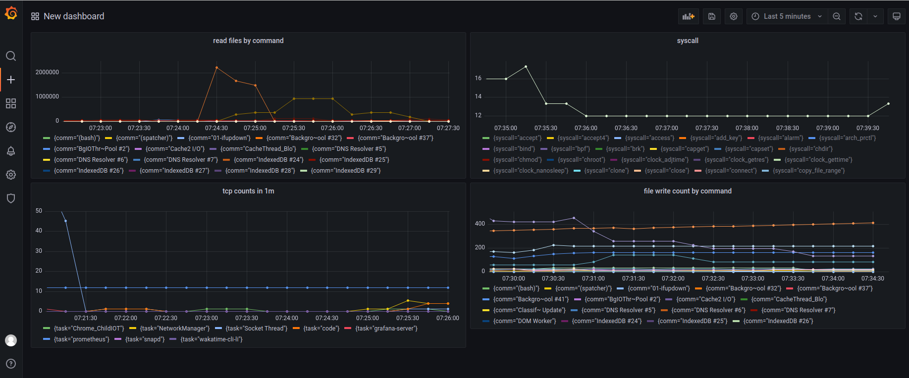
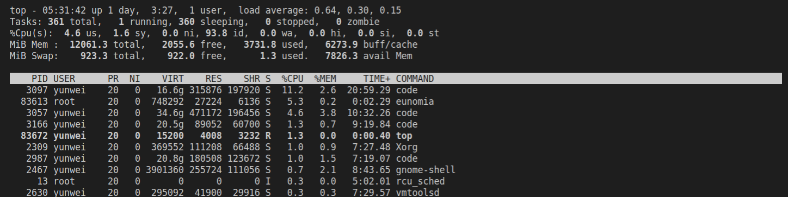
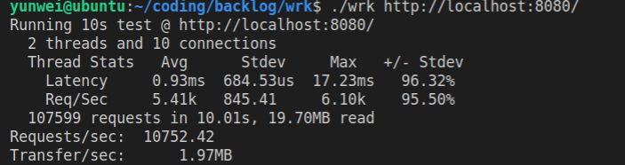

# Eunomia

A lightweight eBPF-based CloudNative Monitor tool for Container Security and Observability

> NOTE: This repo is under heavily development and `NOT YET COMPLETE`, it shall not be used in product environments now.

[](https://github.com/yunwei37/Eunomia/actions)
[](https://codecov.io/gh/filipdutescu/modern-cpp-template)
[](https://github.com/yunwei37/Eunomia/releases)

We have a mirror of the source code on [GitHub](https://github.com/yunwei37/Eunomia) which runs CI. We also have a mirror on [GitLab](https://gitlab.eduxiji.net/zhangdiandian/project788067-89436), for faster access in China and OS comp.

<!-- TOC -->

- [What is Eunomia](#what-is-eunomia)
  - [Three Main Ideas](#three-main-ideas)
  - [Describe](#describe)
  - [Trace Point](#trace-point)
  - [Tutorial and Documents](#tutorial-and-documents)
- [Architecture](#architecture)
- [Quickstart](#quickstart)
  - [Prequest](#prequest)
  - [run as binary](#run-as-binary)
  - [Docker, Prometheus and Grafana](#docker-prometheus-and-grafana)
  - [Prometheus and grafana result](#prometheus-and-grafana-result)
  - [security rules](#security-rules)
  - [build On Linux](#build-on-linux)
- [Why is eBPF](#why-is-ebpf)
- [Why Eunomia](#why-eunomia)
- [Documents](#documents)
- [benchmark](#benchmark)
- [Reference](#reference)
- [Contact](#contact)

<!-- /TOC -->

## What is Eunomia

### Three Main Ideas

1. 无需修改代码，无需繁琐的配置，仅需 BTF 和一个微小的二进制即可启动监控和获取 Eunomia 核心功能：

  > - 代码无侵入即可开箱即用收集多种指标，仅占用少量内存和 CPU 资源；
  > - 告别庞大的镜像和 BCC编译工具链，最小仅需约 4MB 即可在支持的内核上或容器中启动跟踪；

2. 让 ebpf 程序的分发和使用像网页和 web 服务一样自然：

  > - 数百个节点的集群难以分发和部署 ebpf 程序？bpftrace 脚本很方便，但是功能有限？Eunomia 支持通过 http API 直接进行本地编译后的 ebpf 代码的分发和热更新，仅需约数百毫秒和几乎可以忽略的 CPU 内存占用即可完成复杂 ebpf 追踪器的部署和更新；
  > - 可以通过 http API 高效热插拔 ebpf 追踪器（约 100ms），实现按需追踪；

3. 提供一个新手友好的 ebpf 云原生监控框架：

  > - 最少仅需继承和修改三四十行代码，即可在 Eunomia 中基于 libbpf-bootstrap 脚手架添加自定义 ebpf 追踪器、匹配安全告警规则、获取容器元信息、导出数据至 prometheus 和 grafana，实现高效的时序数据存储和可视化，轻松体验云原生监控；
  > - 提供了丰富的文档和开发教程，力求降低 ebpf 程序的开发门槛；

**操作系统大赛决赛报告**：[doc/report-index.md](doc/report-index.md)

### Describe

`Eunomia` 是一个使用 C/C++ 开发的基于 eBPF的轻量级，高性能云原生监控工具框架，旨在帮助用户了解容器的各项行为、监控可疑的容器安全事件，力求提供覆盖容器全生命周期的轻量级开源监控解决方案。

它使用 `Linux` `eBPF` 技术在运行时跟踪您的系统和应用程序，并分析收集的事件以检测可疑的行为模式。目前，它包含性能分析、容器集群网络可视化分析*、容器安全感知告警、一键部署、持久化存储监控等功能，提供了多样化的 ebpf 追踪点，并可以轻松拓展。其核心导出器/命令行工具最小仅需要约 4MB 大小的二进制程序，即可在支持的 Linux 内核上启动。

* [X] 开箱即用：以单一二进制文件或镜像方式分发，一次编译，到处运行，一行代码即可启动，包含多种 ebpf 工具和多种监测点，支持多种输出格式（json, csv, etc) 并保存到文件；
* [X] 轻量级，高性能：编译成的二进制大小仅 `4MB`;
* [X] 通过 `ebpf` 自动收集容器和 k8s 相关元信息，并和多种指标相结合；
* [X] 可集成 `prometheus` 和 `Grafana`，作为监控可视化和预警平台；也可作为 `OpenTelemetry` 的 collector 使用；
* [X] 可自定义运行时安全预警规则, 并通过 prometheus 等实现监控告警;
* [X] 可以自动收集进程行为并通过 `seccomp`/`capability` 进行限制；
* [X] 提供远程的 http API 进行控制，实现 ebpf 跟踪器的热插拔和热更新，也可自行定制插件进行数据分析;
* [X] 其核心框架高度可扩展，可以非常轻松地集成其他的 libbpf ebpf C 程序； 

### Trace Point

`Eunomia` 向下采集容器相关进程的系统和网络可观测数据，向上采集容器相关应用的性能数据。其支持的 ebpf 跟踪点:

- `process`: 进程执行与退出
- `files`: 文件读写
- `tcpconnect`: TCP 连接
- `syscall`: 系统调用
- `tcpconnlat`: TCP 连接延时
- `tcprtt` 跟踪 TCP RTT(round-trip time)，并绘制直方图
- `profile`: 定时采集堆栈跟踪样本, 并进行 On-CPU 性能分析; 支持C/C++/Rust等，也支持对 lua 虚拟机进行采样分析；
- `funclatency` 输出显示函数延迟（调用时间）的直方图*
- `bindsnoop` 跟踪执行 socket bind 的内核函数
- `sigsnoop` 跟踪进程收到的信号；
- `opensnoop` 跟踪 open() 系统调用，并获取文件路径等信息
- `mountsnoop` 跟踪 mount() 和 umount 系统调用
- `memleak` 跟踪和匹配内存分配和释放请求*
- `oomkill`: 跟踪 Linux 内存不足 (OOM) 终止
- `syscount`: 追踪慢系统调用并进行统计

我们参考了 bcc/libbpf-tools 定制实现了我们自己的 ebpf 追踪器，所有的 ebpf 跟踪点都可以通过 pid、namespace、cgroups 等信息和 docker、Kubernetes 元信息相关联，完成端到端可观测数据的覆盖。每个追踪点都有相应的测试和文档，还有源代码解读，可供学习或进一步拓展开发使用。请参考我们的追踪器文档：[doc/trackers_doc](doc/trackers_doc)

> 注：标记*的功能和追踪点还在 alpha 测试阶段，可能存在一些不完善之处，敬请期待。

### Tutorial and Documents

`Eunomia` 的 `ebpf` 追踪器部分是从 `libbpf-tools` 中得到了部分灵感，但是目前关于 ebpf 的资料还相对零散且过时，这也导致了我们在前期的开发过程中走了不少的弯路。因此, 我们也提供了一系列教程，以及丰富的参考资料，旨在降低新手学习eBPF技术的门槛，试图通过大量的例程解释、丰富对 `eBPF、libbpf、bcc` 等内核技术和容器相关原理的认知，让后来者能更深入地参与到 ebpf 的技术开发中来。另外，`Eunomia` 也可以被单独编译为 C++ 二进制库进行分发，可以很方便地添加自定义 libbpf检查器，或者直接利用已有的功能来对 syscall 等指标进行监测，教程中也会提供一部分 `EUNOMIA` 扩展开发接口教程。

1. [eBPF介绍与 libbpf 基础教程](doc/tutorial/tutorial.md)
2. [ebpf 跟踪器源码解析与使用教程](doc/trackers_doc/)

更多详细的教程和文档，请参考我们的网站： https://yunwei37.github.io/Eunomia/

## Architecture

<div  align="center">  
 
 <p>系统架构</p>
</div>

关于详细的系统架构设计和模块划分，请参考 [系统设计报告](doc/report-v1.md)

## Quickstart

### Prequest

Your Kconfig should contain the options below

- Compile options
  ```conf
  CONFIG_DEBUG_INFO_BTF=y
  CONFIG_DEBUG_INFO=y
  ```
- The suggested kernel version is `5.10` or higher. If you use old kernel versions, you may need to install additional BTF info.

### run as binary

You can use our pre-compiled binary(see [release](https://github.com/yunwei37/Eunomia/releases) here). to start a eunomia server:

```sh
sudo ./eunomia server
```

Now the server is ready to accept requests! For HTTP API, see: [doc/API.md](doc/API.md). Hot update is in alpha state, you can see the [doc/hot-update.md](doc/hot-update.md).

This will enable our core ebpf trackers including `process`, `tcp` and `files`, it will also start our security engine to detect potential security issues.

Alternatively, you can simply use eunomia to run a single ebpf tracker, for example:

```sh
sudo ./eunomia run files
```

will trace all files read or write in the system at a defaut interval of 3s, and print the result:

```log
[2022-05-28 11:23:10.699] [info] start eunomia...
[2022-05-28 11:23:10.699] [info] start ebpf tracker...
[2022-05-28 11:23:10.699] [info] start prometheus server...
[2022-05-28 11:23:10.699] [info] press 'Ctrl C' key to exit...
[2022-06-02 11:18:20.173] [info] pid    container_name reads  writes read_bytes write_bytes type   comm         filename
[2022-06-02 11:18:20.173] [info] 142326 ubuntu          0      1          0          1      R      postgres     oom_score_adj
[2022-06-02 11:18:20.173] [info]   5824 ubuntu          1      0         16          0      R      code         state.vscdb 
[2022-06-02 11:18:20.173] [info]   5453 ubuntu          1      0         16          0      R      grafana-server grafana.db  
[2022-06-02 11:18:20.173] [info] 142327 ubuntu          1      0         18          0      R      git          .gitignore  
[2022-06-02 11:18:20.173] [info] 142327 ubuntu          1      0         18          0      R      git          .gitignore  
[2022-06-02 11:18:20.173] [info] 142327 ubuntu          1      0         18          0      R      git          .gitignore  
[2022-06-02 11:18:20.173] [info]   5824 ubuntu          1      1          8         12      R      code         state.vscdb-journal
....
```

You can also use `--container-id` to trace a container, or use `toml`/`json` config file. You can specify the interval of tracing or sampling, the output format, the log level, etc.

we have provide four default trackers, `process`, `tcp`, `syscall` and `files`. You can also add your own trackers from libbpf-tools easily.

for more details, see: [usage.md](doc/usage.md)

### Docker, Prometheus and Grafana

see [quickstart/deploy.md](doc/quickstart/deploy.md)

### Prometheus and grafana result

<div  align="center">
 
 <p>文件读取的byte数</p>
 
  <p>文件读取的系统调用次数</p>
 
 <p>对于容器中进程的跟踪结果，记录开始和结束时间</p>
 
 <p> grafana dashboard 例子，包含了多种监控指标</p>
</div>

- 对于详细的 Prometheus 监控指标文档，请参考：[prometheus_metrics.md](doc/prometheus_metrics.md)

- 关于如何集成 Prometheus 和 Grafane，请参考：[intergration.md](doc/intergration.md)

### security rules

Use eunomia to detect security related events, for example, after started eunomia server, run:

```sh
sudo bpftools/tcp/tcp
```

And you will get an alert in eunomia output:

```log
[2022-06-02 11:26:40.830] [info] Security Rule Detection:
[2022-06-02 11:26:40.831] [info] level: event
[2022-06-02 11:26:40.831] [info] name: Insert-BPF
[2022-06-02 11:26:40.832] [info] message: BPF program loaded: tcp
[2022-06-02 11:26:40.832] [info] pid: 143856
[2022-06-02 11:26:40.833] [info] container_id: 36fca8c5eec1
[2022-06-02 11:26:40.833] [info] container_name: Ubuntu
```

This message means some program inserts a bpf program to the kernel, which may cause container escape ([reference](https://security.tencent.com/index.php/blog/msg/206)). Note that alrough `eunomia` use ebpf as well, it will not trigger this warnning itself. This will also be exported to Prometheus, in metrix `eunomia_seccurity_event_count`.

For more details, please refer to [rules_index](doc/rule_index.md)

> Currenty we only have a framework for detecting security events, more rules will be added in the future.

### build On Linux

You may need to install `libcurl`, `libelf-dev` `clang` and `gtest` as deps. On `Debian/Ubuntu`, just run

```sh
make install-deps
```

We used `C++20` as standard， so you need a compiler that supports C++20, for example, `GCC` > 10.0

Makefile build:

```sh
git submodule update --init --recursive       # check out deps
make install
```

For more details on how to build, you can visit our CI configs：[.github/workflows/ubuntu.yml](.github/workflows/ubuntu.yml)

## Why is eBPF

eBPF是一项革命性的技术，可以在Linux内核中运行沙盒程序，而无需更改内核源代码或加载内核模块。通过使Linux内核可编程，基础架构软件可以利用现有的层，从而使它们更加智能和功能丰富，而无需继续为系统增加额外的复杂性层。

* 优点：低开销

  eBPF 是一个非常轻量级的工具，用于监控使用 Linux 内核运行的任何东西。虽然 eBPF 程序位于内核中，但它不会更改任何源代码，这使其成为泄露监控数据和调试的绝佳伴侣。eBPF 擅长的是跨复杂系统实现无客户端监控。 
* 优点：安全

  解决内核观测行的一种方法是使用内核模块，它带来了大量的安全问题。而eBPF 程序不会改变内核，所以您可以保留代码级更改的访问管理规则。此外，eBPF 程序有一个验证阶段，该阶段通过大量程序约束防止资源被过度使用，保障了运行的ebpf程序不会在内核产生安全问题。
* 优点：精细监控、跟踪

  eBPF 程序能提供比其他方式更精准、更细粒度的细节和内核上下文的监控和跟踪标准。并且eBPF监控、跟踪到的数据可以很容易地导出到用户空间，并由可观测平台进行可视化。 
* 缺点：很新

  eBPF 仅在较新版本的 Linux 内核上可用，这对于在版本更新方面稍有滞后的组织来说可能是令人望而却步的。如果您没有运行 Linux 内核，那么 eBPF 根本不适合您。


## Why Eunomia

目前已经有许多开源的可观测性工具，相比较 Eunomia:

1. 代码无侵入收集多种指标：基于 `ebpf` 实现，不需要对代码进行埋点或改造即可获取到丰富的网络和内核性能数据，并且和容器/k8s元信息相关联;
2. 轻量级：不想安装一大堆 `BCC` 或者 `systemTap` 的环境？无法使用内核模块？因为网络不好镜像拉不下来？得益于 `Libbpf` + BPF `CO-RE`（一次编译，到处运行）的强大性能，仅需安装一个 agent 就可以收集这台主机所有相关的系统数据，约 4MB 即可在支持的内核上或容器中启动跟踪，避免繁琐的依赖项和配置项；也可以通过镜像打包 Prometheus & Grafana 等监控可视化工具, 一站式开箱即用。
3. 高性能：得益于 `ebpf` 的可编程特性，`Eunomia` 直接在内核中使用 eBPF 执行过滤、聚合、度量统计和直方图收集，避免向用户空间 agent 发送大量的低信号事件，大大减少了系统的开销；此外，`Eunomia` 使用了 C/C++ 高效的数据结构和多线程分析处理，以提供高效和快速的数据收集手段，在大多数情况下仅使用不到 2% 的 CPU。
4. 可用性：一般而言，可观测性工具需要比被观测系统至少可靠一个数量级。我们使用了大量的静态分析和动态分析工具，如 clang tidy、cppcheck、Addresssanitizer、Clang Static Analyzer 等，同时进行了大量的测试以保证系统的可用性以及稳定性。
5. 热插拔：Eunomia 完全开源，可通过配置文件或开放的 http API 进行插件拓展，可以在运行时随时启动和停止特定的跟踪器；
6. 热更新：可直接通过 HTTP API 分发和更新编译好的 libbpf ebpf 程序，在不停机的同时以极小的代价进行更新；
7. 可扩展：Eunomia 的核心框架高度模块化，可扩展，可以轻松接入其他的 libbpf ebpf C 程序，实现自定义跟踪器；也提供了大量关于使用 libbpf 进行 ebpf 开发的文档和教程，以供 ebpf 的初学者学习参考。

除了收集容器中的一般系统运行时内核指标，例如系统调用、网络连接、文件访问、进程执行等，我们在探索实现过程中还发现目前对于 `lua` 和 `nginx` 相关用户态 `profile` 工具和指标可观测性开源工具存在一定的空白，但又有相当大的潜在需求；因此我们还计划添加一系列基于 uprobe 的用户态 `nginx/lua` 追踪器，作为可选的扩展方案；请参考 https://github.com/yunwei37/nginx-lua-ebpf-toolkit 仓库。

如果您想要使用 Eunomia，请注意：

- Eunomia 并不是一个完整的可观测性系统，它主要关注于系统的 Metrics ，即数据的数值表现方向，也收集一部分操作系统和网络层面的日志信息。Metrics 提供的信息用于衡量关于系统整体行为和健康状态。Metrics 通常在 “发生了什么” 中扮演重要角色，有时候是 “为什么”。您可能需要将其与应用程序本身的 logs 和 Traces 信息相结合，以便于更好的了解应用程序的行为或故障原因。
- 受 ebpf 技术所限，运行 Eunomia 需要确保操作系统内核支持 ebpf，因此它可能并不能在较旧的内核上正常工作。

## Documents

Eunomia的完整文档在 doc 目录中：

- [develop documents](doc/develop_doc)
- [tracker documents](doc/trackers_doc)
- [tutorial](doc/tutorial)
- [main folder](doc)

## benchmark

使用 top 查看 eunomia 的内存和cpu占用情况



目前有一些简单的性能对比，使用 openresty 在本机上启动一个网络简单的服务，并且使用 wrk 进行压力测试。测试环境：

```
Linux ubuntu 5.13.0-44-generic #49~20.04.1-Ubuntu SMP x86_64 GNU/Linux
4 核，12 GB 内存：
```

这是未开启 eunomia server 的情况：


这是启动 eunomia server 后的情况，使用默认配置并启用 process/container、tcp、files、ipc 等探针，在同样环境下进行测试：



可以观测到启动 eunomia 之后对于服务仅有大约 2% 的性能损耗。

> OpenResty® 是一个基于 Nginx 与 Lua 的高性能 Web 平台，其内部集成了大量精良的 Lua 库、第三方模块以及大多数的依赖项。用于方便地搭建能够处理超高并发、扩展性极高的动态 Web 应用、Web 服务和动态网关。web开发人员可以使用lua编程语言，对核心以及各种c模块进行编程，可以利用openresty快速搭建超1万并发高性能web应用系统。这里的 benchmark 参考了：https://openresty.org/en/benchmark.html

目前还没有比较完善的 benchmark 测试和性能分析，这是我们接下来要完善的内容。

## Reference

* [BumbleBee: Build, Ship, Run eBPF tools](https://www.solo.io/blog/solo-announces-bumblebee/)
* [Container traffic visibility library based on eBPF](https://github.com/ntop/libebpfflow)
* [why-libbpf-bootstrap](https://nakryiko.com/posts/libbpf-bootstrap/#why-libbpf-bootstrap)
* [bpf-core-reference-guide](https://nakryiko.com/posts/bpf-core-reference-guide/)
* [bcc to libbpf](https://nakryiko.com/posts/bcc-to-libbpf-howto-guide/#setting-up-user-space-parts)
* good intro for trace point and kprobe in ebpf
  https://www.iserica.com/posts/brief-intro-for-tracepoint/
  https://www.iserica.com/posts/brief-intro-for-kprobe/
* other
  https://lockc-project.github.io/book/index.html
  https://github.com/willfindlay/bpfcontain-rs
* user space uprobe:
  [an-ebpf-overview-part-5-tracing-user-processes](https://www.collabora.com/news-and-blog/blog/2019/05/14/an-ebpf-overview-part-5-tracing-user-processes/)
* ebpf secomp
  [how_does_the_bpf_recorder_work_](https://developers.redhat.com/articles/2021/12/16/secure-your-kubernetes-deployments-ebpf#how_does_the_bpf_recorder_work_)
  [recorder.bpf.c](https://github.com/kubernetes-sigs/security-profiles-operator/blob/main/internal/pkg/daemon/bpfrecorder/bpf/recorder.bpf.c)
* [libbpf-tools](https://github.com/iovisor/bcc/tree/master/libbpf-tools)

## Contact

**成员**

指导老师：程泽睿志（华为）李东昂（浙江大学）

学生：郑昱笙（yunwei37: 1067852565@qq.com），濮雯旭，张典典
