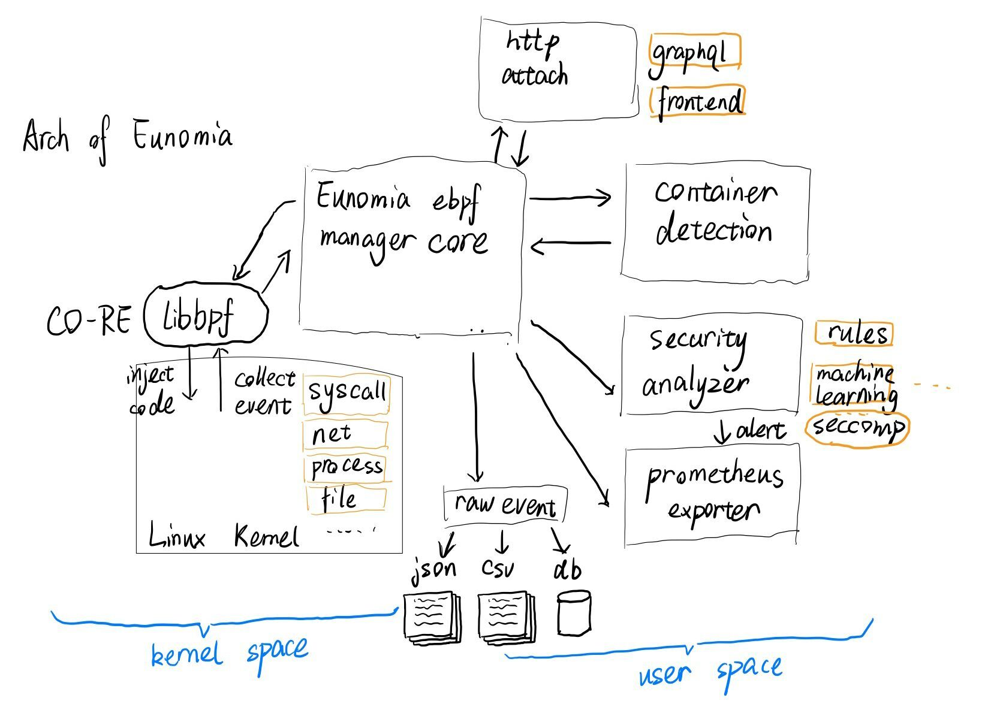
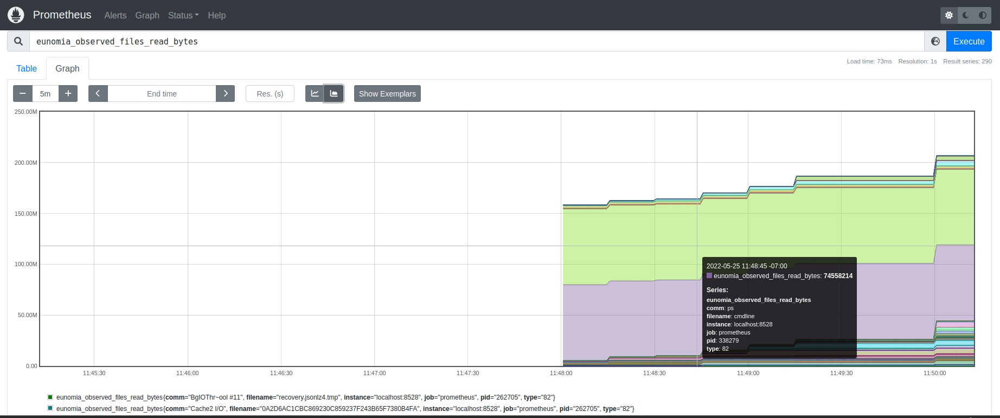
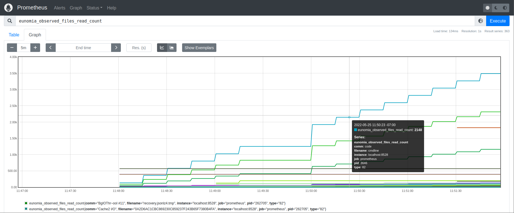
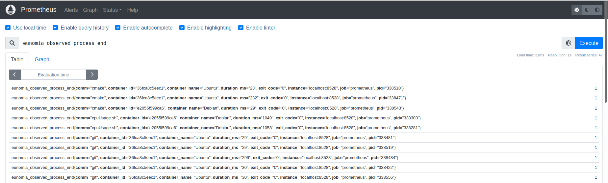

# Eunomia

A lightweight eBPF-based CloudNative Monitor tool for Container Security and Observability

> NOTE: This repo is under heavily development and `NOT YET COMPLETE`, it shall not be used in product environments now.

[](https://github.com/filipdutescu/modern-cpp-template/actions)
[](https://codecov.io/gh/filipdutescu/modern-cpp-template)
[](https://github.com/filipdutescu/modern-cpp-template/releases)

<!-- TOC -->

- [Eunomia](#eunomia)
- [What is Eunomia](#what-is-eunomia)
  - [Tutorial](#tutorial)
- [Quickstart](#quickstart)
  - [Docker and Prometheus](#docker-and-prometheus)
  - [run as binary](#run-as-binary)
  - [build On Linux](#build-on-linux)
- [Why is eBPF](#why-is-ebpf)
- [Architecture](#architecture)
    - [Prometheus-exporter 的效果如图：](#prometheus-exporter-的效果如图)
- [Functionality Overview](#functionality-overview)
      - [tracker_manager](#tracker_manager)
      - [container_manager](#container_manager)
      - [seccomp_manager](#seccomp_manager)
      - [data_collector](#data_collector)
      - [container detection](#container-detection)
      - [security analyzer](#security-analyzer)
      - [prometheus exporter](#prometheus-exporter)
      - [config loader](#config-loader)
      - [cmd](#cmd)
      - [server](#server)
- [Roadmap](#roadmap)
- [Documents](#documents)
- [Reference](#reference)
- [Contact](#contact)

<!-- /TOC -->

# What is Eunomia

Eunomia 是一个基于eBPF的云原生监控工具，旨在帮助用户了解容器的各项行为、监控可疑的容器安全事件，力求为工业界提供覆盖容器全生命周期的轻量级开源监控解决方案。它使用Linux eBPF技术在运行时跟踪您的系统和应用程序，并分析收集的事件以检测可疑的行为模式。目前，它包含 `profile`、容器集群网络可视化分析、容器安全感知告警、一键部署、持久化存储监控等功能。

* 开箱即用：以单一二进制文件或 docker 镜像方式分发，一行代码即可启动，包含多种 ebpf 工具和多种监测点；
* 可集成 prometheus 和 Grafana，作为监控可视化和预警平台；
* 作为守护进程运行，可自定义安全预警规则，也可以自动收集进程系统调用行为并通过 seccomp 进行限制；
* 可外接时序数据库，如 InfluxDB 等，作为信息持久化存储方案；
* 可通过 graphql 在远程发起请求并执行监控工具，将产生的数据进行聚合后返回，用户可自定义运行时扩展插件进行数据分析(`TODO`)；

和过去常用的 BCC 不同，Eunomia 基于 Libbpf + BPF CO-RE（一次编译，到处运行）开发。Libbpf 作为 BPF 程序加载器，接管了重定向、加载、验证等功能，BPF 程序开发者只需要关注 BPF 程序的正确性和性能即可。这种方式将开销降到了最低，且去除了庞大的依赖关系，使得整体开发流程更加顺畅。

## Tutorial

Eunomia 的 ebpf 部分是从 libbpf-tools 中得到了部分灵感，但是目前关于 ebpf 的资料还相对零散，这也导致了我们在前期的开发过程中走了不少的弯路。因此, 我们也提供了一系列教程，以及丰富的参考资料，旨在降低新手学习eBPF技术的门槛，试图通过大量的例程解释、丰富对 `eBPF、libbpf、bcc` 等内核技术和容器相关原理的认知，让后来者能更深入地参与到 ebpf 的技术开发中来。

see: [tutorial](doc/tutorial)

# Quickstart

## Docker and Prometheus

> TODO: docker file

## run as binary

you can use our pre-compiled binary to start a prometheus exporter:

```
./eunomia server
```

This will enable our core ebpf trackers including `process`, `tcp`, `syscall` and `files`, it will also start our security engine to detect potential security issues. For more details, you can refer to our doc.

Alternatively, you can simply use eunomia to run a single ebpf tracker, for example:

```
./eunomia run files --pid=1234
```

will trace all files read or writed by process 1234. You can also use `--container-id` to trace a container. You can also use `toml` config file.

for more details, see: (usage.md)[doc/usage.md]

## build On Linux

Makefile build:

```shell
git submodule update --init --recursive       # check out deps
make install
```

You may need to install libcurl, libelf-dev clang and gtest as deps. On Debian/Ubuntu, run

```
make install-deps
```

TODO: other platforms

# Why is eBPF

eBPF是一项革命性的技术，可以在Linux内核中运行沙盒程序，而无需更改内核源代码或加载内核模块。通过使Linux内核可编程，基础架构软件可以利用现有的层，从而使它们更加智能和功能丰富，而无需继续为系统增加额外的复杂性层。

* 优点：低开销

  eBPF 是一个非常轻量级的工具，用于监控使用 Linux 内核运行的任何东西。虽然 eBPF 程序位于内核中，但它不会更改任何源代码，这使其成为泄露监控数据和调试的绝佳伴侣。eBPF 擅长的是跨复杂系统实现无客户端监控。 
* 优点：安全

  解决内核观测行的一种方法是使用内核模块，它带来了大量的安全问题。而eBPF 程序不会改变内核，所以您可以保留代码级更改的访问管理规则。此外，eBPF 程序有一个验证阶段，该阶段通过大量程序约束防止资源被过度使用，保障了运行的ebpf程序不会在内核产生安全问题。
* 优点：精细监控、跟踪

  eBPF 程序能提供比其他方式更精准、更细粒度的细节和内核上下文的监控和跟踪标准。并且eBPF监控、跟踪到的数据可以很容易地导出到用户空间，并由可观测平台进行可视化。 
* 缺点：很新

  eBPF 仅在较新版本的 Linux 内核上可用，这对于在版本更新方面稍有滞后的组织来说可能是令人望而却步的。如果您没有运行 Linux 内核，那么 eBPF 根本不适合您。

# Architecture

从宏观角度来看，代理在Kuberntes中作为DeamonSet运行。它收集所有系统调用和一些其他跟踪点。我们使用不同的exporter对数据进行分发。对于当前版本，我们只需要通过普罗米修斯导出器（Prometheus-exporter）来导出可以存储到普罗米修斯中并在Grafana中可视化的数据。目前，Eunomia已经开源。

<div  align="center">  
 
 <p>系统架构</p>
</div>

### Prometheus-exporter 的效果如图：


<div  align="center">  
 
 <p>文件读取的byte数</p>
 
  <p>文件读取的系统调用次数</p>
 
 <p>对于容器中进程的跟踪结果，记录开始和结束时间</p>
</div>

# Functionality Overview

#### tracker_manager

   负责启动和停止 ebpf collector，并且和 ebpf collector 通信（每个 tracer 是一个线程）；

- start tracker
- stop tracker(remove tracker)

#### container_manager

   负责观察 container 的启动和停止，在内存中保存每个 container 的相关信息：（cgroup，namespace），同时负责 container id 到 pid 的转换（提供查询接口）

#### seccomp_manager

   负责对 process 进行 seccomp 限制

#### data_collector

   收集数据，再决定怎么办；传给 database 还是聚合还是交给别的地方还是打印

- collect_string
- collect_json
- collet_object

#### container detection

容器安全检测规则引擎，可以帮助您检测事件流中的可疑行为模式。

#### security analyzer

安全分析模块，通过ebpf采集到的底层相关数据，运用包括AI在内的多种方法进行安全性分析。

#### prometheus exporter

将数据导出成Prometheus需要的格式，在Prometheus中保存时序数据，方便后续持久化和可视化功能。

#### config loader

   解析 toml

#### cmd

   命令行解析模块，将命令行字符串解析成对应的参数选项，对Eunomia进行配置。

#### server

   http 通信

# Roadmap

阶段一：学习ebpf相关技术栈（3.10~4.2）

* [X] 入门ebpf技术栈
* [X] 调研、学习 `bcc`
* [X] 调研、学习 `libbpf` 、`libbpf-bootstrap`
* [X] 调研、学习 `seccomp`
* [X] 输出调研文档

阶段二：项目设计（4.3~4.10）

* [X] 与mentor讨论项目需求、并设计功能模块
* [X] 输出系统设计文档
* [X] 输出模块设计文档

阶段三：开发迭代（4.10~6.1）

* [X] 实现进程信息监控（pid、ppid等）
* [X] 实现系统调用信息监控
* [X] 实现进程间通信监控
* [X] 实现tcp（ipv4、ipv6）通信监控
* [X] 实现监控信息存储功能（csv或json格式）
* [X] 完成了系统的原型验证功能
* [X] 基于上述功能，实现命令行调用，完成版本v0.1
* [X] 输出开发v0.1日志文档
* [X] 实现进程id与容器id映射，进程信息过滤
* [X] 添加“seccomp”功能
* [x] 基于上述新增功能，迭代版本v0.2
* [X] 输出开发v0.2日志文档
* [x] 添加可视化模块
* [X] add more tools from libbpf-tools
* [ ] 基于上述新增功能，迭代版本v0.3
* [ ] 输出开发v0.3日志文档
* [ ] 后续更新迭代

阶段四：开发测试（6.2~6.16）

* [ ] 设计测试场景（分别针对基础功能、权限控制、安全逃逸场景）
* [X] 搭建测试环境
* [ ] 测试-开发
* [ ] 输出测试文档

阶段五：项目文档完善（6.17~7.1）

* [ ] 完善开发文档
* [ ] 完善教程文档
* [ ] 完善labs

# Documents

Eunomia的完整文档如下

- [develop documents](doc/develop_doc)
- [tutorial](doc/tutorial)

# Reference

* [基于 eBPF 实现容器运行时安全](https://mp.weixin.qq.com/s/UiR8rjTt2SgJo5zs8n5Sqg)
* [基于ebpf统计docker容器网络流量](https://blog.csdn.net/qq_32740107/article/details/110224623)
* [BumbleBee: Build, Ship, Run eBPF tools](https://www.solo.io/blog/solo-announces-bumblebee/)
* [Container traffic visibility library based on eBPF](https://github.com/ntop/libebpfflow)
* [why-libbpf-bootstrap](https://nakryiko.com/posts/libbpf-bootstrap/#why-libbpf-bootstrap)
* [bpf-core-reference-guide](https://nakryiko.com/posts/bpf-core-reference-guide/)
* [bcc to libbpf](https://nakryiko.com/posts/bcc-to-libbpf-howto-guide/#setting-up-user-space-parts)
* good intro for trace point and kprobe in ebpf
  https://www.iserica.com/posts/brief-intro-for-tracepoint/
  https://www.iserica.com/posts/brief-intro-for-kprobe/
* other
  https://lockc-project.github.io/book/index.html
  https://github.com/willfindlay/bpfcontain-rs
* user space uprobe:
  [an-ebpf-overview-part-5-tracing-user-processes](https://www.collabora.com/news-and-blog/blog/2019/05/14/an-ebpf-overview-part-5-tracing-user-processes/)
* ebpf secomp
  [how_does_the_bpf_recorder_work_](https://developers.redhat.com/articles/2021/12/16/secure-your-kubernetes-deployments-ebpf#how_does_the_bpf_recorder_work_)
  [recorder.bpf.c](https://github.com/kubernetes-sigs/security-profiles-operator/blob/main/internal/pkg/daemon/bpfrecorder/bpf/recorder.bpf.c)
* [libbpf-tools](https://github.com/iovisor/bcc/tree/master/libbpf-tools)

# Contact

**成员**

指导老师：程泽睿志（华为）李东昂（浙江大学）

学生：郑昱笙，濮雯旭，张典典
