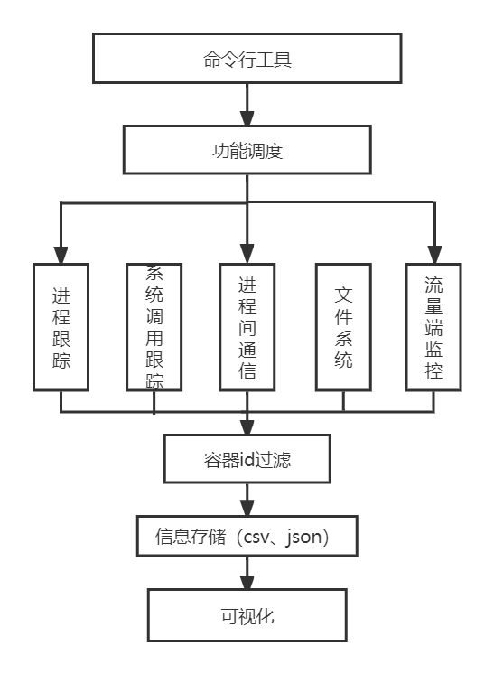

# Eunomia系统设计文档

## Eunomia简介
覆盖容器全生命周期的轻量级开源监控解决方案

- 开箱即用：以单一二进制文件或 docker 镜像方式分发，一行代码即可启动，包含多种 ebpf 工具和多种监测点；
- 作为守护进程运行，可自定义安全预警规则，也可以自动收集进程系统调用行为并通过 seccomp 进行限制；
- 可集成 prometheus 和 Grafana，作为监控可视化和预警平台；
- 可外接时序数据库，如 InfluxDB 等，作为信息持久化存储方案；
- 可通过 graphql 在远程发起请求并执行监控工具，将产生的数据进行聚合后返回，用户可自定义运行时扩展插件进行数据分析；

## 命令行工具

### 功能：

1. run
    直接启动基于ebpf的tracker工具，其整体形式为:
   ```
   ./eunomia run process
    ```
    该命令可以启动process模块，令其对所有进程进行追踪，除非手动终止否则不会自动推出。
   
   除了 tcp模块以外，我们还有：
   - syscall (将上文命令中的tcpconnect修改为syscall即可)
   - ipc (将上文命令中的tcpconnect修改为ipc即可)
   - file w/r (将上文命令中的tcpconnect修改为files即可)
   - process (将上文命令中的tcpconnect修改为process即可)  
     等共计五大模块。为了我们还将计划添加 `perf event` 模块。下文中的所有选项对目前所有模块都支持，
   用户可以根据自己的需要添加
    ```
    ./eunomia run process -p PID -T 30 
    ```
    该命令可以启动process模块，并且指定追踪的进程ID和追踪时间(以秒为单位)。
   
    ```
    ./eunomia run process -c container_id 
    ```
   该命令可以启动process模块，并且指定需要追踪的容器id。
   
   ```
    ./eunomia run process --fmt csv
    ```
    该命令可以监控所有的进程，并且以csv格式输出， 其他可选格式还有json和plain_text
   
    ```
    ./eunomia run tcpconnect -m [/your/log/path]
    ```
   该命令可以启动container manager，用以追踪机器上所有容器的运行情况并将数据记录到日志文件中
   日志文件的路径可以自行指定，如果不输入则使用系统的默认路径，项目的默认存储路径为`./logs/container_log.txt`
   
   
   我们为项目添加了toml解析代码，用户可以通过添加toml文件的形式完成对tracker的配置。
   ```
   ./eunomia run process --config toml_file_path
   ```
   该命令可以读入`toml_file_path`路径指向的toml文件并解析，存入程序中，自动设定追踪器的启动参数。
   
   toml配置样例
   
2. daemon
   作为守护进程运行，记录日志(该模块初赛阶段还未实现，目前仅有规划)

    ```
    ./eunomia daemon -c container_id -p PID
    ```

    输入docker_id和pid，监控某一个容器和进程的相关行为，同时自动自动对高危行为进行预警，比如调用了某些危险 syscall，读写了某些危险文件等。

    ```
    ./eunomia daemon [-c container id] [--config config.toml]
    ```
    通过读取用户自定义的toml文件实现对用户自定义的危险行为监控，并产生日志预警。
    ```
   ./eunomia daemon [-c container_id ] [-p PID] [--seccomp syscall_id_file]
    ```
    加载seccomp配置文件，对 相应 pid 和 container 进行限制；

3. seccomp
   
    ```
    ./eunomia seccomp [-p PID] [-T 30] [-o file]
    ```

    对某个正常的程序追踪 30s 产生 syscall 表，并输出到file指定的位置，用来给 seccomp 进行限制；

4. server
   以server的形式启动本项目
    ```
    ./eunomia server [--prometheus] [--config file_path]
    ```

    作为 prometheus exporter 运行守护进程，同时从toml文件中读入基本设定；

    ```
    ./eunomia server [--listen 8080]
    ```

    在某个端口监听 http 控制请求，可以和我们自己的前端进行通信，并且通过前端进行简单控制和查看网络连接图表。

## 以 docker 形式分发：
   将eunomia封装为docker，以实现其开箱即用的目的。
## 模块划分（类）：

1. tracker_manager：负责启动和停止 ebpf collector，并且和 ebpf collector 通信（每个 tracer 是一个线程）；

- start tracker
- stop tracker(remove tracker)

2. container_manager：负责观察 container 的启动和停止，在内存中保存每个 container 的相关信息：（cgroup，namespace），同时负责 container id 到 pid 的转换（提供查询接口

3. seccomp_manager: 负责对 process 进行 seccomp 限制

4. data_collector: 收集数据，再决定怎么办；传给 database 还是聚合还是交给别的地方还是打印

    collect_string
    collect_json
    collet_object

5. config loader: 解析 toml
6. eunomia：解析命令行
7. server：http 通信


library:

- https://github.com/muellan/clipp
- https://github.com/danielaparker/jsoncons
- https://github.com/yhirose/cpp-httplib

