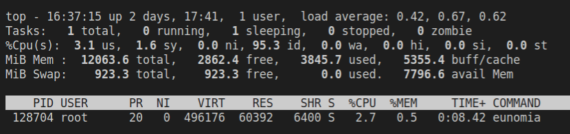
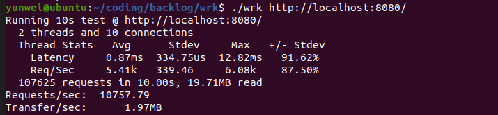

# 操作系统大赛：基于 eBPF 的容器监控工具 Eunomia 初赛报告

基于 eBPF 的轻量级 CloudNative Monitor 工具，用于容器安全性和可观察性

## 目录
<!-- TOC -->

- [目录](#目录)
- [目标描述](#目标描述)
  - [功能概述](#功能概述)
  - [Tutorial](#tutorial)
- [开发计划](#开发计划)
  - [日程表](#日程表)
  - [未来的工作方向](#未来的工作方向)
- [比赛过程中的重要进展](#比赛过程中的重要进展)
  - [benchmark](#benchmark)
- [遇到的主要问题和解决方法](#遇到的主要问题和解决方法)
  - [如何设计 ebpf 挂载点](#如何设计-ebpf-挂载点)
  - [如何进行内核态数据过滤和数据综合](#如何进行内核态数据过滤和数据综合)
  - [如何定位容器元信息](#如何定位容器元信息)
  - [如何设计支持可扩展性的数据结构](#如何设计支持可扩展性的数据结构)
- [分工和协作](#分工和协作)

<!-- /TOC -->

## 目标描述

本项目由两部分组成：

* 一个零基础入门 `eBPF` 技术的教程实践和对应的命令行工具集，主要使用 `C/C++` 语言开发, 同时作为原型验证;
* 一个基于 `eBPF` 技术实现的用于监控容器的工具(**Eunomia**), 包含 `profile`、容器集群网络可视化分析、容器安全感知告警、一键部署、持久化存储监控等功能, 主要使用 C/C++ 语言开发, 力求为工业界提供覆盖容器全生命周期的轻量级开源监控解决方案;

### 功能概述

`Eunomia` 是一个使用 C/C++ 开发的基于eBPF的云原生监控工具，旨在帮助用户了解容器的各项行为、监控可疑的容器安全事件，力求为工业界提供覆盖容器全生命周期的轻量级开源监控解决方案。它使用 `Linux` `eBPF` 技术在运行时跟踪您的系统和应用程序，并分析收集的事件以检测可疑的行为模式。目前，它包含 `profile`、容器集群网络可视化分析*、容器安全感知告警、一键部署、持久化存储监控等功能。

* [X] 开箱即用：以单一二进制文件或镜像方式分发，一次编译，到处运行，一行代码即可启动，包含多种 ebpf 工具和多种监测点，支持多种输出格式（json, csv, etc) 并保存到文件；
* [X] 轻量级，高性能：编译成的二进制大小仅 `4MB`;
* [X] 通过 `ebpf` 自动收集容器和 k8s 相关元信息，并和多种指标相结合；
* [X] 可集成 `prometheus` 和 `Grafana`，作为监控可视化和预警平台；也可作为 `OpenTelemetry` 的 collector 使用；
* [X] 可自定义运行时安全预警规则, 并通过 prometheus 等实现监控告警;
* [X] 可以自动收集进程行为并通过 `seccomp`/`capability` 进行限制；
* [X] 提供远程的 http API 进行控制，实现 ebpf 跟踪器的热插拔，也可自行定制插件进行数据分析;
* [X] 其核心框架高度可扩展，可以非常轻松地集成其他的 libbpf ebpf C 程序；
* [X] 可通过 `graphql` 在远程发起 http 请求并执行监控工具，将产生的数据进行聚合后返回，用户可自定义运行时扩展插件进行在线数据分析；可外接时序数据库，如 `InfluxDB` 等，作为可选的信息持久化存储和数据分析方案；

除了收集容器中的一般系统运行时内核指标，例如系统调用、网络连接、文件访问、进程执行等，我们在探索实现过程中还发现目前对于 `lua` 和 `nginx` 相关用户态 `profile` 工具和指标可观测性开源工具存在一定的空白，但又有相当大的潜在需求；因此我们还计划添加一系列基于 uprobe 的用户态 `nginx/lua` 追踪器，作为可选的扩展方案；（这部分需求来自中科院开源之夏， APISIX 社区的选题）

和过去常用的 `BCC` 不同，`Eunomia` 基于 `Libbpf` + BPF CO-RE（一次编译，到处运行）开发。Libbpf 作为 BPF 程序加载器，接管了重定向、加载、验证等功能，BPF 程序开发者只需要关注 BPF 程序的正确性和性能即可。这种方式将开销降到了最低，且去除了庞大的依赖关系，使得整体开发流程更加顺畅。目前，我们已经发布了 `pre-release` 的版本，其中部分功能已经可以试用，只需下载二进制文件即可运行，


### Tutorial

`Eunomia` 的 `ebpf` 追踪器部分是从 `libbpf-tools` 中得到了部分灵感，但是目前关于 ebpf 的资料还相对零散且过时，这也导致了我们在前期的开发过程中走了不少的弯路。因此, 我们也提供了一系列教程，以及丰富的参考资料，旨在降低新手学习eBPF技术的门槛，试图通过大量的例程解释、丰富对 `eBPF、libbpf、bcc` 等内核技术和容器相关原理的认知，让后来者能更深入地参与到 ebpf 的技术开发中来。另外，`Eunomia` 也可以被单独编译为 C++ 二进制库进行分发，可以很方便地添加自定义 libbpf检查器，或者直接利用已有的功能来对 syscall 等指标进行监测，教程中也会提供一部分 `EUNOMIA` 扩展开发接口教程。

> 教程目前还在完善中。

1. [eBPF介绍](doc/tutorial/0_eBPF介绍.md)
2. [eBPF开发工具介绍: BCC/Libbpf，以及其他](doc/tutorial/1_eBPF开发工具介绍.md)
3. [基于libbpf的内核级别跟踪和监控: syscall, process, files 和其他](doc/tutorial/2_基于libbpf的内核级别跟踪和监控.md)
4. [基于uprobe的用户态nginx相关指标监控](doc/tutorial/3_基于uprobe的用户态nginx相关指标监控.md)
5. [seccomp权限控制](doc/tutorial/4_seccomp权限控制.md)
6. [上手Eunomia: 基于Eunomia捕捉内核事件](doc/tutorial/x_基于Eunomia捕捉内核事件.md)
7. [eBPF介绍与 libbpf 基础教程](doc/tutorial/tutorial.md)
8. [ebpf 跟踪器源码解析与使用教程](doc/trackers_doc/)

## 开发计划

### 日程表

阶段一：学习ebpf相关技术栈（3.10~4.2）

* [X] 入门ebpf技术栈
* [X] 调研、学习 `bcc`
* [X] 调研、学习 `libbpf` 、`libbpf-bootstrap`
* [X] 调研、学习 `seccomp`
* [X] 输出调研文档

阶段二：项目设计（4.3~4.10）

* [X] 与mentor讨论项目需求、并设计功能模块
* [X] 输出系统设计文档
* [X] 输出模块设计文档

阶段三：开发迭代（4.10~6.1）

* [X] 实现进程信息监控（pid、ppid等）
* [X] 实现系统调用信息监控
* [X] 实现进程间通信监控
* [X] 实现tcp（ipv4、ipv6）通信监控
* [X] 实现监控信息存储功能（csv或json格式）
* [X] 完成了系统的原型验证功能
* [X] 基于上述功能，实现命令行调用，完成版本v0.1
* [X] 输出开发v0.1日志文档
* [X] 实现进程id与容器id映射，进程信息过滤
* [X] 添加“seccomp”功能
* [x] 基于上述新增功能，迭代版本v0.2
* [X] 输出开发v0.2日志文档
* [x] 添加可视化模块: prometheus and grafana
* [X] add more tools from libbpf-tools
* [X] 基于上述新增功能，迭代版本v0.3
* [X] 输出开发v0.3日志文档
* [ ] 后续更新迭代

阶段四：开发测试（6.2~6.16）

* [X] lsm support
* [X] add more rules
* [X] 设计测试场景（分别针对基础功能、权限控制、安全逃逸场景）
* [X] 搭建测试环境
* [X] 测试-开发
* [X] 输出测试文档

阶段五：项目文档完善（6.17~7.1）

* [X] 完善开发文档
* [X] 完善教程文档
* [X] 完善labs

### 未来的工作方向

在未来我们计划继续按照上述日程表，完成我们未完成的工作，同时不断优化代码，使得Eunomia能成为一个具有较大使用价值的工具。主要有如下几个方向：

- 完善单元测试和测试场景，并且提供更完整的 benchmark；
- 完善教程文档；
- 完善安全规则和安全分析告警模块，这一部分目前只是个雏形；
- 添加更多的 ebpf 探针，并且支持自定义探针；
- 完善 http 在线分析模块；
- ......

## 比赛过程中的重要进展

- 2022.5.1 首段代码push，实现了对系统调用的成功追踪
- 2022.5.15 完成了五大追踪模块的ebpf代码和简易用户态代码
- 2022.5.17 重构用户态代码，引入简易命令行控制
- 2020.5.20 正式定名Eunomia，该名字的原意是古希腊神话中的一位司管明智，法律与良好秩序女神。我们希望本工具也能在容器安全检测和可观测性中发挥到这样的作用。
- 2022.5.22 将CMake引入本工程，提高了项目编译的速度
- 2022.5.23 开始集成 Prometheus 模块进入工程
- 2022.5.24 重构用户态代码，基本确定命令行控制形式
- 2022.5.28 将日志记录工具spdlog引入本工程
- 2022.6.1 prometheus 和 Grafana 模块集成完成，设计相关 dashboard
- 2022.6.3 完成了 sec_analyzer 模块，对安全风险事件进行分析,发布第一个版本V0.05
- 2022.6.4 整理初赛文档；
- 2022.8.1 添加静态分析和运行时分析，保证安全性与可用性
- 2022.8.7 发布第一个大版本V0.2
- 2022.8.8 接入一系列新的trakcer
- 2022.8.9 发布版本V0.25
- 2022.8.14 整理决赛报告，完善文档


### benchmark

使用 top 查看 eunomia 的内存和cpu占用情况



目前有一些简单的性能对比，使用 openresty 在本机上启动一个网络简单的服务，并且使用 wrk 进行压力测试。测试环境：

```
Linux ubuntu 5.13.0-44-generic #49~20.04.1-Ubuntu SMP x86_64 GNU/Linux
4 核，12 GB 内存：
```

这是未开启 eunomia server 的情况：


这是启动 eunomia server 后的情况，使用默认配置并启用 process/container、tcp、files、ipc 等探针，在同样环境下进行测试：



可以观测到仅有大约 2% 的性能损耗。

> OpenResty® 是一个基于 Nginx 与 Lua 的高性能 Web 平台，其内部集成了大量精良的 Lua 库、第三方模块以及大多数的依赖项。用于方便地搭建能够处理超高并发、扩展性极高的动态 Web 应用、Web 服务和动态网关。web开发人员可以使用lua编程语言，对核心以及各种c模块进行编程，可以利用openresty快速搭建超1万并发高性能web应用系统。这里的 benchmark 参考了：https://openresty.org/en/benchmark.html

目前还没有比较完善的 benchmark 测试和性能分析，这是我们接下来要完善的内容。

## 遇到的主要问题和解决方法

### 如何设计 ebpf 挂载点

如何设计挂载点是ebpf程序在书写时首先需要考虑的问题。ebpf程序是事件驱动的，即只有系统中发生了我们预先规定的事件，我们的程序才会被调用。因此，ebpf挂载点的选择直接关系到程序能否在我们需要的场合下被启动。

我们在选择挂载点时，首先需要明白的是我们需要在什么情况下触发处理函数，然后去寻找合适的挂载点。ebpf的挂载点有多种类型，较为常用的挂载点是 `tracepoint` ， `k/uprobe` ， `lsm` 等。

`tracepoint` 是一段静态的代码，以打桩的形式存在于程序源码中，并向外界提供钩子以挂载。一旦处理函数挂载到了钩子上，那么当钩子对应的事件发生时，处理函数就会被调用。由于 `tracepoint` 使用较为方便，且覆盖面广，ABI也较为稳定，他是我们设计挂载点的一个重要考虑对象。目前Linux已经有1000多个tracepoint可供选择，其支持的所有类型可以在 `/sys/kernel/debug/tracing/events/` 目录下看到，而至于涉及到的参数格式和返回形式，用户可以使用 `cat` 命令，查看对应 `tracepoint` 事件下的format文件得到。

如下便是`sched_process_exec`事件的输出格式。


用户也可以直接访问 `tracepoint` 的源码获得更多信息。在Linux源码的 `./include/trace/events` 目录下，用户可以看到Linux中实现tracepoint的源码。  

`k/uprobe` 是Linux提供的，允许用户动态插桩的方式。由于 `tracepoint` 是静态的，如果用户临时需要对一些其不支持的函数进行追踪，就无法使用 `tracepoint` ，而 `k/uprobe` 允许用户事实对内核态/用户态中某条指令进行追踪。用户在指定了该指令的位置并启用 `k/uprobe` 后，当程序运行到该指令时，内核会自动跳转到我们处理代码，待处理完成后返回到原处。相较于 `tracepoint` ， `k/uprobe` 更为灵活，如果你需要追踪的指令不被 `tracepoint` 所支持，可以考虑使用 `k/uprobe`。

`lsm` 是Linux内核安全模块的一套框架，其本质也是插桩。相较于`tracepoint` ，`lsm` 主要在内核安全的相关路径中插入了hook点。因此如果你希望你的代码检测一些和安全相关的内容，可以考虑使用 `lsm` 。其所有钩子的定义在Linux源码的 `./include/linux/lsm_hook_defs.h` 中，你可以从中选择初你所需要的hook点。


### 如何进行内核态数据过滤和数据综合

如果直接将所有捕获到的数据直接传递到用户态的话，将会带来很大的开销，ebpf 程序一个重要的特征就是能在内核态进行数据过滤和综合。我们设计了一系列数据综合和过滤模式，如：

- 根据次数进行统计，如 syscall 统计每个进程调用 syscall 的次数并存储在map中，而不是直接上报；
- 根据 pid、namespace、cgroup 进行过滤；
- process 短于一定时间间隔的不予统计；
- 根据一定时间进行统计采样，如 files

### 如何定位容器元信息

在程序开始，我们调用 `docker ps -q` 命令获得当前所有正在运行的容器ID。

之后我们开始遍历这些ID，并对每一个ID调用 `docker top id` 命令,获得容器中的所有所有进程信息，并且将这些信息以键值对的形式存储到哈希map上。之后我们会在 `sched_process_exec` 和 `sched_process_exit` 的两个点挂载基于ebpf的处理函数，捕获进程信息。

如果捕获的进程与其父进程存在 namespace 变化的情况，那么我们就会重复一次开始的工作，判断是否有新的容器产生。

如果有，则将其添加到哈希map中。如果其父进程已经存在于哈希map中，那么我们就认为此进程也是一个容器相关进程，也将其存储到哈希map中。在进程退出时，我们则需要检查其是否存在于哈希map中，如果存在则需要将其删除。


### 如何设计支持可扩展性的数据结构

首先尽可能降低各个模块的耦合性，这样在修改时可以较为方便地完成改动。其次，在最初设计时为未来可能的扩展预留位置。这部分主要是 tracker 和 handler 的设计，具体可以参考我们的设计文档部分：[#44-ebpf-探针设计](#44-ebpf-探针设计)

## 分工和协作

现在我们大部分的分工方式是在 gitlab 上面的 issue 中进行分配，并且且通过 issue 完成项目质量管理和追踪。参考：[issues](https://gitlab.eduxiji.net/zhangdiandian/project788067-89436/-/issues)

- 郑昱笙同学：负责项目架构设计和调研，负责了 process、files、syscall 相关探针设计；
- 张典典同学：主要负责了seccomp模块、可视化以及部分quickstart的工作
- 濮雯旭同学：主要负责了container和ipc追踪模块的撰写以及后期用户态代码中与命令行控制相关的重构工作
