# 项目设计报告: Eunomia

基于 eBPF 的轻量级 CloudNative Monitor 工具，用于容器安全性和可观察性

## 1. 目录
<!-- TOC -->

- [项目设计报告: Eunomia](#项目设计报告-eunomia)
  - [1. 目录](#1-目录)
  - [2. 目标描述](#2-目标描述)
    - [2.1. 功能概述](#21-功能概述)
    - [2.2. Tutorial](#22-tutorial)
  - [3. 比赛题目分析和相关资料调研](#3-比赛题目分析和相关资料调研)
    - [3.1. 题目描述](#31-题目描述)
    - [3.2. 赛题分析](#32-赛题分析)
    - [3.3. 相关资料调研](#33-相关资料调研)
      - [3.3.1. ebpf](#331-ebpf)
      - [3.3.2. ebpf 开发工具技术选型](#332-ebpf-开发工具技术选型)
      - [3.3.3. 容器可观测性](#333-容器可观测性)
      - [3.3.4. 信息可视化展示](#334-信息可视化展示)
      - [3.3.5. 容器运行时安全](#335-容器运行时安全)
  - [4. 系统框架设计](#4-系统框架设计)
    - [4.1. 系统设计](#41-系统设计)
    - [4.2. 模块设计](#42-模块设计)
    - [4.3. 功能设计](#43-功能设计)
    - [4.4. ebpf 主要观测点](#44-ebpf-主要观测点)
    - [4.5. ebpf 可观测信息设计](#45-ebpf-可观测信息设计)
    - [4.6. 重要数据结构设计](#46-重要数据结构设计)
    - [4.7. 安全规则设计](#47-安全规则设计)
  - [5. 开发计划](#5-开发计划)
    - [5.1. 日程表](#51-日程表)
    - [5.2. 未来的工作方向](#52-未来的工作方向)
  - [6. 比赛过程中的重要进展](#6-比赛过程中的重要进展)
  - [7. 系统测试情况](#7-系统测试情况)
    - [7.1. 快速上手](#71-快速上手)
    - [7.2. 命令行测试情况](#72-命令行测试情况)
      - [7.2.1. tracker系列命令](#721-tracker系列命令)
    - [7.3. 容器测试情况](#73-容器测试情况)
    - [7.4. 信息可视化测试情况： prometheus and grafana](#74-信息可视化测试情况-prometheus-and-grafana)
    - [7.5. CI/持续集成](#75-ci持续集成)
  - [8. 遇到的主要问题和解决方法](#8-遇到的主要问题和解决方法)
    - [8.1. 如何设计 ebpf 挂载点](#81-如何设计-ebpf-挂载点)
    - [8.2. 如何进行内核态数据过滤和数据综合](#82-如何进行内核态数据过滤和数据综合)
    - [8.3. 如何定位容器元信息](#83-如何定位容器元信息)
    - [8.4. 如何设计支持可扩展性的数据结构](#84-如何设计支持可扩展性的数据结构)
  - [9. 分工和协作](#9-分工和协作)
  - [10. 提交仓库目录和文件描述](#10-提交仓库目录和文件描述)
    - [10.1. 项目仓库目录结构](#101-项目仓库目录结构)
    - [10.2. 各目录及其文件描述](#102-各目录及其文件描述)
      - [10.2.1. bpftools目录](#1021-bpftools目录)
      - [10.2.2. cmake目录](#1022-cmake目录)
      - [10.2.3. doc目录](#1023-doc目录)
      - [10.2.4. include目录](#1024-include目录)
      - [10.2.5. libbpf目录](#1025-libbpf目录)
      - [10.2.6. src目录](#1026-src目录)
      - [10.2.7. test目录](#1027-test目录)
      - [10.2.8. third_party目录](#1028-third_party目录)
      - [10.2.9. tools目录](#1029-tools目录)
      - [10.2.10. vmlinux目录](#10210-vmlinux目录)
  - [11. 比赛收获](#11-比赛收获)
    - [11.1. 郑昱笙同学](#111-郑昱笙同学)
    - [11.2. 张典典同学](#112-张典典同学)
    - [11.3. 濮雯旭同学](#113-濮雯旭同学)
  - [12. 附录](#12-附录)
    - [12.1. Prometheus 观测指标](#121-prometheus-观测指标)
  - [13. Process Metrics](#13-process-metrics)
    - [13.1. Metrics List](#131-metrics-list)
    - [13.2. Labels List](#132-labels-list)
  - [14. files Metrics](#14-files-metrics)
    - [14.1. Metrics List](#141-metrics-list)
    - [14.2. Labels List](#142-labels-list)
  - [15. Tcp Connect Metrics](#15-tcp-connect-metrics)
    - [15.1. Metrics List](#151-metrics-list)
    - [15.2. Labels List](#152-labels-list)
  - [16. Syscall Metrics](#16-syscall-metrics)
    - [16.1. Metrics List](#161-metrics-list)
    - [16.2. Labels List](#162-labels-list)
  - [17. Security Event Metrics](#17-security-event-metrics)
    - [17.1. Metrics List](#171-metrics-list)
    - [17.2. Labels List](#172-labels-list)
  - [18. Service Metrics](#18-service-metrics)
    - [18.1. Metrics List](#181-metrics-list)
    - [18.2. Labels List](#182-labels-list)
  - [19. PromQL Example](#19-promql-example)
    - [19.1. 命令行工具帮助信息](#191-命令行工具帮助信息)

<!-- /TOC -->

## 2. 目标描述

本项目由两部分组成：

* 一个零基础入门 `eBPF` 技术的教程实践和对应的命令行工具集，主要使用 `C/C++` 语言开发, 同时作为原型验证;
* 一个基于 `eBPF` 技术实现的用于监控容器的工具(**Eunomia**), 包含 `profile`、容器集群网络可视化分析、容器安全感知告警、一键部署、持久化存储监控等功能, 主要使用 Go 语言开发, 力求为工业界提供覆盖容器全生命周期的轻量级开源监控解决方案;

### 2.1. 功能概述

`Eunomia` 是一个使用 C/C++ 开发的基于eBPF的云原生监控工具，旨在帮助用户了解容器的各项行为、监控可疑的容器安全事件，力求为工业界提供覆盖容器全生命周期的轻量级开源监控解决方案。它使用 `Linux` `eBPF` 技术在运行时跟踪您的系统和应用程序，并分析收集的事件以检测可疑的行为模式。目前，它包含 `profile`、容器集群网络可视化分析*、容器安全感知告警、一键部署、持久化存储监控等功能。

* [X] 开箱即用：以单一二进制文件或 `docker` 镜像方式分发，一次编译，到处运行，一行代码即可启动，包含多种 ebpf 工具和多种监测点，支持多种输出格式（json, csv, etc) 并保存到文件；
* [X] 通过 `ebpf` 自动收集容器相关元信息，并和多种指标相结合；
* [X] 可集成 `prometheus` 和 `Grafana`，作为监控可视化和预警平台；
* [X] 可自定义运行时安全预警规则, 并通过 prometheus 等实现监控告警; 
* [X] 可以自动收集进程系统调用行为并通过 seccomp 进行限制；
* [ ] 可通过 `graphql` 在远程发起 http 请求并执行监控工具，将产生的数据进行聚合后返回，用户可自定义运行时扩展插件进行在线数据分析；可外接时序数据库，如 `InfluxDB` 等，作为可选的信息持久化存储和数据分析方案；

除了收集容器中的一般系统运行时内核指标，例如系统调用、网络连接、文件访问、进程执行等，我们在探索实现过程中还发现目前对于 `lua` 和 `nginx` 相关用户态 `profile` 工具和指标可观测性开源工具存在一定的空白，但又有相当大的潜在需求；因此我们还计划添加一系列基于 uprobe 的用户态 `nginx/lua` 追踪器，作为可选的扩展方案；（这部分需求来自中科院开源之夏， APISIX 社区的选题）

和过去常用的 `BCC` 不同，`Eunomia` 基于 `Libbpf` + BPF CO-RE（一次编译，到处运行）开发。Libbpf 作为 BPF 程序加载器，接管了重定向、加载、验证等功能，BPF 程序开发者只需要关注 BPF 程序的正确性和性能即可。这种方式将开销降到了最低，且去除了庞大的依赖关系，使得整体开发流程更加顺畅。目前，我们已经发布了 `pre-release` 的版本，其中部分功能已经可以试用，只需下载二进制文件即可运行，


### 2.2. Tutorial

`Eunomia` 的 `ebpf` 追踪器部分是从 `libbpf-tools` 中得到了部分灵感，但是目前关于 ebpf 的资料还相对零散且过时，这也导致了我们在前期的开发过程中走了不少的弯路。因此, 我们也提供了一系列教程，以及丰富的参考资料，旨在降低新手学习eBPF技术的门槛，试图通过大量的例程解释、丰富对 `eBPF、libbpf、bcc` 等内核技术和容器相关原理的认知，让后来者能更深入地参与到 ebpf 的技术开发中来。另外，`Eunomia` 也可以被单独编译为 C++ 二进制库进行分发，可以很方便地添加自定义 libbpf检查器，或者直接利用已有的功能来对 syscall 等指标进行监测，教程中也会提供一部分 `EUNOMIA` 扩展开发接口教程。

> 教程目前还在完善中。

1. [eBPF介绍](doc/tutorial/0_eBPF介绍.md)
2. [eBPF开发工具介绍: BCC/Libbpf，以及其他](doc/tutorial/1_eBPF开发工具介绍.md)
3. [基于libbpf的内核级别跟踪和监控: syscall, process, files 和其他](doc/tutorial/2_基于libbpf的内核级别跟踪和监控.md)
4. [基于uprobe的用户态nginx相关指标监控](doc/tutorial/3_基于uprobe的用户态nginx相关指标监控.md)
5. [seccomp权限控制](doc/tutorial/4_seccomp权限控制.md)
6. [上手Eunomia: 基于Eunomia捕捉内核事件](doc/tutorial/x_基于Eunomia捕捉内核事件.md)

## 3. 比赛题目分析和相关资料调研

### 3.1. 题目描述

容器是一种应用层抽象，用于将代码和依赖资源打包在一起。多个容器可以在同一台机器上运行，共享操作系统内核。这使得容器的隔离性相对较弱，带来安全上的风险，最严重时会导致容器逃逸，严重影响底层基础设施的保密性、完整性和可用性。

eBPF 是一个通用执行引擎，能够高效地安全地执行基于系统事件的特定代码，可基于此开发性能分析工具**、网络数据包过滤、系统调用过滤，**系统观测和分析等诸多场景。eBPF可以由hook机制在系统调用被使用时触发，也可以通过kprobe或uprobe将eBPF程序附在内核/用户程序的任何地方。

这些机制让eBPF的跟踪技术可以有效地感知容器的各项行为，包括但不限于：

- 容器对文件的访问
- 容器对系统的调用
- 容器之间的互访

请基于eBPF技术开发一个监控工具，该工具可以监控容器的行为，并生成报表（如json文件）将各个容器的行为分别记录下来以供分析。

- **第一题：行为感知**

  编写eBPF程序，感知容器的各项行为。
- **第二题：信息存储**

  在第一题的基础上，令工具可以将采集到的数据以特定的格式保存在本地。
- **第三题：权限推荐（可选）**

  Seccomp是Linux内核的特性，开发者可以通过seccomp限制容器的行为。capabilities则将进程作为root的权限分成了各项更小的权限，方便			调控。这两个特性都有助于保障容器安全，但是因为业务执行的逻辑差异，准确配置权限最小集非常困难。请利用上面开发的监控工具，分析业务容器的行为记录报表，然后基于报表自动推荐精准的权限配置最小集。
### 3.2. 赛题分析
  本赛题分为三个部分，第一部分为编写ebpf程序，感知容器行为，这一部分的关键点在于找到合适的ebpf程序挂载点。挂载点确定后我们可以使用现有的各种ebpf开发框架编写开发代码，完成此部分任务。第二部分信息存储则需要我们将内核态捕捉到的信息传递到用户态，然后在用户态进行输出。这一部分具有较大的的可操作空间。我们可以使用最简单的打印方式，将所有数据打印出来，也可以将所有数据存储到日志文件中，还可以通过可视化的手段，将数据进行可视化展示。第三部分则涉及到了一个新的模块Seccomp，seccomp是linux内核中的一个安全模块，可以限制某一进程可以调用的syscall的数量。该技术可以进一步增强本工具的监督保护能力，因此本次也应当将其融合进入本项目

### 3.3. 相关资料调研

#### 3.3.1. ebpf

eBPF是一项革命性的技术，可以在Linux内核中运行沙盒程序，而无需更改内核源代码或加载内核模块。通过使Linux内核可编程，基础架构软件可以利用现有的层，从而使它们更加智能和功能丰富，而无需继续为系统增加额外的复杂性层。

* 优点：低开销

  eBPF 是一个非常轻量级的工具，用于监控使用 Linux 内核运行的任何东西。虽然 eBPF 程序位于内核中，但它不会更改任何源代码，这使其成为泄露监控数据和调试的绝佳伴侣。eBPF 擅长的是跨复杂系统实现无客户端监控。 
* 优点：安全

  解决内核观测行的一种方法是使用内核模块，它带来了大量的安全问题。而eBPF 程序不会改变内核，所以您可以保留代码级更改的访问管理规则。此外，eBPF 程序有一个验证阶段，该阶段通过大量程序约束防止资源被过度使用，保障了运行的ebpf程序不会在内核产生安全问题。
* 优点：精细监控、跟踪

  eBPF 程序能提供比其他方式更精准、更细粒度的细节和内核上下文的监控和跟踪标准。并且eBPF监控、跟踪到的数据可以很容易地导出到用户空间，并由可观测平台进行可视化。 
* 缺点：很新

  eBPF 仅在较新版本的 Linux 内核上可用，这对于在版本更新方面稍有滞后的组织来说可能是令人望而却步的。如果您没有运行 Linux 内核，那么 eBPF 根本不适合您。

#### 3.3.2. ebpf 开发工具技术选型
原始的eBPF程序编写是非常繁琐和困难的。为了改变这一现状，
llvm于2015年推出了可以将由高级语言编写的代码编译为eBPF字节码的功能，同时，其将`bpf()`
等原始的系统调用进行了初步地封装，给出了`libbpf`库。这些库会包含将字节码加载到内核中
的函数以及一些其他的关键函数。在Linux的源码包的`samples/bpf/`目录下，有大量Linux
提供的基于`libbpf`的eBPF样例代码。
一个典型的基于`libbpf`的eBPF程序具有`*_kern.c`和`*_user.c`两个文件，
`*_kern.c`中书写在内核中的挂载点以及处理函数，`*_user.c`中书写用户态代码，
完成内核态代码注入以及与用户交互的各种任务。 更为详细的教程可以参
考[该视频](https://www.bilibili.com/video/BV1f54y1h74r?spm_id_from=333.999.0.0)。
然而由于该方法仍然较难理解且入门存在一定的难度，因此现阶段的eBPF程序开发大多基于一些工具，比如：
- BCC
- BPFtrace
- libbpf-bootstrap

等等，目前使用较多的是BCC工具，但本项目放弃了BCC，选择了libbpf-bootstrap作为我们的开发工具。  
BCC全称为BPF Compiler Collection，是一个python库，包含了完整的编写、编译、和加载BPF程序的工具链，以及用于调试和诊断性能问题的工具。自2015年发布以来，BCC经过上百位贡献者地不断完善后，目前已经包含了大量随时可用的跟踪工具。并且[其官方项目库](https://github.com/iovisor/bcc/blob/master/docs/tutorial.md)提供了一个方便上手的教程，用户可以快速地根据教程完成BCC入门工作。用户可以在BCC上使用Python、Lua等高级语言进行编程。
相较于使用C语言直接编程，这些高级语言具有极大的便捷性，用户只需要使用C来设计内核中的BPF程序，其余包括编译、解析、加载等工作在内，均可由BCC完成。  然而使用BCC存在一个缺点便是在于其兼容性并不好。基于BCC的
eBPF程序每次执行时候都需要进行编译，编译则需要用户配置相关的头文件和对应实现。在实际应用中，相信大家也会有体会，编译依赖问题是一个很棘手的问题。也正是因此，在本项目的开发中我们放弃了BCC，选择了可以做到一次编译-多次运行的libbpf-bootstrap工具。
        `libbpf-bootstrap`是一个基于`libbpf`库的BPF开发脚手架，从其
[github](https://github.com/libbpf/libbpf-bootstrap) 上可以得到其源码。`libbpf-bootstrap`综合了BPF社区过去多年的实践，为开发者提了一个现代化的、便捷的工作流，实现了一次编译，重复使用的目的。
        基于`libbpf-bootstrap`的BPF程序对于源文件有一定的命名规则，
用于生成内核态字节码的bpf文件以`.bpf.c`结尾，用户态加载字节码的文件以`.c`结尾，且这两个文件的
前缀必须相同。  
        基于`libbpf-bootstrap`的BPF程序在编译时会先将`*.bpf.c`文件编译为对应的`.o`文件，然后根据此文件生成`skeleton`文件，即`*.skel.h`，这个文件会包含内核态中定义的一些数据结构，以及用于装载内核态代码的关键函数。在用户态代码`include`此文件之后调用对应的装载函数即可将字节码装载到内核中。


#### 3.3.3. 容器可观测性

`Docker`容器提供了大量接口和命令以方便用户观测容器。
`docker ps `命令可以显示出目前正在运行的所有容器的ID，名称，运行时间等等数据，`docker top `命令可以显示容器中所有正在运行的进程，并且显示其在宿主机上的进程号，通过这种方式我们可以在宿主机中找到和容器有关的进程号并进行重点追踪。`docker inspect`命令则可以根据需要具体查看容器的各种信息。
通过在程序中执行这些命令并且读取其输出我们可以较为快速的观测到容器的实际运行情况。

#### 3.3.4. 信息可视化展示

`Prometheus`是一套开源的监控、报警、时间序列数据库的组合，受启发于Google的Brogmon监控系统，2012年开始由前Google工程师在Soundcloud以开源软件的形式进行研发，并且于2015年早期对外发布早期版本。2016年，Prometheus加入了云计算基金会，成为kubernetes之后的第二个托管项目。其架构如下所示:
   
`Prometheus`具有以下特点：
- 可以自定义多维数据模型并且使用metric和
- 存储高效，不依赖分布式存储，支持单节点工作
- 使用灵活且强大的查询语言`PromQL`
- 通过基于http的pull方式采集时许数据
- 通过push gateway进行序列数据推送
`Grafana` 是一款用Go语言开发的开源数据可视化工具，具有数据监控、数据统计和告警功能，是目前较为流行的一种时序数据展示工具，并且支持目前绝大部分常用的时序数据库。

在本项目中，我们计划将程序捕获到的数据使用`Prometheus`进行存储，之后对于存储的数据我们使用`Grafana`进行可视化

#### 3.3.5. 容器运行时安全

确保容器运行时安全的关键点[1]：

- 使用 `ebpf` 跟踪技术自动生成容器访问控制权限。包括：容器对文件的可疑访问，容器对系统的可疑调用，容器之间的可疑互访，检测容器的异常进程，对可疑行为进行取证。例如：
- 检测容器运行时是否创建其他进程。
- 检测容器运行时是否存在文件系统读取和写入的异常行为，例如在运行的容器中安装了新软件包或者更新配置。
- 检测容器运行时是否打开了新的监听端口或者建立意外连接的异常网络活动。
- 检测容器中用户操作及可疑的 shell 脚本的执行。

## 4. 系统框架设计

### 4.1. 系统设计

### 4.2. 模块设计

### 4.3. 功能设计

### 4.4. ebpf 主要观测点

### 4.5. ebpf 可观测信息设计

### 4.6. 重要数据结构设计

### 4.7. 安全规则设计

## 5. 开发计划

### 5.1. 日程表

阶段一：学习ebpf相关技术栈（3.10~4.2）

* [X] 入门ebpf技术栈
* [X] 调研、学习 `bcc`
* [X] 调研、学习 `libbpf` 、`libbpf-bootstrap`
* [X] 调研、学习 `seccomp`
* [X] 输出调研文档

阶段二：项目设计（4.3~4.10）

* [X] 与mentor讨论项目需求、并设计功能模块
* [X] 输出系统设计文档
* [X] 输出模块设计文档

阶段三：开发迭代（4.10~6.1）

* [X] 实现进程信息监控（pid、ppid等）
* [X] 实现系统调用信息监控
* [X] 实现进程间通信监控
* [X] 实现tcp（ipv4、ipv6）通信监控
* [X] 实现监控信息存储功能（csv或json格式）
* [X] 完成了系统的原型验证功能
* [X] 基于上述功能，实现命令行调用，完成版本v0.1
* [X] 输出开发v0.1日志文档
* [X] 实现进程id与容器id映射，进程信息过滤
* [X] 添加“seccomp”功能
* [x] 基于上述新增功能，迭代版本v0.2
* [X] 输出开发v0.2日志文档
* [x] 添加可视化模块: prometheus and grafana
* [X] add more tools from libbpf-tools
* [X] 基于上述新增功能，迭代版本v0.3
* [X] 输出开发v0.3日志文档
* [ ] 后续更新迭代

阶段四：开发测试（6.2~6.16）

* [ ] graphql for extentions
* [ ] lsm support
* [ ] add more rules
* [ ] 设计测试场景（分别针对基础功能、权限控制、安全逃逸场景）
* [X] 搭建测试环境
* [ ] 测试-开发
* [ ] 输出测试文档

阶段五：项目文档完善（6.17~7.1）

* [ ] 完善开发文档
* [ ] 完善教程文档
* [ ] 完善labs

### 5.2. 未来的工作方向

## 6. 比赛过程中的重要进展

## 7. 系统测试情况

### 7.1. 快速上手
从gitlab上clone本项目
```
git clone https://gitlab.eduxiji.net/zhangdiandian/project788067-89436.git
```
之后将子模块也clone到本地
```
git submodule update --init --recursive
```
运行编译命令
```
sudo make install
```
编译完成后的所有可执行文件会在build目录下，eunomia可执行文件位于./build/bin/Debug/目录下，测试代码位于./build/test/目录下。使用
```
sudo ./eunomia run process
```
即可开启eunomia的process   
具体的命令行操作方法可以使用
```
sudo ./eunomia --help
```
进行查看

### 7.2. 命令行测试情况
        各项命令测试结果如下：
#### 7.2.1. tracker系列命令

- process模块测试  
  - 追踪所有process
    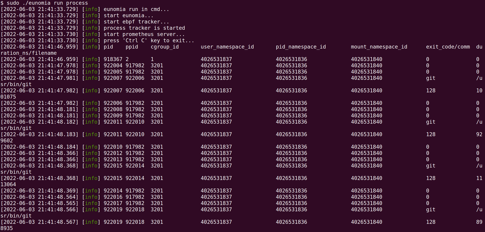
  - 追踪所有process并设置输出格式为csv
    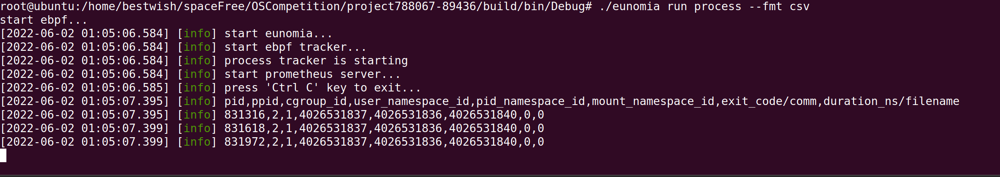
  - 追踪所有和id为7d4cc7108e89的容器有关的进程
    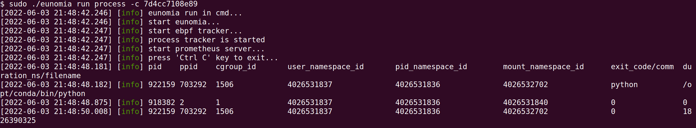
  - 追踪pid为322375的进程，并设置10s后自动退出
    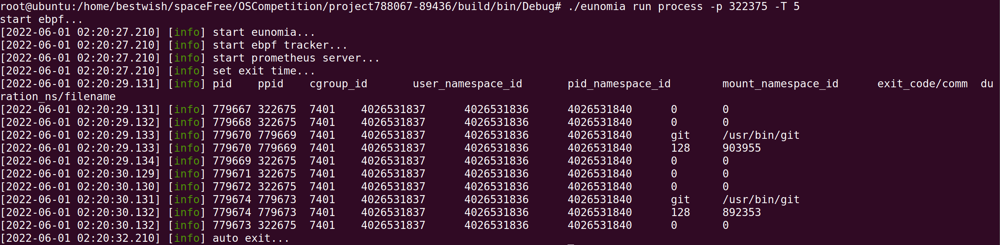
  - 使用toml文件配置追踪参数(toml配置附在结果图后)
    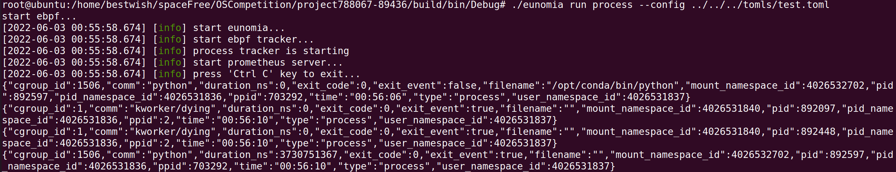
    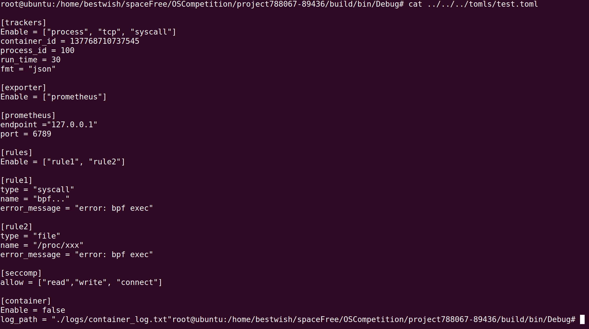
  - 开启process追踪模块的同时开启单独的容器监视模块，并将记录写到指定文件夹
    
    
- tcp模块测试
  - 追踪所有tcp
    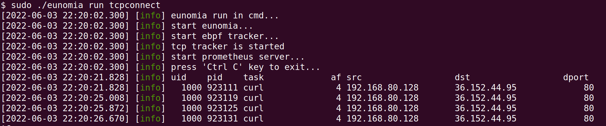
  - 追踪所有tcp并设置输出格式为csv
    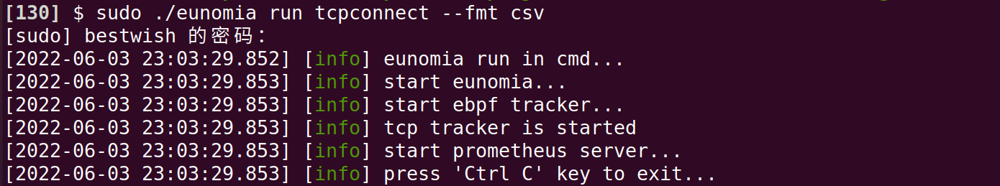
  - 追踪所有和id为7d4cc7108e89的容器有关的进程
    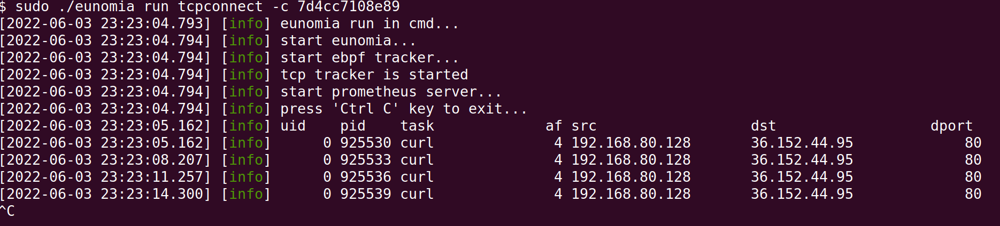
  - 追踪pid为924913的进程，并设置15s后自动退出
    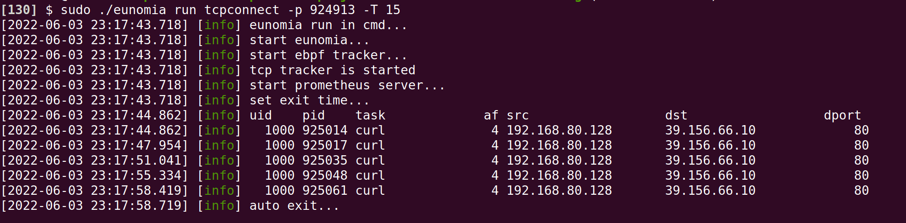
  - 使用toml文件配置追踪参数(toml配置与process相同)
    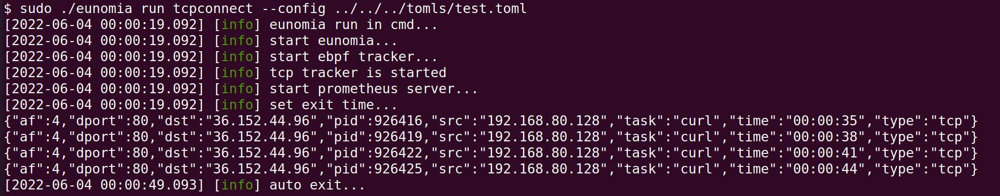
  - 开启process追踪模块的同时开启单独的容器监视模块，并将记录写到指定文件夹
    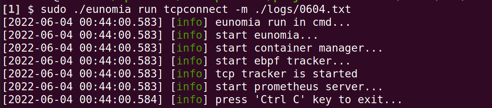
    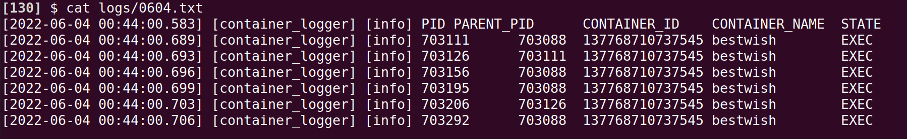
- syscall模块测试
  - 追踪所有syscall
    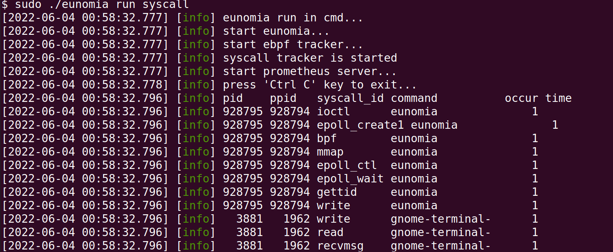  
  - 追踪所有syscall并设置输出格式为csv
    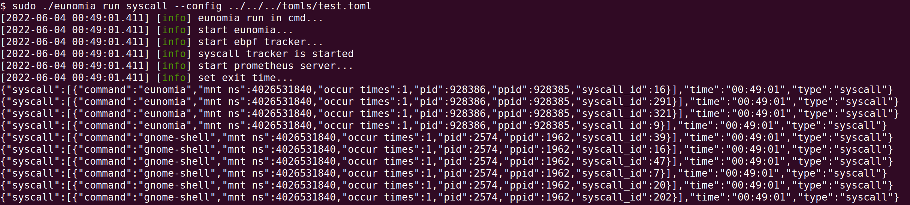
  - 使用toml文件配置追踪参数(toml配置与process相同)
    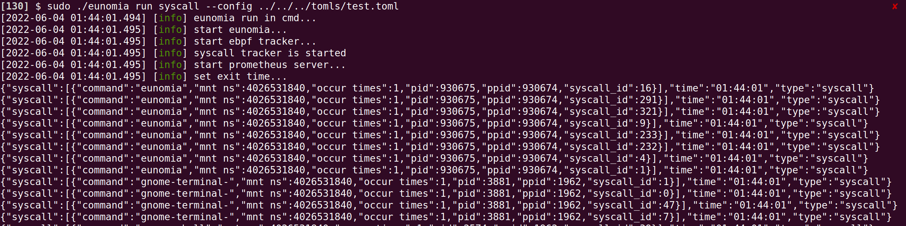
  - 开启syscall追踪模块的同时开启单独的容器监视模块，并将记录写到指定文件夹
    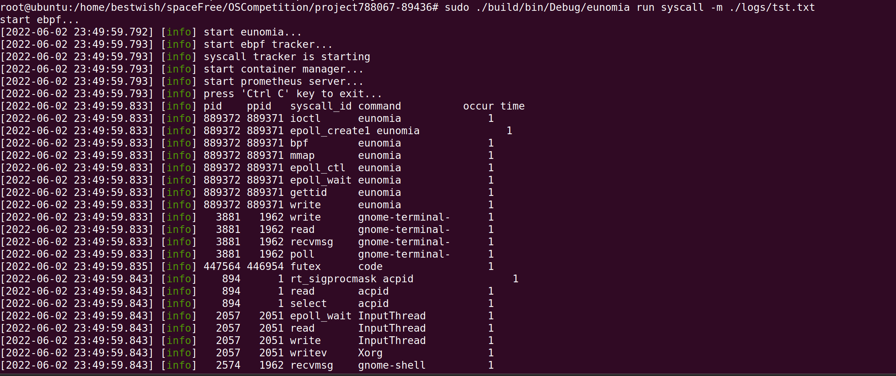
    
- files模块测试
  - 追踪所有文件读写
    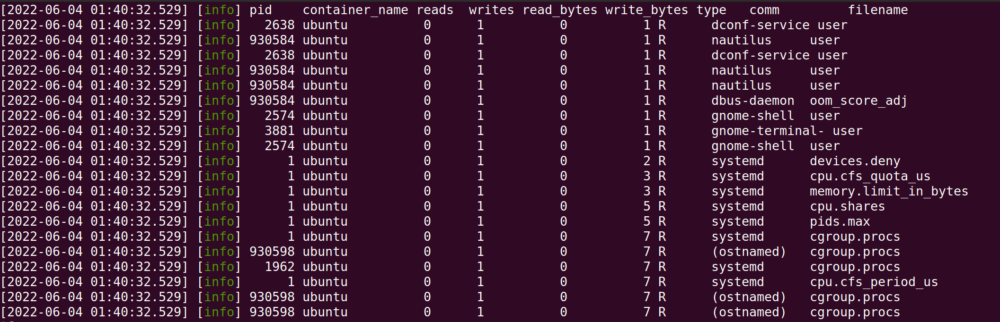  
  - 追踪所有files读写并设置输出格式为json
    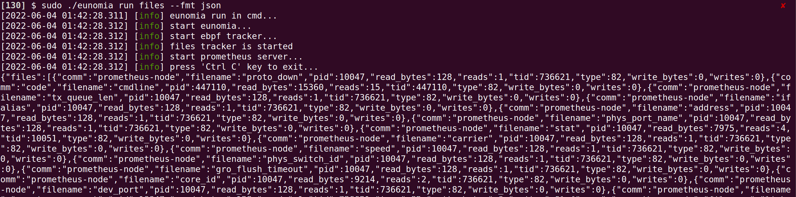
  - 使用toml文件配置追踪参数(toml配置与process相同)
    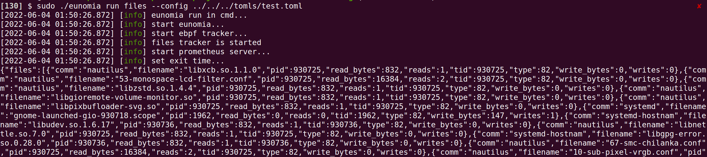
  - 开启files追踪模块的同时开启单独的容器监视模块，并将记录写到指定文件夹
    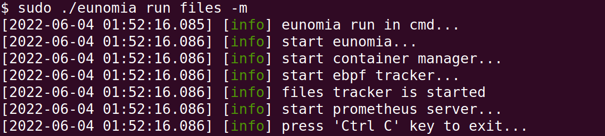
    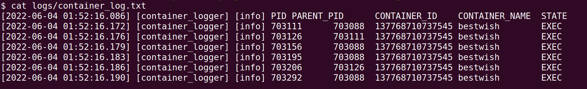


### 7.3. 容器测试情况


### 7.4. 信息可视化测试情况： prometheus and grafana
    
Grafana是一个开源的可视化和分析平台。允许查询、可视化、告警和监控的不同数据，无论数据存储在哪里。简单地说支持多种数据源，提供多种面板、插件来快速将复杂的数据转换为漂亮的图形和可视化的工具，另监控可自定义告警监控规则。Prometheus是高扩展性的监控和报警系统。它采用拉取策略获取指标数据，并规定了获取数据的API，用户可以通过exporter收集系统数据。

Eunomia能够将自定义的BPF跟踪数据导出到prometheus，它基于Prometheus-CPP这个SDK实现了prometheus获取数据的API，prometheus可以通过这些API主动拉取到自定义的BPF跟踪数据。具体来说，我们只需要在对应的tracker中嵌入BPF代码，运行Eunomia就可以实现导出BPF跟踪数据，而这些数据是可以被prometheus主动拉取到的，进而实现BPF跟踪数据的存储、处理和可视化展示。

- prometheus

  - 配置prometheus添加eunomia数据源
   job_name: "prometheus" 
     # metrics_path defaults to '/metrics'
     # scheme defaults to 'http'. 
     static_configs:
       - targets: ["localhost:9090"]
   job_name: "eunomia_node"
     static_configs:
       - targets: ["localhost:8528"] 
  - 从prometheus查看数据源的状态
    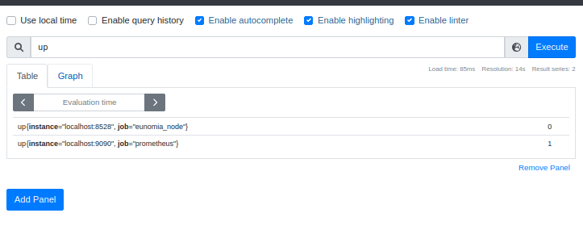
  - 从promethesu查看eunomia暴露的指标列表
  - 从Prometheus查看部分指标的数值分布
    
    
    
- grafana

  - grafana配置从peometheus拉取数据的端口
  
  - grafana部分指标展示效果如下图，左上为文件读操作Bytes监控;左下为系统调用热力
图，方便定位到热点调用路径;右上为文件读操作TOP10;右下为文件写操作TOP10。
  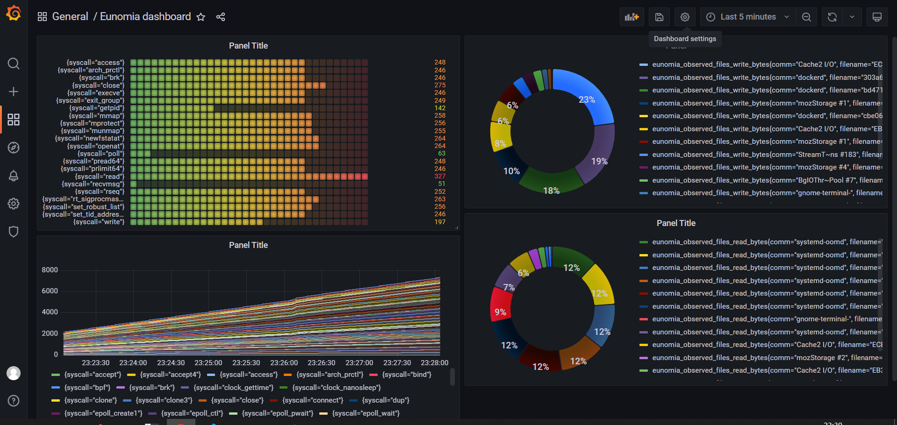
  

### 7.5. CI/持续集成

## 8. 遇到的主要问题和解决方法

### 8.1. 如何设计 ebpf 挂载点
        如何设计挂载点是ebpf程序在书写时首先需要考虑的问题。ebpf程序是事件驱动的，即只有系统中发生了我们预先规定的事件，我们的程序才会被调用。因此，ebpf挂载点的选择直接关系到程序能否在我们需要的场合下被启动。
        我们在选择挂载点时，首先需要明白的是我们需要在什么情况下触发处理函数，然后去寻找合适的挂载点。ebpf的挂载点有多种类型，较为常用的挂载点是`tracepoint`，`k/uprobe`，`lsm`等。
        `tracepoint`是一段静态的代码，以打桩的形式存在于程序源码中，并向外界提供钩子以挂载。一旦处理函数挂载到了钩子上，那么当钩子对应的事件发生时，处理函数就会被调用。由于`tracepoint`使用较为方便，且覆盖面广，ABI也较为稳定，他是我们设计挂载点的一个重要考虑对象。目前Linux已经有1000多个tracepoint可供选择，其支持的所有类型可以在`/sys/kernel/debug/tracing/events/`目录下看到，而至于涉及到的参数格式和返回形式，用户可以使用`cat`命令，查看对应`tracepoint`事件下的format文件得到。如下便是`sched_process_exec`事件的输出格式。
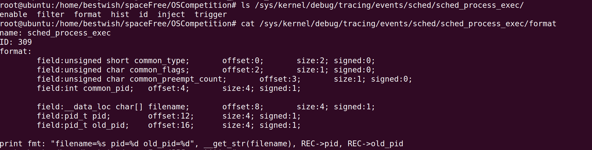
        用户也可以直接访问`tracepoint`的源码获得更多信息。在Linux源码的`./include/trace/events`目录下，用户可以看到Linux中实现tracepoint的源码。  
        `k/uprobe`是Linux提供的，允许用户动态插桩的方式。由于`tracepoint`是静态的，如果用户临时需要对一些其不支持的函数进行追踪，就无法使用`tracepoint`，而`k/uprobe`允许用户事实对内核态/用户态中某条指令进行追踪。用户在指定了该指令的位置并启用`k/uprobe`后，当程序运行到该指令时，内核会自动跳转到我们处理代码，待处理完成后返回到原处。相较于`tracepoint`，`k/uprobe`更为灵活，如果你需要追踪的指令不被`tracepoint`所支持，可以考虑使用`k/uprobe`。  
         `lsm`是Linux内核安全模块的一套框架，其本质也是插桩。相较于`tracepoint`，`lsm`主要在内核安全的相关路径中插入了hook点。因此如果你希望你的代码检测一些和安全相关的内容，可以考虑使用`lsm`。其所有钩子的定义在Linux源码的`./include/linux/lsm_hook_defs.h`中，你可以从中选择初你所需要的hook点。


### 8.2. 如何进行内核态数据过滤和数据综合
        ebpf程序在内核态处理数据有诸多不便，有许多库我们都无法使用，如果遇上的复杂的数据过滤和数据综合，我们需要手动实现很多函数。因此我们认为更为合理的处理方案是将内核态的数据使用ebpf-map传输到用户态，在用户态进行过滤和综合，之后再输出。

### 8.3. 如何定位容器元信息

        在程序开始伊始，我们调用`docker ps -q`命令获得当前所有正在运行的容器ID。之后我们开始遍历这些ID，并对每一个ID调用`docker top id`命令,获得容器中的所有所有进程信息，并且将这些信息以键值对的形式存储到哈希map上。之后我们会在`sched_process_exec`和`sched_process_exit`的两个点挂载基于ebpf的处理函数，捕获进程信息。如果捕获的进程与其父进程存在namespace变化的情况，那么我们就会重复一次开始的工作，判断是否有新的容器产生。如果有，则将其添加到哈希map中。如果其父进程已经存在于哈希map中，那么我们就认为此进程也是一个容器相关进程，也将其存储到哈希map中。在进程退出时，我们则需要检查其是否存在于哈希map中，如果存在则需要将其删除。处理函数的逻辑如下图所示。
        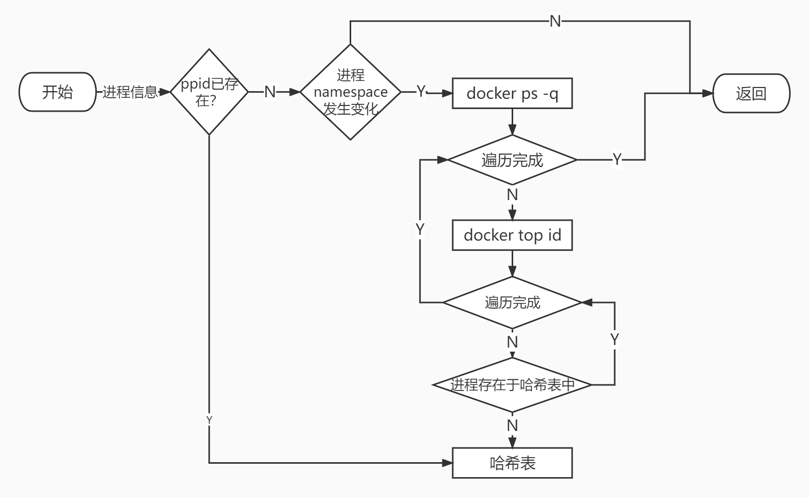


### 8.4. 如何设计支持可扩展性的数据结构

        首先尽可能降低各个模块的耦合性，这样在修改时可以较为方便地完成改动。其次，在最初设计时为未来可能的扩展预留位置。

## 9. 分工和协作


## 10. 提交仓库目录和文件描述


### 10.1. 项目仓库目录结构

          本仓库的主要目录结构如下所示：   

  ```
  ├─bpftools       - ebpf内核态代码
  │  ├─container  
  │  ├─files  
  │  ├─ipc  
  │  ├─process  
  │  ├─seccomp  
  │  ├─syscall  
  │  └─tcp  
  ├─cmake  
  ├─doc           - 项目开发文档
  │  ├─develop_doc   
  │  ├─imgs  
  │  └─tutorial  
  ├─include       
  │   └─eunomia   - 项目主要头文件
  │       └─model  
  ├─libbpf  
  ├─src           - 项目主要代码
  ├─test          - 项目单元测试和集成测试
  │   └─src  
  ├─third_party  
  │       └─prometheus-cpp  
  ├─tools  
  └─vmlinux  
  ```
### 10.2. 各目录及其文件描述
#### 10.2.1. bpftools目录

本目录内的所有文件均为基于ebpf开发的内核态监视代码，
共有7个子目录，子目录名表示了子目录内文件所实现的模块。比如process子目录代表了其中的文件
主要实现了进程追踪方面的ebpf内核态代码，其他子目录同理。

#### 10.2.2. cmake目录

本项目使用cmake进行编译，本目录中的所有文件都是本项目cmake
的相关配置文件。

#### 10.2.3. doc目录

本目录内的所有文件为与本项目相关的文档，其中develop_doc目录为开发文档，其中记录了本项目开发的各种详细信息。tutorial目录为本项目为所有想进行ebpf开发的同学所设计的
教学文档，其中会提供一些入门教程，方便用户快速上手。imgs目录为开发文档和教学文档中所需要的一些
图片。

#### 10.2.4. include目录

本项目中用户态代码的头文件均会存放在本目录下。eunomia子目录中存放的
是各个模块和所需要的头文件，eunomia下的model子目录存放的是各个头文件中的一些必要结构体经过抽象后
的声明。

#### 10.2.5. libbpf目录

该目录为libbpf-bootstrap框架中自带的libbpf头文件。

#### 10.2.6. src目录

该目录主要记录了各个模块的用户态代码cpp文件。

#### 10.2.7. test目录

本目录主要包括了对各个模块的测试代码。

#### 10.2.8. third_party目录

本模块为Prometheus库所需的依赖。

#### 10.2.9. tools目录

本模块主要包含了一些项目所需要的脚本。

#### 10.2.10. vmlinux目录

        本目录主要是libbpf-bootstrap框架自带的vmlinux头文件。

## 11. 比赛收获

### 11.1. 郑昱笙同学


### 11.2. 张典典同学

### 11.3. 濮雯旭同学


## 12. 附录

### 12.1. Prometheus 观测指标

## 13. Process Metrics

### 13.1. Metrics List
| **Metric Name** | **Type** | **Description** |
| --- | --- | --- |
| `eunomia_observed_process_start` | Counter | Number of observed process start |
| `eunomia_observed_process_end` | Counter | Number of observed process end |

### 13.2. Labels List
| **Label Name** | **Example** | **Notes** |
| --- | --- | --- |
| `node` | worker-1 | Node name represented in Kubernetes cluster |
| `pod` | default | Name of the pod |
| `mount_namespace` | 46289463245 | Mount Namespace of the pod |
| `container_name` | Ubuntu | The name of the container |
| `container_id` | 1a2b3c4d5e6f | The shorten container id which contains 12 characters |
| `pid` | 12344 | The pid of the running process |
| `comm` | ps | The command of the running process |
| `filename` | /usr/bin/ps | The exec file name |
| `exit_code` | 0 | The exit code |
| `duration_ms` | 375 | The running time |


## 14. files Metrics

### 14.1. Metrics List
| **Metric Name** | **Type** | **Description** |
| --- | --- | --- |
| `eunomia_observed_files_read_count` | Counter | Number of observed files read count |
| `eunomia_observed_files_write_count` | Counter | Number of observed files write count |
| `eunomia_observed_files_write_bytes` | Counter | Number of observed files read bytes |
| `eunomia_observed_files_read_bytes` | Counter | Number of observed files write bytes |

### 14.2. Labels List
| **Label Name** | **Example** | **Notes** |
| --- | --- | --- |
| `comm` | eunomia | The command of the running process |
| `filename` | online | The exec file name |
| `pid` | 7686 | The pid of the running proces |
| `type` | 82 | Type of comm |

## 15. Tcp Connect Metrics

### 15.1. Metrics List
| **Metric Name** | **Type** | **Description** |
| --- | --- | --- |
| `eunomia_observed_tcp_v4_count` | Counter | Number of observed tcp v4 connect count |
| `eunomia_observed_tcp_v6_count` | Counter | Number of observed tcp v6 connect count |

### 15.2. Labels List
| **Label Name** | **Example** | **Notes** |
| --- | --- | --- |
| `dst` | 127.0.0.1 | Destination of TCP connection |
| `pid` | 4036 | The pid of the running proces |
| `port` | 20513 | TCP exposed ports |
| `src` | 127.0.0.1 | Resources of TCP connection |
| `container_id` | 1a2b3c4d5e6f | The shorten container id which contains 12 characters |
| `task` | Socket Thread | The task of the running process |
| `uid` | 1000 | The uid of the running proces |


## 16. Syscall Metrics

### 16.1. Metrics List
| **Metric Name** | **Type** | **Description** |
| --- | --- | --- |
| `eunomia_observed_syscall_count` | Counter | Number of observed syscall count |

### 16.2. Labels List
| **Label Name** | **Example** | **Notes** |
| --- | --- | --- |
| `comm` | firefox | The command of the running process |
| `pid` | 4036 | The pid of the running proces |
| `syscall` | writev | Name of the syscall called by running process |

## 17. Security Event Metrics

### 17.1. Metrics List
| **Metric Name** | **Type** | **Description** |
| --- | --- | --- |
| `eunomia_seccurity_warn_count` | Counter | Number of observed security warnings |
| `eunomia_seccurity_event_count` | Counter | Number of observed security event |
| `eunomia_seccurity_alert_count` | Counter | Number of observed security alert |

### 17.2. Labels List
| **Label Name** | **Example** | **Notes** |
| --- | --- | --- |
| `comm` | firefox | The command of the running process |
| `pid` | 4036 | The pid of the running proces |
| `syscall` | writev | Name of the syscall called by running process |


## 18. Service Metrics

Service metrics are generated from the eunomia server-side events, which are used to show the quality of eunomia own service.

### 18.1. Metrics List
| **Metric Name** | **Type** | **Description** |
| --- | --- | --- |
| `eunomia_run_tracker_total` | Counter | Total number of running trackers |

### 18.2. Labels List
| **Label Name** | **Example** | **Notes** |
| --- | --- | --- |
| `node` | worker-1 | Node name represented in Kubernetes cluster |
| `namespace` | default | Namespace of the pod |
| `container` | api-container | The name of the container |
| `container_id` | 1a2b3c4d5e6f | The shorten container id which contains 12 characters |
| `ip` | 10.1.11.23 | The IP address of the entity |
| `port` | 80 | The listening port of the entity |

## 19. PromQL Example

Here are some examples of how to use these metrics in Prometheus, which can help you understand them faster.

| **Describe** | **PromQL** |
| --- | --- |
| Request counts | `sum(increase(eunomia_observed_tcp_v4_count{}[1m])) by(task)` |
| read rate | `sum(rate(eunomia_observed_files_read_bytes{}[1m])) by(comm)` |
| write rate | `sum(rate(eunomia_observed_files_write_count{}[1m])) by(comm)` |


### 19.1. 命令行工具帮助信息
