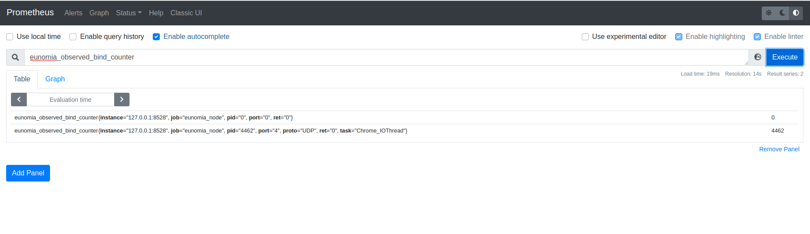

# ebpf 追踪器文档详解与 ebpf 源码分析

## Eunomia - Bindsnoop: 使用基于 eBPF 的云原生监控工具监控 socket 端口绑定事件

### 背景

Bindsnoop 会跟踪操作 socket 端口绑定的内核函数，并且在可能会影响端口绑定的系统调用发生之前，打印
现有的 socket 选项。

### 实现原理

Bindsnoop 通过kprobe实现。其主要挂载点为 `inet_bind` 和 `inet6_bind`。`inet_bind` 为处理 IPV4 类型
socket 端口绑定系统调用的接口，`inet6_bind` 为处理IPV6类型 socket 端口绑定系统调用的接口。
```c
SEC("kprobe/inet_bind")
int BPF_KPROBE(ipv4_bind_entry, struct socket *socket)
{
	if (filter_cg && !bpf_current_task_under_cgroup(&cgroup_map, 0))
		return 0;

	return probe_entry(ctx, socket);
}
SEC("kretprobe/inet_bind")

int BPF_KRETPROBE(ipv4_bind_exit)
{
	if (filter_cg && !bpf_current_task_under_cgroup(&cgroup_map, 0))
		return 0;

	return probe_exit(ctx, 4);
}

SEC("kprobe/inet6_bind")
int BPF_KPROBE(ipv6_bind_entry, struct socket *socket)
{
	if (filter_cg && !bpf_current_task_under_cgroup(&cgroup_map, 0))
		return 0;

	return probe_entry(ctx, socket);
}

SEC("kretprobe/inet6_bind")
int BPF_KRETPROBE(ipv6_bind_exit)
{
	if (filter_cg && !bpf_current_task_under_cgroup(&cgroup_map, 0))
		return 0;

	return probe_exit(ctx, 6);
}
```
当系统试图进行socket端口绑定操作时, kprobe挂载的处理函数会被触发。在进入绑定函数时，`probe_entry`会先被
调用，它会以 tid 为主键将 socket 信息存入 map 中。
```c
static int probe_entry(struct pt_regs *ctx, struct socket *socket)
{
	__u64 pid_tgid = bpf_get_current_pid_tgid();
	__u32 pid = pid_tgid >> 32;
	__u32 tid = (__u32)pid_tgid;

	if (target_pid && target_pid != pid)
		return 0;

	bpf_map_update_elem(&sockets, &tid, &socket, BPF_ANY);
	return 0;
};
```
在执行完绑定函数后，`probe_exit`函数会被调用。该函数会读取tid对应的socket信息，将其和其他信息一起
写入 event 结构体并输出到用户态。
```c
struct bind_event {
	unsigned __int128 addr;
	__u64 ts_us;
	__u32 pid;
	__u32 bound_dev_if;
	int ret;
	__u16 port;
	__u16 proto;
	__u8 opts;
	__u8 ver;
	char task[TASK_COMM_LEN];
};
```
当用户停止该工具时，其用户态代码会读取存入的数据并按要求打印。

### Eunomia中使用方式




### 总结
Bindsnoop 通过 kprobe 挂载点，实现了对 socket 端口的监视，增强了 Eunomia 的应用范围。


## Eunomia - Biolatency: 使用基于 eBPF 的云原生监控工具统计系统中发生的I/O事件

### 背景

Biolatency 可以统计在该工具运行后系统中发生的I/O事件个数，并且计算I/O事件在不同时间段内的分布情况，以
直方图的形式展现给用户。

### 实现原理

Biolatency 主要通过 tracepoint 实现，其在 `block_rq_insert`, `block_rq_issue`, 
`block_rq_complete` 挂载点下设置了处理函数。在 `bock_rq_insert` 和 `block_rq_issue` 挂载点下，
Biolatency 会将IO操作发生时的request queue和时间计入map中。
```c
int trace_rq_start(struct request *rq, int issue)
{
	if (issue && targ_queued && BPF_CORE_READ(rq->q, elevator))
		return 0;

	u64 ts = bpf_ktime_get_ns();

	if (filter_dev) {
		struct gendisk *disk = get_disk(rq);
		u32 dev;

		dev = disk ? MKDEV(BPF_CORE_READ(disk, major),
				BPF_CORE_READ(disk, first_minor)) : 0;
		if (targ_dev != dev)
			return 0;
	}
	bpf_map_update_elem(&start, &rq, &ts, 0);
	return 0;
}

SEC("tp_btf/block_rq_insert")
int block_rq_insert(u64 *ctx)
{
	if (filter_cg && !bpf_current_task_under_cgroup(&cgroup_map, 0))
		return 0;
    
	if (LINUX_KERNEL_VERSION < KERNEL_VERSION(5, 11, 0))
		return trace_rq_start((void *)ctx[1], false);
	else
		return trace_rq_start((void *)ctx[0], false);
}

SEC("tp_btf/block_rq_issue")
int block_rq_issue(u64 *ctx)
{
	if (filter_cg && !bpf_current_task_under_cgroup(&cgroup_map, 0))
		return 0;
    
	if (LINUX_KERNEL_VERSION < KERNEL_VERSION(5, 11, 0))
		return trace_rq_start((void *)ctx[1], true);
	else
		return trace_rq_start((void *)ctx[0], true);
}

```
在block_rq_complete 挂载点下，Biolatency 会根据 request queue 从map中读取
上一次操作发生的时间，然后计算与当前时间的差值来判断其在直方图中存在的区域，将该区域内的IO操作
计数加一。
```c
SEC("tp_btf/block_rq_complete")
int BPF_PROG(block_rq_complete, struct request *rq, int error,
	unsigned int nr_bytes)
{
	if (filter_cg && !bpf_current_task_under_cgroup(&cgroup_map, 0))
		return 0;

	u64 slot, *tsp, ts = bpf_ktime_get_ns();
	struct hist_key hkey = {};
	struct hist *histp;
	s64 delta;

	tsp = bpf_map_lookup_elem(&start, &rq);
	if (!tsp)
		return 0;
	delta = (s64)(ts - *tsp);
	if (delta < 0)
		goto cleanup;

	if (targ_per_disk) {
		struct gendisk *disk = get_disk(rq);

		hkey.dev = disk ? MKDEV(BPF_CORE_READ(disk, major),
					BPF_CORE_READ(disk, first_minor)) : 0;
	}
	if (targ_per_flag)
		hkey.cmd_flags = rq->cmd_flags;

	histp = bpf_map_lookup_elem(&hists, &hkey);
	if (!histp) {
		bpf_map_update_elem(&hists, &hkey, &initial_hist, 0);
		histp = bpf_map_lookup_elem(&hists, &hkey);
		if (!histp)
			goto cleanup;
	}

	if (targ_ms)
		delta /= 1000000U;
	else
		delta /= 1000U;
	slot = log2l(delta);
	if (slot >= MAX_SLOTS)
		slot = MAX_SLOTS - 1;
	__sync_fetch_and_add(&histp->slots[slot], 1);

cleanup:
	bpf_map_delete_elem(&start, &rq);
	return 0;
}

```
当用户中止程序时，用户态程序会读取直方图map中的数据，并打印呈现。

### Eunomia中使用方式

TODO

### 总结
Biolatency 通过 tracepoint 挂载点实现了对IO事件个数的统计，并且能以直方图的
形式进行展现，可以方便开发者了解系统I/O事件情况。

## Eunomia - Biopattern: 使用基于 eBPF 的云原生监控工具统计随机/顺序磁盘 I/O

### 背景

Biopattern 可以统计随机/顺序磁盘I/O次数的比例。

### 实现原理

Biopattern 的ebpf代码在 `tracepoint/block/block_rq_complete` 挂载点下实现。在磁盘完成IO请求
后，程序会经过此挂载点。Biopattern 内部存有一张以设备号为主键的哈希表，当程序经过挂载点时, Biopattern
会获得操作信息，根据哈希表中该设备的上一次操作记录来判断本次操作是随机IO还是顺序IO，并更新操作计数。

```c
SEC("tracepoint/block/block_rq_complete")
int handle__block_rq_complete(struct trace_event_raw_block_rq_complete *ctx)
{
	sector_t *last_sectorp,  sector = ctx->sector;
	struct counter *counterp, zero = {};
	u32 nr_sector = ctx->nr_sector;
	dev_t dev = ctx->dev;

	if (targ_dev != -1 && targ_dev != dev)
		return 0;

	counterp = bpf_map_lookup_or_try_init(&counters, &dev, &zero);
	if (!counterp)
		return 0;
	if (counterp->last_sector) {
		if (counterp->last_sector == sector)
			__sync_fetch_and_add(&counterp->sequential, 1);
		else
			__sync_fetch_and_add(&counterp->random, 1);
		__sync_fetch_and_add(&counterp->bytes, nr_sector * 512);
	}
	counterp->last_sector = sector + nr_sector;
	return 0;
}

```
当用户停止Biopattern后，用户态程序会读取获得的计数信息，并将其输出给用户。

### Eunomia中使用方式

尚未集成

### 总结

Biopattern 可以展现随机/顺序磁盘I/O次数的比例，对于开发者把握整体I/O情况有较大帮助。

## Eunomia - Biosnoop: 使用基于 eBPF 的云原生监控工具监控块设备 I/O
### 背景

Biosnoop 会追踪并打印磁盘的 I/O 操作。

### 实现原理

Biosnoop 在 `block_rq_insert`, `block_rq_issue` 和 `block_rq_complete` 三个 tracepoint 下
挂载了处理函数。当磁盘I/O操作发生时，`block_rq_insert` 和 `block_rq_issue` 两个挂载点下的处理函数
会以该操作对应的 request queue 为键，其对应的操作类型和发生时间为值，插入哈希表中。
```c
SEC("tp_btf/block_rq_insert")
int BPF_PROG(block_rq_insert)
{
	if (LINUX_KERNEL_VERSION > KERNEL_VERSION(5, 10, 0))
		return trace_rq_start((void *)ctx[0], true);
	else
		return trace_rq_start((void *)ctx[1], true);
}

SEC("tp_btf/block_rq_issue")
int BPF_PROG(block_rq_issue)
{
	if (LINUX_KERNEL_VERSION > KERNEL_VERSION(5, 10, 0))
		return trace_rq_start((void *)ctx[0], false);
	else
		return trace_rq_start((void *)ctx[1], false);
}

```
在 fentry/blk_account_io_start 和 kprobe/blk_account_io_merge_bio 两个挂载点下，
Biosnoop 会统计进程信息，并以 request queue 为键，pid 和 command 为值，存入另一张哈希表中。
```c
static __always_inline
int trace_pid(struct request *rq)
{
	u64 id = bpf_get_current_pid_tgid();
	struct piddata piddata = {};

	piddata.pid = id;
	bpf_get_current_comm(&piddata.comm, sizeof(&piddata.comm));
	bpf_map_update_elem(&infobyreq, &rq, &piddata, 0);
	return 0;
}

SEC("fentry/blk_account_io_start")
int BPF_PROG(blk_account_io_start, struct request *rq)
{
	return trace_pid(rq);
}
SEC("kprobe/blk_account_io_merge_bio")
int BPF_KPROBE(blk_account_io_merge_bio, struct request *rq)
{
	return trace_pid(rq);
}

```
在完成I/O操作后, block_rq_complete 挂载点下的处理函数会从两张哈希表中
根据 request queue 获得对应的信息并输出。
```c
SEC("tp_btf/block_rq_complete")
int BPF_PROG(block_rq_complete, struct request *rq, int error,
	     unsigned int nr_bytes)
{
	u64 slot, ts = bpf_ktime_get_ns();
	struct piddata *piddatap;
	struct event event = {};
	struct stage *stagep;
	s64 delta;

	stagep = bpf_map_lookup_elem(&start, &rq);
	if (!stagep)
		return 0;
	delta = (s64)(ts - stagep->issue);
	if (delta < 0)
		goto cleanup;
	piddatap = bpf_map_lookup_elem(&infobyreq, &rq);
	if (!piddatap) {
		event.comm[0] = '?';
	} else {
		__builtin_memcpy(&event.comm, piddatap->comm,
				sizeof(event.comm));
		event.pid = piddatap->pid;
	}
	event.delta = delta;
	if (targ_queued && BPF_CORE_READ(rq, q, elevator)) {
		if (!stagep->insert)
			event.qdelta = -1; /* missed or don't insert entry */
		else
			event.qdelta = stagep->issue - stagep->insert;
	}
	event.ts = ts;
	event.sector = rq->__sector;
	event.len = rq->__data_len;
	event.cmd_flags = rq->cmd_flags;
	event.dev = stagep->dev;
	bpf_perf_event_output(ctx, &events, BPF_F_CURRENT_CPU, &event,
			sizeof(event));

cleanup:
	bpf_map_delete_elem(&start, &rq);
	bpf_map_delete_elem(&infobyreq, &rq);
	return 0;
}

```

### Eunomia中使用方式

TODO

### 总结

Biosnoop 通过将 tracepoint, kprobe 和 fentry 三类挂载点结合，实现了对磁盘I/O操作的统计。

## Eunomia - Biostacks: 使用基于 eBPF 的云原生监控工具监控内核 I/O 操作耗时


### 背景
由于有些磁盘I/O操作不是直接由应用发起的，比如元数据读写，因此有些直接捕捉磁盘I/O操作信息可能
会有一些无法解释的I/O操作发生。为此，Biostacks 会直接追踪内核中初始化I/O操作的函数，并将磁
盘I/O操作耗时以直方图的形式展现。

### 实现原理
Biostacks 的挂载点为 `fentry/blk_account_io_start`, `kprobe/blk_account_io_merge_bio` 和
`fentry/blk_account_io_done`。`fentry/blk_account_io_start` 和 `kprobe/blk_account_io_merge_bio`
挂载点均时内核需要发起I/O操作中必经的初始化路径。在经过此处时，Biostacks 会根据 request queue ，将数据存入
map中。
```c
static __always_inline
int trace_start(void *ctx, struct request *rq, bool merge_bio)
{
	struct internal_rqinfo *i_rqinfop = NULL, i_rqinfo = {};
	struct gendisk *disk = BPF_CORE_READ(rq, rq_disk);
	dev_t dev;

	dev = disk ? MKDEV(BPF_CORE_READ(disk, major),
			BPF_CORE_READ(disk, first_minor)) : 0;
	if (targ_dev != -1 && targ_dev != dev)
		return 0;

	if (merge_bio)
		i_rqinfop = bpf_map_lookup_elem(&rqinfos, &rq);
	if (!i_rqinfop)
		i_rqinfop = &i_rqinfo;

	i_rqinfop->start_ts = bpf_ktime_get_ns();
	i_rqinfop->rqinfo.pid = bpf_get_current_pid_tgid();
	i_rqinfop->rqinfo.kern_stack_size =
		bpf_get_stack(ctx, i_rqinfop->rqinfo.kern_stack,
			sizeof(i_rqinfop->rqinfo.kern_stack), 0);
	bpf_get_current_comm(&i_rqinfop->rqinfo.comm,
			sizeof(&i_rqinfop->rqinfo.comm));
	i_rqinfop->rqinfo.dev = dev;

	if (i_rqinfop == &i_rqinfo)
		bpf_map_update_elem(&rqinfos, &rq, i_rqinfop, 0);
	return 0;
}

SEC("fentry/blk_account_io_start")
int BPF_PROG(blk_account_io_start, struct request *rq)
{
	return trace_start(ctx, rq, false);
}

SEC("kprobe/blk_account_io_merge_bio")
int BPF_KPROBE(blk_account_io_merge_bio, struct request *rq)
{
	return trace_start(ctx, rq, true);
}

```
在I/O操作完成后，fentry/blk_account_io_done 下的处理函数会从map中读取之前存入的信息，根据当下时间
记录时间差值，得到I/O操作的耗时信息，并更新到存储直方图数据的map中。
```c
SEC("fentry/blk_account_io_done")
int BPF_PROG(blk_account_io_done, struct request *rq)
{
	u64 slot, ts = bpf_ktime_get_ns();
	struct internal_rqinfo *i_rqinfop;
	struct rqinfo *rqinfop;
	struct hist *histp;
	s64 delta;

	i_rqinfop = bpf_map_lookup_elem(&rqinfos, &rq);
	if (!i_rqinfop)
		return 0;
	delta = (s64)(ts - i_rqinfop->start_ts);
	if (delta < 0)
		goto cleanup;
	histp = bpf_map_lookup_or_try_init(&hists, &i_rqinfop->rqinfo, &zero);
	if (!histp)
		goto cleanup;
	if (targ_ms)
		delta /= 1000000U;
	else
		delta /= 1000U;
	slot = log2l(delta);
	if (slot >= MAX_SLOTS)
		slot = MAX_SLOTS - 1;
	__sync_fetch_and_add(&histp->slots[slot], 1);

cleanup:
	bpf_map_delete_elem(&rqinfos, &rq);
	return 0;
}
```
在用户输入程序退出指令后，其用户态程序会将直方图map中的信息读出并打印。

### Eunomia中使用方式

TODO

### 总结

Biostacks 从源头实现了对I/O操作的追踪，可以极大的方便我们掌握磁盘I/O情况。

## Eunomia - Bitesize: 使用基于 eBPF 的云原生监控工具监控块设备 I/O

### 背景

为了能更好的获得 I/O 操作需要的磁盘块大小相关信息，Bitesize 工具被开发。它可以在启动后追踪
不同进程所需要的块大小，并以直方图的形式显示分布

### 实现原理

Biteszie 在 `block_rq_issue` 追踪点下挂在了处理函数。当进程对磁盘发出了块 I/O 请求操作时，
系统会经过此挂载点，此时处理函数或许请求的信息，将其存入对应的map中。
```c
static int trace_rq_issue(struct request *rq)
{
	struct hist_key hkey;
	struct hist *histp;
	u64 slot;

	if (filter_dev) {
		struct gendisk *disk = get_disk(rq);
		u32 dev;

		dev = disk ? MKDEV(BPF_CORE_READ(disk, major),
				BPF_CORE_READ(disk, first_minor)) : 0;
		if (targ_dev != dev)
			return 0;
	}
	bpf_get_current_comm(&hkey.comm, sizeof(hkey.comm));
	if (!comm_allowed(hkey.comm))
		return 0;

	histp = bpf_map_lookup_elem(&hists, &hkey);
	if (!histp) {
		bpf_map_update_elem(&hists, &hkey, &initial_hist, 0);
		histp = bpf_map_lookup_elem(&hists, &hkey);
		if (!histp)
			return 0;
	}
	slot = log2l(rq->__data_len / 1024);
	if (slot >= MAX_SLOTS)
		slot = MAX_SLOTS - 1;
	__sync_fetch_and_add(&histp->slots[slot], 1);

	return 0;
}

SEC("tp_btf/block_rq_issue")
int BPF_PROG(block_rq_issue)
{
	if (LINUX_KERNEL_VERSION >= KERNEL_VERSION(5, 11, 0))
		return trace_rq_issue((void *)ctx[0]);
	else
		return trace_rq_issue((void *)ctx[1]);
}
```

当用户发出中止工具的指令后，其用户态代码会将map中存储的数据读出并逐进程的展示追踪结果

### Eunomia中使用方式

TODO

### 总结

Bitesize 以进程为粒度，使得开发者可以更好的掌握程序对磁盘 I/O 的请求情况。

## Eunomia - capable: 使用基于 eBPF 的云原生监控工具监控 Capabilities 机制检查

### 背景

`Capabilities` 机制是在 Linux 内核 2.2 之后引入的一种功能组划分机制。当线程需要执行某样操作时，
内核便会对其检查，该机制可以避免普通线程越级操作，影响内核。因此，对 capability 检查的追踪可以让
开发者更好的掌握系统中线程的操作情况。Capable 工具通过追踪内核中 `cap_capable()` 函
数，实现了对于 capability 检查的追踪。

### 实现原理

Capable 在 `kprobe/cap_capable` 挂载点下挂载了执行函数。当`cap_capable()` 函数被
调用时，该执行函数便会运行，获取调用线程的信息。
```c
SEC("kprobe/cap_capable")
int BPF_KPROBE(kprobe__cap_capable, const struct cred *cred, struct user_namespace *targ_ns, int cap, int cap_opt)
{
  __u32 pid;
  __u64 pid_tgid;
  struct cap_key_t i_key;

  if (filter_cg && !bpf_current_task_under_cgroup(&cgroup_map, 0))
    return 0;

  pid_tgid = bpf_get_current_pid_tgid();
  pid = pid_tgid >> 32;

  if (pid == my_pid)
    return 0;

  if (targ_pid != -1 && targ_pid != pid)
    return 0;

  struct cap_event event = {};
  event.pid = pid;
  event.tgid = pid_tgid;
  event.cap = cap;
  event.uid = bpf_get_current_uid_gid();
  bpf_get_current_comm(&event.task, sizeof(event.task));

  if (LINUX_KERNEL_VERSION >= KERNEL_VERSION(5, 1, 0))
  {
    event.audit = (cap_opt & 0b10) == 0;
    event.insetid = (cap_opt & 0b100) != 0;
  }
  else
  {
    event.audit = cap_opt;
    event.insetid = -1;
  }

  if (unique_type)
  {
    struct unique_key key = { .cap = cap };
    if (unique_type == UNQ_CGROUP)
      key.cgroupid = bpf_get_current_cgroup_id();
    else
      key.tgid = pid_tgid;

    if (bpf_map_lookup_elem(&seen, &key) != NULL)
      return 0;

    u64 zero = 0;
    bpf_map_update_elem(&seen, &key, &zero, 0);
  }

  if (kernel_stack || user_stack)
  {
    i_key.pid = pid;
    i_key.tgid = pid_tgid;

    i_key.kern_stack_id = i_key.user_stack_id = -1;
    if (user_stack)
      i_key.user_stack_id = bpf_get_stackid(ctx, &stackmap, BPF_F_USER_STACK);
    if (kernel_stack)
      i_key.kern_stack_id = bpf_get_stackid(ctx, &stackmap, 0);

    bpf_map_update_elem(&info, &i_key, &event, BPF_NOEXIST);
  }
  bpf_perf_event_output(ctx, &events, BPF_F_CURRENT_CPU, &event, sizeof(event));

  return 0;
}
```
在处理程序中，Capable会先读取各种基本信息，比如`tid`, `tgid`, `comm`等信息。
之后，他还会读取capable事件在内核栈中的路径，以及调用线程的`cgroupid`等额外信息。
用户可以根据需要，在命令行中输入不同的参数，使得Capable展现不同的数据。

### Eunomia中使用方式


### 总结

Capable 工具可以在内核的 capability check 环节捕获调用线程的信息并进行呈现，
这使得使用者可以对内核安全由更好的掌握。

## Eunomia - Funclatency: 使用基于 eBPF 的云原生监控工具监控内核函数耗时

### 背景

快速便捷地掌握某个内核函数在系统中执行的耗时可以帮助开发者们更好地优化程序，写出更
高效的代码。在过去这个事情是一个繁琐的事情，用户往往需要自行添加代码进行打点计时，
而 `Funclatency` 工具通过ebpf技术，快速地实现了对函数耗时的追踪。

### 实现原理

`Funclatency` 定义了 kprobe 和 kretprobe， 分别作用于用户指定的函数被
执行前和退出后。当调用了函数时，`Funclatency` 会进行打点计时操作，将pid和时
间点数据存入map中。在函数返回时，`Funclatency` 会再进行一次打点计时操作，根据pid
从map中找到对应的进入时间，通过计算差值得到函数的执行时长。
```c
SEC("kprobe/dummy_kprobe")
int BPF_KPROBE(dummy_kprobe)
{
	u64 id = bpf_get_current_pid_tgid();
	u32 tgid = id >> 32;
	u32 pid = id;
	u64 nsec;

	if (filter_cg && !bpf_current_task_under_cgroup(&cgroup_map, 0))
		return 0;

	if (targ_tgid && targ_tgid != tgid)
		return 0;
	nsec = bpf_ktime_get_ns();
	bpf_map_update_elem(&starts, &pid, &nsec, BPF_ANY);

	return 0;
}

SEC("kretprobe/dummy_kretprobe")
int BPF_KRETPROBE(dummy_kretprobe)
{
	u64 *start;
	u64 nsec = bpf_ktime_get_ns();
	u64 id = bpf_get_current_pid_tgid();
	u32 pid = id;
	u64 slot, delta;

	if (filter_cg && !bpf_current_task_under_cgroup(&cgroup_map, 0))
		return 0;

	start = bpf_map_lookup_elem(&starts, &pid);
	if (!start)
		return 0;

	delta = nsec - *start;

	switch (units) {
	case USEC:
		delta /= 1000;
		break;
	case MSEC:
		delta /= 1000000;
		break;
	}

	slot = log2l(delta);
	if (slot >= MAX_SLOTS)
		slot = MAX_SLOTS - 1;
	__sync_fetch_and_add(&hist[slot], 1);

	return 0;
}

```

在得到数据后，`Funclatency` 会将在内核态对数据进行预处理，存入对应的直方图
map中。当用户中止程序时，`Funclatency` 会以直方图的形式将该函数的耗时分布
展现出来。

### Eunomia中使用方式

TODO

### 总结

`Funclatency` 使得开发者非常方便地实现对某个函数的耗时监控，从而更好地对程序
进行优化。

## Eunomia - llcstat: 使用基于 eBPF 的云原生监控工具监控 cache miss 和 cache reference

### 背景

为了能更好地优化程序性能，开发者有时需要考虑如何更好地减少cache miss的发生。
但是程序到底可能发生多少次cache miss这是一个难以回答的问题。`llcstat` 通过
ebpf技术，实现了对 cache miss 和 cache reference 的准确追踪，可以极大方便开发者
调试程序，优化性能。

### 实现原理

`llcstat` 引入了linux中的 `perf_event` 机制，程序在用户态载入的时候，
会将现有的c `perf_event` attach到指定的位置。
```c
	if (open_and_attach_perf_event(PERF_COUNT_HW_CACHE_MISSES,
					env.sample_period,
					obj->progs.on_cache_miss, mlinks))
		goto cleanup;
	if (open_and_attach_perf_event(PERF_COUNT_HW_CACHE_REFERENCES,
					env.sample_period,
					obj->progs.on_cache_ref, rlinks))
```

同时，`llcstat` 在内核态中会在`perf_event`下挂载执行函数，当程序运行到了
挂载点，执行函数会启动并开始计数，将结果写入对应的map中。

```c
static __always_inline
int trace_event(__u64 sample_period, bool miss)
{
	struct key_info key = {};
	struct value_info *infop, zero = {};

	u64 pid_tgid = bpf_get_current_pid_tgid();
	key.cpu = bpf_get_smp_processor_id();
	key.pid = pid_tgid >> 32;
	if (targ_per_thread)
		key.tid = (u32)pid_tgid;
	else
		key.tid = key.pid;

	infop = bpf_map_lookup_or_try_init(&infos, &key, &zero);
	if (!infop)
		return 0;
	if (miss)
		infop->miss += sample_period;
	else
		infop->ref += sample_period;
	bpf_get_current_comm(infop->comm, sizeof(infop->comm));

	return 0;
}

SEC("perf_event")
int on_cache_miss(struct bpf_perf_event_data *ctx)
{
	return trace_event(ctx->sample_period, true);
}

SEC("perf_event")
int on_cache_ref(struct bpf_perf_event_data *ctx)
{
	return trace_event(ctx->sample_period, false);
}
```

用户态程序会读取map存入的 cache miss 和 cache reference 的计数信息，并
逐进程的进行展示。

### Eunomia中使用方式

TODO

### 总结

`llcstat` 运用了ebpf计数，高效简洁地展示了某个线程发生cache miss和cache 
reference的次数，这使得开发者们在优化程序的过程中有了更明确的量化指标。

## Eunomia - Memleak: 使用基于 eBPF 的云原生监控工具监控内存泄漏

### 背景

内存泄漏对于一个程序而言是一个很严重的问题。倘若放任一个存在内存泄漏的程序运行，久而久之
系统的内存会慢慢被耗尽，导致程序运行速度显著下降。为了避免这一情况，`memleak`工具被提出。
它可以跟踪并匹配内存分配和释放的请求，并且打印出已经被分配资源而又尚未释放的堆栈信息。

### 实现原理

`memleak` 的实现逻辑非常直观。它在我们常用的动态分配内存的函数接口路径上挂载了ebpf程序，
同时在free上也挂载了ebpf程序。在调用分配内存相关函数时，`memleak` 会记录调用者的pid，分配得到
内存的地址，分配得到的内存大小等基本数据。在free之后，`memeleak`则会去map中删除记录的对应的分配
信息。对于用户态常用的分配函数 `malloc`, `calloc` 等，`memleak`使用了 uporbe 技术实现挂载，对于
内核态的函数，比如 `kmalloc` 等，`memleak` 则使用了现有的 tracepoint 来实现。
`memleak`主要的挂载点为
```c
SEC("uprobe/malloc")

SEC("uretprobe/malloc")

SEC("uprobe/calloc")

SEC("uretprobe/calloc")

SEC("uprobe/realloc")

SEC("uretprobe/realloc")

SEC("uprobe/memalign")

SEC("uretprobe/memalign")

SEC("uprobe/posix_memalign")

SEC("uretprobe/posix_memalign")

SEC("uprobe/valloc")

SEC("uretprobe/valloc")

SEC("uprobe/pvalloc")

SEC("uretprobe/pvalloc")

SEC("uprobe/aligned_alloc")

SEC("uretprobe/aligned_alloc")

SEC("uprobe/free")

SEC("tracepoint/kmem/kmalloc")

SEC("tracepoint/kmem/kfree")


SEC("tracepoint/kmem/kmalloc_node")

SEC("tracepoint/kmem/kmem_cache_alloc")

SEC("tracepoint/kmem/kmem_cache_alloc_node")

SEC("tracepoint/kmem/kmem_cache_free")

SEC("tracepoint/kmem/mm_page_alloc")

SEC("tracepoint/kmem/mm_page_free")

SEC("tracepoint/percpu/percpu_alloc_percpu")

SEC("tracepoint/percpu/percpu_free_percpu")

```

### Eunomia中使用方式

TODO

### 总结

`memleak` 实现了对内存分配系列函数的监控追踪，可以避免程序发生严重的内存泄漏事故，对于开发者而言
具有极大的帮助。

## Eunomia - mountsnoop: 使用基于 eBPF 的云原生监控工具监控 Mount/Unmount

### 背景

为了更好的掌握文件系统mount和unmount的的情况，`mountsnoop`被提出。该工具可以监控mount和umount
这两个系统调用，从而展现文件系统挂载和卸载的全貌。

### 实现原理

`mountsnoop` 使用了linux自带的，设立在mount和umount下的追踪点。
```c
static int probe_entry(const char *src, const char *dest, const char *fs,
		       __u64 flags, const char *data, enum op op)
{
	__u64 pid_tgid = bpf_get_current_pid_tgid();
	__u32 pid = pid_tgid >> 32;
	__u32 tid = (__u32)pid_tgid;
	struct arg arg = {};

	if (target_pid && target_pid != pid)
		return 0;

	arg.ts = bpf_ktime_get_ns();
	arg.flags = flags;
	arg.src = src;
	arg.dest = dest;
	arg.fs = fs;
	arg.data= data;
	arg.op = op;
	bpf_map_update_elem(&args, &tid, &arg, BPF_ANY);
	return 0;
};

static int probe_exit(void *ctx, int ret)
{
	__u64 pid_tgid = bpf_get_current_pid_tgid();
	__u32 pid = pid_tgid >> 32;
	__u32 tid = (__u32)pid_tgid;
	struct arg *argp;
	struct event *eventp;
	struct task_struct *task;
	int zero = 0;

	argp = bpf_map_lookup_elem(&args, &tid);
	if (!argp)
		return 0;

	eventp = bpf_map_lookup_elem(&heap, &zero);
	if (!eventp)
		return 0;

	task = (struct task_struct *)bpf_get_current_task();
	eventp->delta = bpf_ktime_get_ns() - argp->ts;
	eventp->flags = argp->flags;
	eventp->pid = pid;
	eventp->tid = tid;
	eventp->mnt_ns = BPF_CORE_READ(task, nsproxy, mnt_ns, ns.inum);
	eventp->ret = ret;
	eventp->op = argp->op;
	bpf_get_current_comm(&eventp->comm, sizeof(eventp->comm));
	if (argp->src)
		bpf_probe_read_user_str(eventp->src, sizeof(eventp->src), argp->src);
	else
		eventp->src[0] = '\0';
	if (argp->dest)
		bpf_probe_read_user_str(eventp->dest, sizeof(eventp->dest), argp->dest);
	else
		eventp->dest[0] = '\0';
	if (argp->fs)
		bpf_probe_read_user_str(eventp->fs, sizeof(eventp->fs), argp->fs);
	else
		eventp->fs[0] = '\0';
	if (argp->data)
		bpf_probe_read_user_str(eventp->data, sizeof(eventp->data), argp->data);
	else
		eventp->data[0] = '\0';
	bpf_perf_event_output(ctx, &events, BPF_F_CURRENT_CPU, eventp, sizeof(*eventp));

	bpf_map_delete_elem(&args, &tid);
	return 0;
}

SEC("tracepoint/syscalls/sys_enter_mount")
int mount_entry(struct trace_event_raw_sys_enter *ctx)
{
	const char *src = (const char *)ctx->args[0];
	const char *dest = (const char *)ctx->args[1];
	const char *fs = (const char *)ctx->args[2];
	__u64 flags = (__u64)ctx->args[3];
	const char *data = (const char *)ctx->args[4];

	return probe_entry(src, dest, fs, flags, data, MOUNT);
}

SEC("tracepoint/syscalls/sys_exit_mount")
int mount_exit(struct trace_event_raw_sys_exit *ctx)
{
	return probe_exit(ctx, (int)ctx->ret);
}

SEC("tracepoint/syscalls/sys_enter_umount")
int umount_entry(struct trace_event_raw_sys_enter *ctx)
{
	const char *dest = (const char *)ctx->args[0];
	__u64 flags = (__u64)ctx->args[1];

	return probe_entry(NULL, dest, NULL, flags, NULL, UMOUNT);
}

SEC("tracepoint/syscalls/sys_exit_umount")
int umount_exit(struct trace_event_raw_sys_exit *ctx)
{
	return probe_exit(ctx, (int)ctx->ret);
}
```
当程序进入mount时，执行函数会收集`src`, `dest`,`fs`,`flags` `data`等基本数据，然后以tid为主键
写入map中。mount完成后，执行函数会再一次收集相关基本信息，然后输出到用户态进行显示。umount的操作思路
也基本类似。不过在收集数据时，相较于mount，umount会少掉`src`，`fs`等一部分不相关数据。


### Eunomia中使用方式


### 总结

`mountsnoop` 通过对 mount 和 umount 两个系统调用的追踪，快速方便地实现了对系统范围内的文件系统挂载
的掌控，可以方便开发者们更好地掌握系统信息。

## Eunomia - oomkill: 使用基于 eBPF 的云原生监控工具监控 out-of-memory killer

### 背景
开发者在编写程序时，有时可能会因为不小心而写出会耗尽内存的代码，这时候程序就会被系统自动杀死。为了监测
这一类一场情况，`oomkill`(out-of-memory killer)工具被开发了出来。该工具可以监测系统中因为内存耗尽
而被杀死的进程，并将详细信息进行输出反馈。

### 实现原理
`oomkill` 的实现逻辑非常简单，它在`kprobe/oom_kill_process`下挂载了执行函数。每当发生因为内存耗尽，
进程被杀死的情况时，该执行函数会被触发，此时其会记录数据，并输出到用户态的代码进行展示。
```c
SEC("kprobe/oom_kill_process")
int BPF_KPROBE(oom_kill_process, struct oom_control *oc, const char *message)
{
	struct data_t data;

	data.fpid = bpf_get_current_pid_tgid() >> 32;
	data.tpid = BPF_CORE_READ(oc, chosen, tgid);
	data.pages = BPF_CORE_READ(oc, totalpages);
	bpf_get_current_comm(&data.fcomm, sizeof(data.fcomm));
	bpf_probe_read_kernel(&data.tcomm, sizeof(data.tcomm), BPF_CORE_READ(oc, chosen, comm));
	bpf_perf_event_output(ctx, &events, BPF_F_CURRENT_CPU, &data, sizeof(data));
	return 0;
}
```

### Eunomia中使用方式


### 总结

`oomkill` 通过一个简便的方式，使得对内存耗尽的进程的监控成为了可能，这能方便开发者在开发时更好地掌握
程序运行的动态。

## Eunomia - Funclatency: 使用基于 eBPF 的云原生监控工具监控 Mount/Unmount

### 背景
通过对 open 系统调用的监测，`opensnoop`可以展现系统内所有调用了 open 系统调用的进程信息。

### 实现原理
`opensnoop` 的实现逻辑比较简单，它在 `sys_enter_open` 和 `sys_enter_openat` 这两个追踪点下
加了执行函数，当有 open 系统调用发生时，执行函数便会被触发。同样在，在对应的 `sys_exit_open` 和 
`sys_exit_openat` 系统调用下，`opensnoop` 也加了执行函数。
```c
static __always_inline
bool trace_allowed(u32 tgid, u32 pid)
{
	u32 uid;

	/* filters */
	if (targ_tgid && targ_tgid != tgid)
		return false;
	if (targ_pid && targ_pid != pid)
		return false;
	if (valid_uid(targ_uid)) {
		uid = (u32)bpf_get_current_uid_gid();
		if (targ_uid != uid) {
			return false;
		}
	}
	return true;
}

SEC("tracepoint/syscalls/sys_enter_open")
int tracepoint__syscalls__sys_enter_open(struct trace_event_raw_sys_enter* ctx)
{
	u64 id = bpf_get_current_pid_tgid();
	/* use kernel terminology here for tgid/pid: */
	u32 tgid = id >> 32;
	u32 pid = id;

	/* store arg info for later lookup */
	if (trace_allowed(tgid, pid)) {
		struct args_t args = {};
		args.fname = (const char *)ctx->args[0];
		args.flags = (int)ctx->args[1];
		bpf_map_update_elem(&start, &pid, &args, 0);
	}
	return 0;
}

SEC("tracepoint/syscalls/sys_enter_openat")
int tracepoint__syscalls__sys_enter_openat(struct trace_event_raw_sys_enter* ctx)
{
	u64 id = bpf_get_current_pid_tgid();
	/* use kernel terminology here for tgid/pid: */
	u32 tgid = id >> 32;
	u32 pid = id;

	/* store arg info for later lookup */
	if (trace_allowed(tgid, pid)) {
		struct args_t args = {};
		args.fname = (const char *)ctx->args[1];
		args.flags = (int)ctx->args[2];
		bpf_map_update_elem(&start, &pid, &args, 0);
	}
	return 0;
}

static __always_inline
int trace_exit(struct trace_event_raw_sys_exit* ctx)
{
	struct event event = {};
	struct args_t *ap;
	int ret;
	u32 pid = bpf_get_current_pid_tgid();

	ap = bpf_map_lookup_elem(&start, &pid);
	if (!ap)
		return 0;	/* missed entry */
	ret = ctx->ret;
	if (targ_failed && ret >= 0)
		goto cleanup;	/* want failed only */

	/* event data */
	event.pid = bpf_get_current_pid_tgid() >> 32;
	event.uid = bpf_get_current_uid_gid();
	bpf_get_current_comm(&event.comm, sizeof(event.comm));
	bpf_probe_read_user_str(&event.fname, sizeof(event.fname), ap->fname);
	event.flags = ap->flags;
	event.ret = ret;

	/* emit event */
	bpf_perf_event_output(ctx, &events, BPF_F_CURRENT_CPU,
			      &event, sizeof(event));

cleanup:
	bpf_map_delete_elem(&start, &pid);
	return 0;
}

SEC("tracepoint/syscalls/sys_exit_open")
int tracepoint__syscalls__sys_exit_open(struct trace_event_raw_sys_exit* ctx)
{
	return trace_exit(ctx);
}

SEC("tracepoint/syscalls/sys_exit_openat")
int tracepoint__syscalls__sys_exit_openat(struct trace_event_raw_sys_exit* ctx)
{
	return trace_exit(ctx);
}

```
在 enter 环节，`opensnoop` 会记录调用者的pid, comm等基本信息，并存入map中。在 exit 环节，`opensnoop`
会根据pid读出之前存入的数据，再结合捕获的其他数据，输出到用户态处理函数中，展现给用户。

### Eunomia中使用方式


### 总结
`opensnoop` 通过对 open 系统调用的追踪，使得用户可以较为方便地掌握目前系统中调用了 open 系统调用的进程信息。

# Eunomia - profile: 使用基于 eBPF 的云原生监控工具性能分析

### 背景

`profile` 是一款用户追踪程序执行调用流程的工具，类似于perf中的 -g 指令。但是相较于perf而言，
`profile`的功能更为细化，它可以选择用户需要追踪的层面，比如在用户态层面进行追踪，或是在内核态进行追踪。

### 实现原理

`profile` 的实现依赖于linux中的perf_event。在注入ebpf程序前，`profile` 工具会先将 perf_event 
注册好。
```c
static int open_and_attach_perf_event(int freq, struct bpf_program *prog,
				      struct bpf_link *links[])
{
	struct perf_event_attr attr = {
		.type = PERF_TYPE_SOFTWARE,
		.freq = env.freq,
		.sample_freq = env.sample_freq,
		.config = PERF_COUNT_SW_CPU_CLOCK,
	};
	int i, fd;

	for (i = 0; i < nr_cpus; i++) {
		if (env.cpu != -1 && env.cpu != i)
			continue;

		fd = syscall(__NR_perf_event_open, &attr, -1, i, -1, 0);
		if (fd < 0) {
			/* Ignore CPU that is offline */
			if (errno == ENODEV)
				continue;
			fprintf(stderr, "failed to init perf sampling: %s\n",
				strerror(errno));
			return -1;
		}
		links[i] = bpf_program__attach_perf_event(prog, fd);
		if (!links[i]) {
			fprintf(stderr, "failed to attach perf event on cpu: "
				"%d\n", i);
			links[i] = NULL;
			close(fd);
			return -1;
		}
	}

	return 0;
}
```
其ebpf程序实现逻辑是对程序的堆栈进行定时采样，从而捕获程序的执行流程。
```c
SEC("perf_event")
int do_perf_event(struct bpf_perf_event_data *ctx)
{
	__u64 id = bpf_get_current_pid_tgid();
	__u32 pid = id >> 32;
	__u32 tid = id;
	__u64 *valp;
	static const __u64 zero;
	struct key_t key = {};

	if (!include_idle && tid == 0)
		return 0;

	if (targ_pid != -1 && targ_pid != pid)
		return 0;
	if (targ_tid != -1 && targ_tid != tid)
		return 0;

	key.pid = pid;
	bpf_get_current_comm(&key.name, sizeof(key.name));

	if (user_stacks_only)
		key.kern_stack_id = -1;
	else
		key.kern_stack_id = bpf_get_stackid(&ctx->regs, &stackmap, 0);

	if (kernel_stacks_only)
		key.user_stack_id = -1;
	else
		key.user_stack_id = bpf_get_stackid(&ctx->regs, &stackmap, BPF_F_USER_STACK);

	if (key.kern_stack_id >= 0) {
		// populate extras to fix the kernel stack
		__u64 ip = PT_REGS_IP(&ctx->regs);

		if (is_kernel_addr(ip)) {
		    key.kernel_ip = ip;
		}
	}

	valp = bpf_map_lookup_or_try_init(&counts, &key, &zero);
	if (valp)
		__sync_fetch_and_add(valp, 1);

	return 0;
}
```
通过这种方式，它可以根据用户指令，简单的决定追踪用户态层面的执行流程或是内核态层面的执行流程。

### Eunomia中使用方式

TODO

### 总结

`profile` 实现了对程序执行流程的分析，在debug等操作中可以极大的帮助开发者提高效率。

## Eunomia - sigsnoop: 使用基于 eBPF 的云原生监控工具监控 signal

### 背景
`kill`系统调用是程序杀死进程或线程的重要手段。通过对`kill`系统调用的监测，用户对于系统中的进程退出的
感知能力会更深一步。`sigsnoop` 工具通过在`kill`系统调用的各个关键tracepoint节点添加执行函数，实现
了对系统范围内`kill`syscall的监测。

### 实现原理
`sigsnoop` 在利用了linux的tracepoint挂载点，其在`kill`进入和退出的各个关键挂载点均挂载了执行函数。
```c
static int probe_entry(pid_t tpid, int sig)
{
	struct event event = {};
	__u64 pid_tgid;
	__u32 pid, tid;

	if (target_signal && sig != target_signal)
		return 0;

	pid_tgid = bpf_get_current_pid_tgid();
	pid = pid_tgid >> 32;
	tid = (__u32)pid_tgid;
	if (filtered_pid && pid != filtered_pid)
		return 0;

	event.pid = pid;
	event.tpid = tpid;
	event.sig = sig;
	bpf_get_current_comm(event.comm, sizeof(event.comm));
	bpf_map_update_elem(&values, &tid, &event, BPF_ANY);
	return 0;
}

static int probe_exit(void *ctx, int ret)
{
	__u64 pid_tgid = bpf_get_current_pid_tgid();
	__u32 tid = (__u32)pid_tgid;
	struct event *eventp;

	eventp = bpf_map_lookup_elem(&values, &tid);
	if (!eventp)
		return 0;

	if (failed_only && ret >= 0)
		goto cleanup;

	eventp->ret = ret;
	bpf_perf_event_output(ctx, &events, BPF_F_CURRENT_CPU, eventp, sizeof(*eventp));

cleanup:
	bpf_map_delete_elem(&values, &tid);
	return 0;
}

SEC("tracepoint/syscalls/sys_enter_kill")
int kill_entry(struct trace_event_raw_sys_enter *ctx)
{
	pid_t tpid = (pid_t)ctx->args[0];
	int sig = (int)ctx->args[1];

	return probe_entry(tpid, sig);
}

SEC("tracepoint/syscalls/sys_exit_kill")
int kill_exit(struct trace_event_raw_sys_exit *ctx)
{
	return probe_exit(ctx, ctx->ret);
}

SEC("tracepoint/syscalls/sys_enter_tkill")
int tkill_entry(struct trace_event_raw_sys_enter *ctx)
{
	pid_t tpid = (pid_t)ctx->args[0];
	int sig = (int)ctx->args[1];

	return probe_entry(tpid, sig);
}

SEC("tracepoint/syscalls/sys_exit_tkill")
int tkill_exit(struct trace_event_raw_sys_exit *ctx)
{
	return probe_exit(ctx, ctx->ret);
}

SEC("tracepoint/syscalls/sys_enter_tgkill")
int tgkill_entry(struct trace_event_raw_sys_enter *ctx)
{
	pid_t tpid = (pid_t)ctx->args[1];
	int sig = (int)ctx->args[2];

	return probe_entry(tpid, sig);
}

SEC("tracepoint/syscalls/sys_exit_tgkill")
int tgkill_exit(struct trace_event_raw_sys_exit *ctx)
{
	return probe_exit(ctx, ctx->ret);
}

SEC("tracepoint/signal/signal_generate")
int sig_trace(struct trace_event_raw_signal_generate *ctx)
{
	struct event event = {};
	pid_t tpid = ctx->pid;
	int ret = ctx->errno;
	int sig = ctx->sig;
	__u64 pid_tgid;
	__u32 pid;

	if (failed_only && ret == 0)
		return 0;

	if (target_signal && sig != target_signal)
		return 0;

	pid_tgid = bpf_get_current_pid_tgid();
	pid = pid_tgid >> 32;
	if (filtered_pid && pid != filtered_pid)
		return 0;

	event.pid = pid;
	event.tpid = tpid;
	event.sig = sig;
	event.ret = ret;
	bpf_get_current_comm(event.comm, sizeof(event.comm));
	bpf_perf_event_output(ctx, &events, BPF_F_CURRENT_CPU, &event, sizeof(event));
	return 0;
}

```
当进入`kill`时，`sigsnoop`会以tid为主键，将`kill`的相关信息写入map中。在完成syscall时，`sigsnoop`则
会更新之前记录的信息，并将数据输出到用户态进行呈现。对于部分不经过此路径的syscall，`sigsnoop`则在
`signal_generate`挂载点下同样挂载了执行函数，其会捕获sycall信息，并直接输出到用户态。

### Eunomia中使用方式


### 总结
`sigsnoop` 通过linux中的tracepoint机制，成功地实现了对于系统范围内syscall的追踪。

## Eunomia - syscount: 使用基于 eBPF 的云原生监控工具监控慢系统调用

### 背景
`syscount` 可以统计系统或者某个进程发生的各类syscall的总数或者时耗时。 

### 实现原理
`syscount` 的实现逻辑非常直观，他在 `sys_enter` 和 `sys_exit` 这两个 `tracepoint` 下挂载了
执行函数。
```c
SEC("tracepoint/raw_syscalls/sys_enter")
int sys_enter(struct trace_event_raw_sys_enter *args)
{
	u64 id = bpf_get_current_pid_tgid();
	pid_t pid = id >> 32;
	u32 tid = id;
	u64 ts;

	if (filter_cg && !bpf_current_task_under_cgroup(&cgroup_map, 0))
		return 0;

	if (filter_pid && pid != filter_pid)
		return 0;

	ts = bpf_ktime_get_ns();
	bpf_map_update_elem(&start, &tid, &ts, 0);
	return 0;
}

SEC("tracepoint/raw_syscalls/sys_exit")
int sys_exit(struct trace_event_raw_sys_exit *args)
{
	if (filter_cg && !bpf_current_task_under_cgroup(&cgroup_map, 0))
		return 0;

	u64 id = bpf_get_current_pid_tgid();
	static const struct data_t zero;
	pid_t pid = id >> 32;
	struct data_t *val;
	u64 *start_ts, lat = 0;
	u32 tid = id;
	u32 key;

	/* this happens when there is an interrupt */
	if (args->id == -1)
		return 0;

	if (filter_pid && pid != filter_pid)
		return 0;
	if (filter_failed && args->ret >= 0)
		return 0;
	if (filter_errno && args->ret != -filter_errno)
		return 0;

	if (measure_latency) {
		start_ts = bpf_map_lookup_elem(&start, &tid);
		if (!start_ts)
			return 0;
		lat = bpf_ktime_get_ns() - *start_ts;
	}

	key = (count_by_process) ? pid : args->id;
	val = bpf_map_lookup_or_try_init(&data, &key, &zero);
	if (val) {
		__sync_fetch_and_add(&val->count, 1);
		if (count_by_process)
			save_proc_name(val);
		if (measure_latency)
			__sync_fetch_and_add(&val->total_ns, lat);
	}
	return 0;
}

```
当syscall发生时，`syscount`会记录其tid和发生的时间并存入map中。在syscall完成时，`syscount` 会根据用户
的需求，统计syscall持续的时间，或者是发生的次数。
### Eunomia中使用方式

TODO

### 总结
`sycount` 使得用户可以较为方便的追踪某个进程或者是系统内系统调用发生的情况。

## Eunomia - tcpconnlat: 使用基于 eBPF 的云原生监控工具测量 tcp 连接延时

### 背景

在互联网后端日常开发接口的时候中，不管你使用的是C、Java、PHP还是Golang，都避免不了需要调用mysql、redis等组件来获取数据，可能还需要执行一些rpc远程调用，或者再调用一些其它restful api。 在这些调用的底层，基本都是在使用TCP协议进行传输。这是因为在传输层协议中，TCP协议具备可靠的连接，错误重传，拥塞控制等优点，所以目前应用比UDP更广泛一些。但相对而言，tcp 连接也有一些缺点，例如建立连接的延时较长等。因此也会出现像 QUIC ，即 快速UDP网络连接 ( Quick UDP Internet Connections )这样的替代方案。

tcp 连接延时分析对于网络性能分析优化或者故障排查都能起到不少作用。

### tcpconnlat 的实现原理

tcpconnlat 这个工具跟踪执行活动TCP连接的内核函数 (例如，通过connect()系统调用），并显示本地测量的连接的延迟（时间），即从发送 SYN 到响应包的时间。

### tcp 连接原理

tcp 连接的整个过程如图所示：


在这个连接过程中，我们来简单分析一下每一步的耗时：

1. 客户端发出SYNC包：客户端一般是通过connect系统调用来发出 SYN 的，这里牵涉到本机的系统调用和软中断的 CPU 耗时开销
2. SYN传到服务器：SYN从客户端网卡被发出，这是一次长途远距离的网络传输
3. 服务器处理SYN包：内核通过软中断来收包，然后放到半连接队列中，然后再发出SYN/ACK响应。主要是 CPU 耗时开销
4. SYC/ACK传到客户端：长途网络跋涉
5. 客户端处理 SYN/ACK：客户端内核收包并处理SYN后，经过几us的CPU处理，接着发出 ACK。同样是软中断处理开销
6. ACK传到服务器：长途网络跋涉
7. 服务端收到ACK：服务器端内核收到并处理ACK，然后把对应的连接从半连接队列中取出来，然后放到全连接队列中。一次软中断CPU开销
8. 服务器端用户进程唤醒：正在被accpet系统调用阻塞的用户进程被唤醒，然后从全连接队列中取出来已经建立好的连接。一次上下文切换的CPU开销

在客户端视角，在正常情况下一次TCP连接总的耗时也就就大约是一次网络RTT的耗时。但在某些情况下，可能会导致连接时的网络传输耗时上涨、CPU处理开销增加、甚至是连接失败。这种时候在发现延时过长之后，就可以结合其他信息进行分析。

### ebpf 实现原理

在 TCP 三次握手的时候，Linux 内核会维护两个队列，分别是：

- 半连接队列，也称 SYN 队列；
- 全连接队列，也称 accepet 队列；


服务端收到客户端发起的 SYN 请求后，内核会把该连接存储到半连接队列，并向客户端响应 SYN+ACK，接着客户端会返回 ACK，服务端收到第三次握手的 ACK 后，内核会把连接从半连接队列移除，然后创建新的完全的连接，并将其添加到 accept 队列，等待进程调用 accept 函数时把连接取出来。

我们的 ebpf 代码实现在 https://github.com/yunwei37/Eunomia/blob/master/bpftools/tcpconnlat/tcpconnlat.bpf.c 中：

它主要使用了 trace_tcp_rcv_state_process 和 kprobe/tcp_v4_connect 这样的跟踪点：

```c

SEC("kprobe/tcp_v4_connect")
int BPF_KPROBE(tcp_v4_connect, struct sock *sk)
{
	return trace_connect(sk);
}

SEC("kprobe/tcp_v6_connect")
int BPF_KPROBE(tcp_v6_connect, struct sock *sk)
{
	return trace_connect(sk);
}

SEC("kprobe/tcp_rcv_state_process")
int BPF_KPROBE(tcp_rcv_state_process, struct sock *sk)
{
	return handle_tcp_rcv_state_process(ctx, sk);
}
```

在 trace_connect 中，我们跟踪新的 tcp 连接，记录到达时间，并且把它加入 map 中：

```c
struct {
	__uint(type, BPF_MAP_TYPE_HASH);
	__uint(max_entries, 4096);
	__type(key, struct sock *);
	__type(value, struct piddata);
} start SEC(".maps");

static int trace_connect(struct sock *sk)
{
	u32 tgid = bpf_get_current_pid_tgid() >> 32;
	struct piddata piddata = {};

	if (targ_tgid && targ_tgid != tgid)
		return 0;

	bpf_get_current_comm(&piddata.comm, sizeof(piddata.comm));
	piddata.ts = bpf_ktime_get_ns();
	piddata.tgid = tgid;
	bpf_map_update_elem(&start, &sk, &piddata, 0);
	return 0;
}
```

在 handle_tcp_rcv_state_process 中，我们跟踪接收到的 tcp 数据包，从 map 从提取出对应的 connect 事件，并且计算延迟：

```c
static int handle_tcp_rcv_state_process(void *ctx, struct sock *sk)
{
	struct piddata *piddatap;
	struct event event = {};
	s64 delta;
	u64 ts;

	if (BPF_CORE_READ(sk, __sk_common.skc_state) != TCP_SYN_SENT)
		return 0;

	piddatap = bpf_map_lookup_elem(&start, &sk);
	if (!piddatap)
		return 0;

	ts = bpf_ktime_get_ns();
	delta = (s64)(ts - piddatap->ts);
	if (delta < 0)
		goto cleanup;

	event.delta_us = delta / 1000U;
	if (targ_min_us && event.delta_us < targ_min_us)
		goto cleanup;
	__builtin_memcpy(&event.comm, piddatap->comm,
			sizeof(event.comm));
	event.ts_us = ts / 1000;
	event.tgid = piddatap->tgid;
	event.lport = BPF_CORE_READ(sk, __sk_common.skc_num);
	event.dport = BPF_CORE_READ(sk, __sk_common.skc_dport);
	event.af = BPF_CORE_READ(sk, __sk_common.skc_family);
	if (event.af == AF_INET) {
		event.saddr_v4 = BPF_CORE_READ(sk, __sk_common.skc_rcv_saddr);
		event.daddr_v4 = BPF_CORE_READ(sk, __sk_common.skc_daddr);
	} else {
		BPF_CORE_READ_INTO(&event.saddr_v6, sk,
				__sk_common.skc_v6_rcv_saddr.in6_u.u6_addr32);
		BPF_CORE_READ_INTO(&event.daddr_v6, sk,
				__sk_common.skc_v6_daddr.in6_u.u6_addr32);
	}
	bpf_perf_event_output(ctx, &events, BPF_F_CURRENT_CPU,
			&event, sizeof(event));

cleanup:
	bpf_map_delete_elem(&start, &sk);
	return 0;
}
```

### Eunomia 测试 demo

使用命令行进行追踪：

```bash
$ sudo build/bin/Release/eunomia run tcpconnlat
[sudo] password for yunwei: 
[2022-08-07 02:13:39.601] [info] eunomia run in cmd...
[2022-08-07 02:13:40.534] [info] press 'Ctrl C' key to exit...
PID    COMM        IP  SRC              DEST             PORT  LAT(ms) CONATINER/OS
3477   openresty    4  172.19.0.7       172.19.0.5       2379  0.05    docker-apisix_apisix_1
3483   openresty    4  172.19.0.7       172.19.0.5       2379  0.08    docker-apisix_apisix_1
3477   openresty    4  172.19.0.7       172.19.0.5       2379  0.04    docker-apisix_apisix_1
3478   openresty    4  172.19.0.7       172.19.0.5       2379  0.05    docker-apisix_apisix_1
3478   openresty    4  172.19.0.7       172.19.0.5       2379  0.03    docker-apisix_apisix_1
3478   openresty    4  172.19.0.7       172.19.0.5       2379  0.03    docker-apisix_apisix_1
```

还可以使用 eunomia 作为 prometheus exporter，在运行上述命令之后，打开 prometheus 自带的可视化面板：

使用下述查询命令即可看到延时的统计图表：

```
  rate(eunomia_observed_tcpconnlat_v4_histogram_sum[5m])
/
  rate(eunomia_observed_tcpconnlat_v4_histogram_count[5m])
```

结果：


### 总结

通过上面的实验，我们可以看到，tcpconnlat 工具的实现原理是基于内核的TCP连接的跟踪，并且可以跟踪到 tcp 连接的延迟时间；除了命令行使用方式之外，还可以将其和容器、k8s 等元信息综合起来，通过 `prometheus` 和 `grafana` 等工具进行网络性能分析。

> `Eunomia` 是一个使用 C/C++ 开发的基于 eBPF的轻量级，高性能云原生监控工具，旨在帮助用户了解容器的各项行为、监控可疑的容器安全事件，力求提供覆盖容器全生命周期的轻量级开源监控解决方案。它使用 `Linux` `eBPF` 技术在运行时跟踪您的系统和应用程序，并分析收集的事件以检测可疑的行为模式。目前，它包含性能分析、容器集群网络可视化分析*、容器安全感知告警、一键部署、持久化存储监控等功能，提供了多样化的 ebpf 追踪点。其核心导出器/命令行工具最小仅需要约 4MB 大小的二进制程序，即可在支持的 Linux 内核上启动。

项目地址：https://github.com/yunwei37/Eunomia

### 参考资料

1. http://kerneltravel.net/blog/2020/tcpconnlat/
2. https://network.51cto.com/article/640631.html

## Tcprtt工具讲解

### 背景
网络质量在互联网社会中是一个很重要的因素。导致网络质量差的因素有很多，可能是硬件因素导致，也可能是程序
写的不好导致。为了能更好地定位网络问题，`tcprtt` 工具被提出。它可以监测TCP链接的往返时间，从而分析
网络质量，帮助用户定位问题来源。

### 实现原理
`tcprtt` 在tcp链接建立的执行点下挂载了执行函数。
```c
SEC("fentry/tcp_rcv_established")
int BPF_PROG(tcp_rcv, struct sock *sk)
{
	const struct inet_sock *inet = (struct inet_sock *)(sk);
	struct tcp_sock *ts;
	struct hist *histp;
	u64 key, slot;
	u32 srtt;

	if (targ_sport && targ_sport != inet->inet_sport)
		return 0;
	if (targ_dport && targ_dport != sk->__sk_common.skc_dport)
		return 0;
	if (targ_saddr && targ_saddr != inet->inet_saddr)
		return 0;
	if (targ_daddr && targ_daddr != sk->__sk_common.skc_daddr)
		return 0;

	if (targ_laddr_hist)
		key = inet->inet_saddr;
	else if (targ_raddr_hist)
		key = inet->sk.__sk_common.skc_daddr;
	else
		key = 0;
	histp = bpf_map_lookup_or_try_init(&hists, &key, &zero);
	if (!histp)
		return 0;
	ts = (struct tcp_sock *)(sk);
	srtt = BPF_CORE_READ(ts, srtt_us) >> 3;
	if (targ_ms)
		srtt /= 1000U;
	slot = log2l(srtt);
	if (slot >= MAX_SLOTS)
		slot = MAX_SLOTS - 1;
	__sync_fetch_and_add(&histp->slots[slot], 1);
	if (targ_show_ext) {
		__sync_fetch_and_add(&histp->latency, srtt);
		__sync_fetch_and_add(&histp->cnt, 1);
	}
	return 0;
}

SEC("kprobe/tcp_rcv_established")
int BPF_KPROBE(tcp_rcv_kprobe, struct sock *sk)
{
	const struct inet_sock *inet = (struct inet_sock *)(sk);
	u32 srtt, saddr, daddr;
	struct tcp_sock *ts;
	struct hist *histp;
	u64 key, slot;

	if (targ_sport) {
		u16 sport;
		bpf_probe_read_kernel(&sport, sizeof(sport), &inet->inet_sport);
		if (targ_sport != sport)
			return 0;
	}
	if (targ_dport) {
		u16 dport;
		bpf_probe_read_kernel(&dport, sizeof(dport), &sk->__sk_common.skc_dport);
		if (targ_dport != dport)
			return 0;
	}
	bpf_probe_read_kernel(&saddr, sizeof(saddr), &inet->inet_saddr);
	if (targ_saddr && targ_saddr != saddr)
		return 0;
	bpf_probe_read_kernel(&daddr, sizeof(daddr), &sk->__sk_common.skc_daddr);
	if (targ_daddr && targ_daddr != daddr)
		return 0;

	if (targ_laddr_hist)
		key = saddr;
	else if (targ_raddr_hist)
		key = daddr;
	else
		key = 0;
	histp = bpf_map_lookup_or_try_init(&hists, &key, &zero);
	if (!histp)
		return 0;
	ts = (struct tcp_sock *)(sk);
	bpf_probe_read_kernel(&srtt, sizeof(srtt), &ts->srtt_us);
	srtt >>= 3;
	if (targ_ms)
		srtt /= 1000U;
	slot = log2l(srtt);
	if (slot >= MAX_SLOTS)
		slot = MAX_SLOTS - 1;
	__sync_fetch_and_add(&histp->slots[slot], 1);
	if (targ_show_ext) {
		__sync_fetch_and_add(&histp->latency, srtt);
		__sync_fetch_and_add(&histp->cnt, 1);
	}
	return 0;
}

```
当有tcp链接建立时，该工具会自动根据当前系统的支持情况，选择合适的执行函数。
在执行函数中，`tcprtt`会收集tcp链接的各项基本底薪，包括地址，源端口，目标端口，耗时
等等，并将其更新到直方图的map中。运行结束后通过用户态代码，展现给用户。

### Eunomia中使用方式

TODO

### 总结

`tcprtt` 通过直方图的形式，可以轻松展现当前系统中网络抖动的情况，方便开发者快速定位系统网络问题

