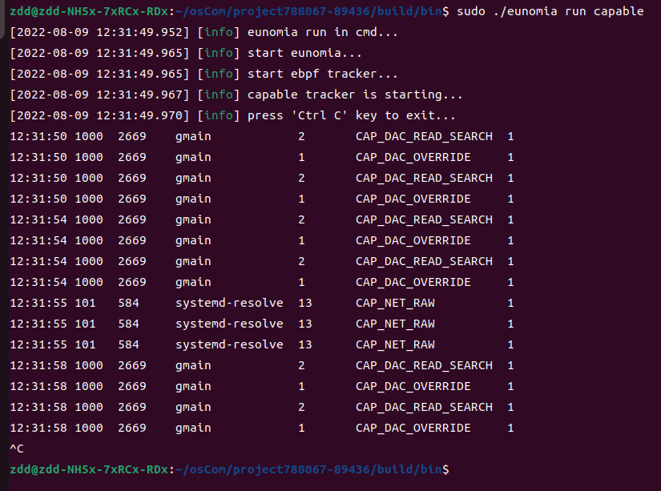
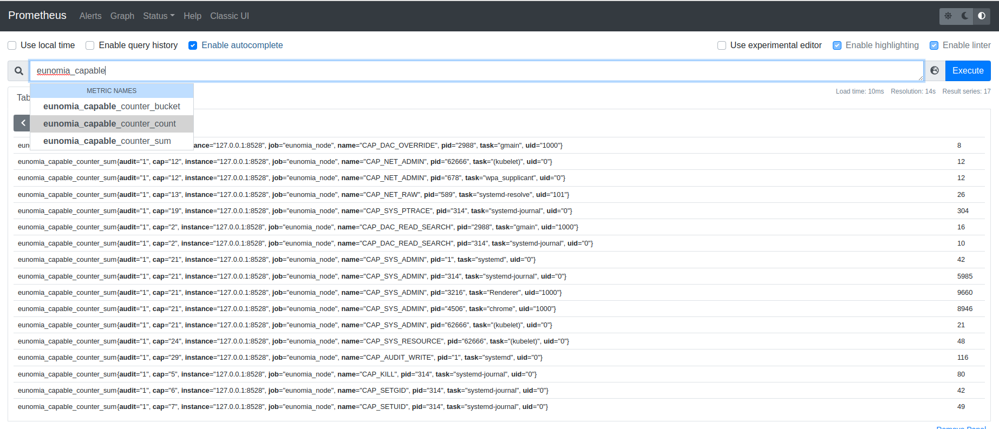

## Eunomia - capable: 使用基于 eBPF 的云原生监控工具监控 Capabilities 机制检查

### 背景

`Capabilities` 机制是在 Linux 内核 2.2 之后引入的一种功能组划分机制。当线程需要执行某样操作时，
内核便会对其检查，该机制可以避免普通线程越级操作，影响内核。因此，对 capability 检查的追踪可以让
开发者更好的掌握系统中线程的操作情况。Capable 工具通过追踪内核中 `cap_capable()` 函
数，实现了对于 capability 检查的追踪。

### 实现原理

Capable 在 `kprobe/cap_capable` 挂载点下挂载了执行函数。当`cap_capable()` 函数被
调用时，该执行函数便会运行，获取调用线程的信息。
```c
SEC("kprobe/cap_capable")
int BPF_KPROBE(kprobe__cap_capable, const struct cred *cred, struct user_namespace *targ_ns, int cap, int cap_opt)
{
  __u32 pid;
  __u64 pid_tgid;
  struct cap_key_t i_key;

  if (filter_cg && !bpf_current_task_under_cgroup(&cgroup_map, 0))
    return 0;

  pid_tgid = bpf_get_current_pid_tgid();
  pid = pid_tgid >> 32;

  if (pid == my_pid)
    return 0;

  if (targ_pid != -1 && targ_pid != pid)
    return 0;

  struct cap_event event = {};
  event.pid = pid;
  event.tgid = pid_tgid;
  event.cap = cap;
  event.uid = bpf_get_current_uid_gid();
  bpf_get_current_comm(&event.task, sizeof(event.task));

  if (LINUX_KERNEL_VERSION >= KERNEL_VERSION(5, 1, 0))
  {
    event.audit = (cap_opt & 0b10) == 0;
    event.insetid = (cap_opt & 0b100) != 0;
  }
  else
  {
    event.audit = cap_opt;
    event.insetid = -1;
  }

  if (unique_type)
  {
    struct unique_key key = { .cap = cap };
    if (unique_type == UNQ_CGROUP)
      key.cgroupid = bpf_get_current_cgroup_id();
    else
      key.tgid = pid_tgid;

    if (bpf_map_lookup_elem(&seen, &key) != NULL)
      return 0;

    u64 zero = 0;
    bpf_map_update_elem(&seen, &key, &zero, 0);
  }

  if (kernel_stack || user_stack)
  {
    i_key.pid = pid;
    i_key.tgid = pid_tgid;

    i_key.kern_stack_id = i_key.user_stack_id = -1;
    if (user_stack)
      i_key.user_stack_id = bpf_get_stackid(ctx, &stackmap, BPF_F_USER_STACK);
    if (kernel_stack)
      i_key.kern_stack_id = bpf_get_stackid(ctx, &stackmap, 0);

    bpf_map_update_elem(&info, &i_key, &event, BPF_NOEXIST);
  }
  bpf_perf_event_output(ctx, &events, BPF_F_CURRENT_CPU, &event, sizeof(event));

  return 0;
}
```
在处理程序中，Capable会先读取各种基本信息，比如`tid`, `tgid`, `comm`等信息。
之后，他还会读取capable事件在内核栈中的路径，以及调用线程的`cgroupid`等额外信息。
用户可以根据需要，在命令行中输入不同的参数，使得Capable展现不同的数据。

### Eunomia中使用方式




### 总结

Capable 工具可以在内核的 capability check 环节捕获调用线程的信息并进行呈现，
这使得使用者可以对内核安全由更好的掌握。