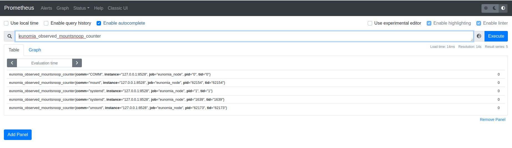

## Eunomia - mountsnoop: 使用基于 eBPF 的云原生监控工具监控 Mount/Unmount

### 背景

为了更好的掌握文件系统mount和unmount的的情况，`mountsnoop`被提出。该工具可以监控mount和umount
这两个系统调用，从而展现文件系统挂载和卸载的全貌。

### 实现原理

`mountsnoop` 使用了linux自带的，设立在mount和umount下的追踪点。
```c
static int probe_entry(const char *src, const char *dest, const char *fs,
		       __u64 flags, const char *data, enum op op)
{
	__u64 pid_tgid = bpf_get_current_pid_tgid();
	__u32 pid = pid_tgid >> 32;
	__u32 tid = (__u32)pid_tgid;
	struct arg arg = {};

	if (target_pid && target_pid != pid)
		return 0;

	arg.ts = bpf_ktime_get_ns();
	arg.flags = flags;
	arg.src = src;
	arg.dest = dest;
	arg.fs = fs;
	arg.data= data;
	arg.op = op;
	bpf_map_update_elem(&args, &tid, &arg, BPF_ANY);
	return 0;
};

static int probe_exit(void *ctx, int ret)
{
	__u64 pid_tgid = bpf_get_current_pid_tgid();
	__u32 pid = pid_tgid >> 32;
	__u32 tid = (__u32)pid_tgid;
	struct arg *argp;
	struct event *eventp;
	struct task_struct *task;
	int zero = 0;

	argp = bpf_map_lookup_elem(&args, &tid);
	if (!argp)
		return 0;

	eventp = bpf_map_lookup_elem(&heap, &zero);
	if (!eventp)
		return 0;

	task = (struct task_struct *)bpf_get_current_task();
	eventp->delta = bpf_ktime_get_ns() - argp->ts;
	eventp->flags = argp->flags;
	eventp->pid = pid;
	eventp->tid = tid;
	eventp->mnt_ns = BPF_CORE_READ(task, nsproxy, mnt_ns, ns.inum);
	eventp->ret = ret;
	eventp->op = argp->op;
	bpf_get_current_comm(&eventp->comm, sizeof(eventp->comm));
	if (argp->src)
		bpf_probe_read_user_str(eventp->src, sizeof(eventp->src), argp->src);
	else
		eventp->src[0] = '\0';
	if (argp->dest)
		bpf_probe_read_user_str(eventp->dest, sizeof(eventp->dest), argp->dest);
	else
		eventp->dest[0] = '\0';
	if (argp->fs)
		bpf_probe_read_user_str(eventp->fs, sizeof(eventp->fs), argp->fs);
	else
		eventp->fs[0] = '\0';
	if (argp->data)
		bpf_probe_read_user_str(eventp->data, sizeof(eventp->data), argp->data);
	else
		eventp->data[0] = '\0';
	bpf_perf_event_output(ctx, &events, BPF_F_CURRENT_CPU, eventp, sizeof(*eventp));

	bpf_map_delete_elem(&args, &tid);
	return 0;
}

SEC("tracepoint/syscalls/sys_enter_mount")
int mount_entry(struct trace_event_raw_sys_enter *ctx)
{
	const char *src = (const char *)ctx->args[0];
	const char *dest = (const char *)ctx->args[1];
	const char *fs = (const char *)ctx->args[2];
	__u64 flags = (__u64)ctx->args[3];
	const char *data = (const char *)ctx->args[4];

	return probe_entry(src, dest, fs, flags, data, MOUNT);
}

SEC("tracepoint/syscalls/sys_exit_mount")
int mount_exit(struct trace_event_raw_sys_exit *ctx)
{
	return probe_exit(ctx, (int)ctx->ret);
}

SEC("tracepoint/syscalls/sys_enter_umount")
int umount_entry(struct trace_event_raw_sys_enter *ctx)
{
	const char *dest = (const char *)ctx->args[0];
	__u64 flags = (__u64)ctx->args[1];

	return probe_entry(NULL, dest, NULL, flags, NULL, UMOUNT);
}

SEC("tracepoint/syscalls/sys_exit_umount")
int umount_exit(struct trace_event_raw_sys_exit *ctx)
{
	return probe_exit(ctx, (int)ctx->ret);
}
```
当程序进入mount时，执行函数会收集`src`, `dest`,`fs`,`flags` `data`等基本数据，然后以tid为主键
写入map中。mount完成后，执行函数会再一次收集相关基本信息，然后输出到用户态进行显示。umount的操作思路
也基本类似。不过在收集数据时，相较于mount，umount会少掉`src`，`fs`等一部分不相关数据。


### Eunomia中使用方式





### 总结
`mountsnoop` 通过对 mount 和 umount 两个系统调用的追踪，快速方便地实现了对系统范围内的文件系统挂载
的掌控，可以方便开发者们更好地掌握系统信息。