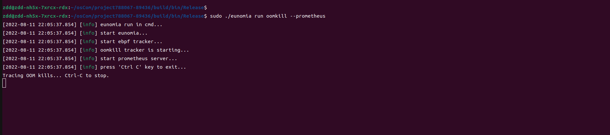

## Eunomia - oomkill: 使用基于 eBPF 的云原生监控工具监控 out-of-memory killer

### 背景
开发者在编写程序时，有时可能会因为不小心而写出会耗尽内存的代码，这时候程序就会被系统自动杀死。为了监测
这一类一场情况，`oomkill`(out-of-memory killer)工具被开发了出来。该工具可以监测系统中因为内存耗尽
而被杀死的进程，并将详细信息进行输出反馈。

### 实现原理
`oomkill` 的实现逻辑非常简单，它在`kprobe/oom_kill_procee`下挂载了执行函数。每当发生因为内存耗尽，
进程被杀死的情况时，该执行函数会被触发，此时其会记录数据，并输出到用户态的代码进行展示。
```c
SEC("kprobe/oom_kill_process")
int BPF_KPROBE(oom_kill_process, struct oom_control *oc, const char *message)
{
	struct data_t data;

	data.fpid = bpf_get_current_pid_tgid() >> 32;
	data.tpid = BPF_CORE_READ(oc, chosen, tgid);
	data.pages = BPF_CORE_READ(oc, totalpages);
	bpf_get_current_comm(&data.fcomm, sizeof(data.fcomm));
	bpf_probe_read_kernel(&data.tcomm, sizeof(data.tcomm), BPF_CORE_READ(oc, chosen, comm));
	bpf_perf_event_output(ctx, &events, BPF_F_CURRENT_CPU, &data, sizeof(data));
	return 0;
}
```

### Eunomia中使用方式



### 总结
`oomkill` 通过一个简便的方式，使得对内存耗尽的进程的监控成为了可能，这能方便开发者在开发时更好地掌握
程序运行的动态。