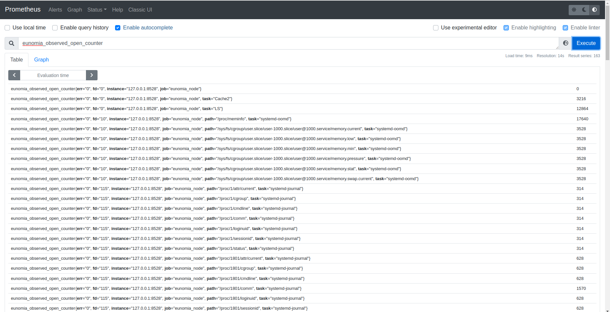
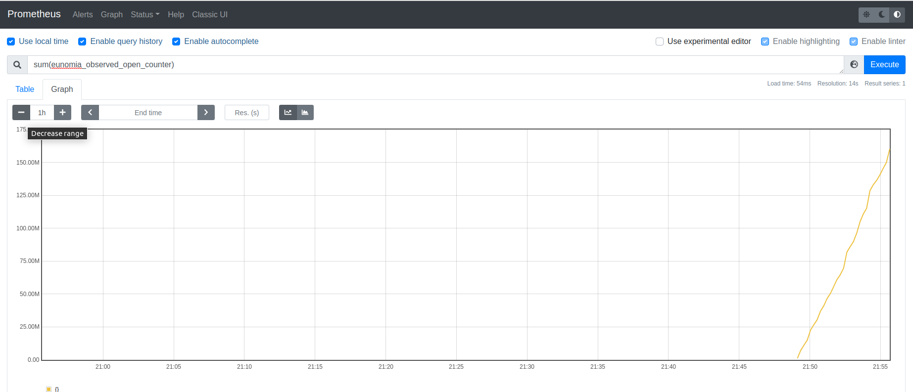

## Eunomia - Funclatency: 使用基于 eBPF 的云原生监控工具监控 Mount/Unmount

### 背景
通过对 open 系统调用的监测，`opensnoop`可以展现系统内所有调用了 open 系统调用的进程信息。

### 实现原理
`opensnoop` 的实现逻辑比较简单，它在 `sys_enter_open` 和 `sys_enter_openat` 这两个追踪点下
加了执行函数，当有 open 系统调用发生时，执行函数便会被触发。同样在，在对应的 `sys_exit_open` 和 
`sys_exit_openat` 系统调用下，`opensnoop` 也加了执行函数。
```c
static __always_inline
bool trace_allowed(u32 tgid, u32 pid)
{
	u32 uid;

	/* filters */
	if (targ_tgid && targ_tgid != tgid)
		return false;
	if (targ_pid && targ_pid != pid)
		return false;
	if (valid_uid(targ_uid)) {
		uid = (u32)bpf_get_current_uid_gid();
		if (targ_uid != uid) {
			return false;
		}
	}
	return true;
}

SEC("tracepoint/syscalls/sys_enter_open")
int tracepoint__syscalls__sys_enter_open(struct trace_event_raw_sys_enter* ctx)
{
	u64 id = bpf_get_current_pid_tgid();
	/* use kernel terminology here for tgid/pid: */
	u32 tgid = id >> 32;
	u32 pid = id;

	/* store arg info for later lookup */
	if (trace_allowed(tgid, pid)) {
		struct args_t args = {};
		args.fname = (const char *)ctx->args[0];
		args.flags = (int)ctx->args[1];
		bpf_map_update_elem(&start, &pid, &args, 0);
	}
	return 0;
}

SEC("tracepoint/syscalls/sys_enter_openat")
int tracepoint__syscalls__sys_enter_openat(struct trace_event_raw_sys_enter* ctx)
{
	u64 id = bpf_get_current_pid_tgid();
	/* use kernel terminology here for tgid/pid: */
	u32 tgid = id >> 32;
	u32 pid = id;

	/* store arg info for later lookup */
	if (trace_allowed(tgid, pid)) {
		struct args_t args = {};
		args.fname = (const char *)ctx->args[1];
		args.flags = (int)ctx->args[2];
		bpf_map_update_elem(&start, &pid, &args, 0);
	}
	return 0;
}

static __always_inline
int trace_exit(struct trace_event_raw_sys_exit* ctx)
{
	struct event event = {};
	struct args_t *ap;
	int ret;
	u32 pid = bpf_get_current_pid_tgid();

	ap = bpf_map_lookup_elem(&start, &pid);
	if (!ap)
		return 0;	/* missed entry */
	ret = ctx->ret;
	if (targ_failed && ret >= 0)
		goto cleanup;	/* want failed only */

	/* event data */
	event.pid = bpf_get_current_pid_tgid() >> 32;
	event.uid = bpf_get_current_uid_gid();
	bpf_get_current_comm(&event.comm, sizeof(event.comm));
	bpf_probe_read_user_str(&event.fname, sizeof(event.fname), ap->fname);
	event.flags = ap->flags;
	event.ret = ret;

	/* emit event */
	bpf_perf_event_output(ctx, &events, BPF_F_CURRENT_CPU,
			      &event, sizeof(event));

cleanup:
	bpf_map_delete_elem(&start, &pid);
	return 0;
}

SEC("tracepoint/syscalls/sys_exit_open")
int tracepoint__syscalls__sys_exit_open(struct trace_event_raw_sys_exit* ctx)
{
	return trace_exit(ctx);
}

SEC("tracepoint/syscalls/sys_exit_openat")
int tracepoint__syscalls__sys_exit_openat(struct trace_event_raw_sys_exit* ctx)
{
	return trace_exit(ctx);
}

```
在 enter 环节，`opensnoop` 会记录调用者的pid, comm等基本信息，并存入map中。在 exit 环节，`opensnoop`
会根据pid读出之前存入的数据，再结合捕获的其他数据，输出到用户态处理函数中，展现给用户。

### Eunomia中使用方式




### 总结
`opensnoop` 通过对 open 系统调用的追踪，使得用户可以较为方便地掌握目前系统中调用了 open 系统调用的进程信息。

