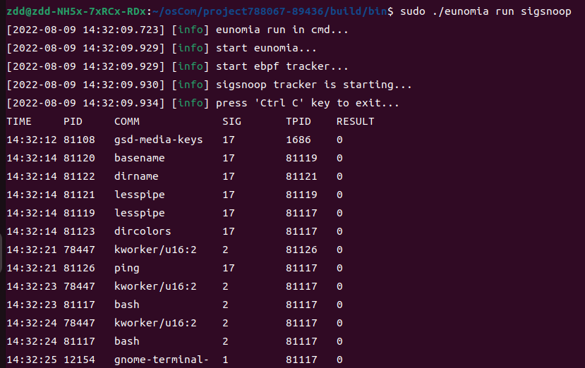
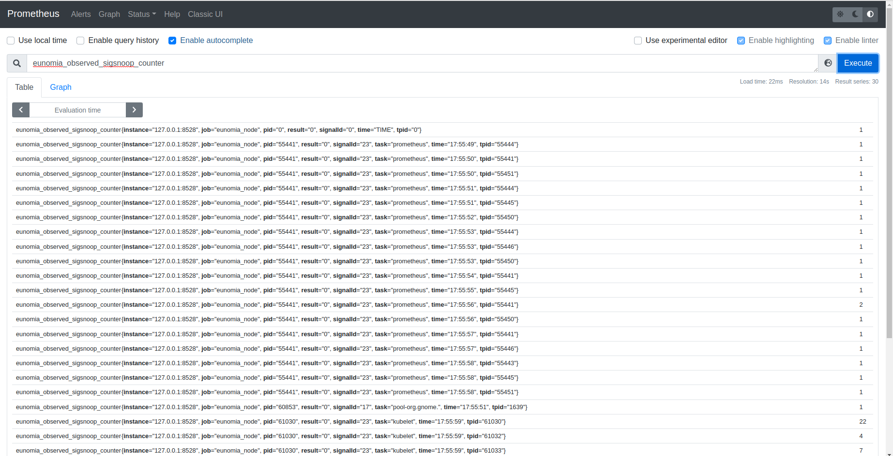

## Eunomia - sigsnoop: 使用基于 eBPF 的云原生监控工具监控 signal

### 背景
系统调用是用户态和内核态交互的重要渠道。对系统调用的成功监测，可以使得开发者对系统安全有更深一步的掌控。
`sigsnoop` 工具通过在系统调用的各个关键tracepoint节点添加执行函数，实现了对系统范围内syscall的监测。

### 实现原理
`sigsnoop` 在利用了linux的tracepoint挂载点，其在syscall进入和退出的各个关键挂载点均挂载了执行函数。
```c
SEC("tracepoint/syscalls/sys_enter_kill")
int kill_entry(struct trace_event_raw_sys_enter *ctx)
{
	pid_t tpid = (pid_t)ctx->args[0];
	int sig = (int)ctx->args[1];

	return probe_entry(tpid, sig);
}

SEC("tracepoint/syscalls/sys_exit_kill")
int kill_exit(struct trace_event_raw_sys_exit *ctx)
{
	return probe_exit(ctx, ctx->ret);
}

SEC("tracepoint/syscalls/sys_enter_tkill")
int tkill_entry(struct trace_event_raw_sys_enter *ctx)
{
	pid_t tpid = (pid_t)ctx->args[0];
	int sig = (int)ctx->args[1];

	return probe_entry(tpid, sig);
}

SEC("tracepoint/syscalls/sys_exit_tkill")
int tkill_exit(struct trace_event_raw_sys_exit *ctx)
{
	return probe_exit(ctx, ctx->ret);
}

SEC("tracepoint/syscalls/sys_enter_tgkill")
int tgkill_entry(struct trace_event_raw_sys_enter *ctx)
{
	pid_t tpid = (pid_t)ctx->args[1];
	int sig = (int)ctx->args[2];

	return probe_entry(tpid, sig);
}

SEC("tracepoint/syscalls/sys_exit_tgkill")
int tgkill_exit(struct trace_event_raw_sys_exit *ctx)
{
	return probe_exit(ctx, ctx->ret);
}

SEC("tracepoint/signal/signal_generate")
int sig_trace(struct trace_event_raw_signal_generate *ctx)
{
	struct event event = {};
	pid_t tpid = ctx->pid;
	int ret = ctx->errno;
	int sig = ctx->sig;
	__u64 pid_tgid;
	__u32 pid;

	if (failed_only && ret == 0)
		return 0;

	if (target_signal && sig != target_signal)
		return 0;

	pid_tgid = bpf_get_current_pid_tgid();
	pid = pid_tgid >> 32;
	if (filtered_pid && pid != filtered_pid)
		return 0;

	event.pid = pid;
	event.tpid = tpid;
	event.sig = sig;
	event.ret = ret;
	bpf_get_current_comm(event.comm, sizeof(event.comm));
	bpf_perf_event_output(ctx, &events, BPF_F_CURRENT_CPU, &event, sizeof(event));
	return 0;
}

```
当进入syscall时，`sigsnoop`会以tid为主键，将syscall的相关信息写入map中。在完成syscall时，`sigsnoop`则
会更新之前记录的信息，并将数据输出到用户态进行呈现。对于部分不经过此路径的syscall，`sigsnoop`则在
`signal_generate`挂载点下同样挂载了执行函数，其会捕获sycall信息，并直接输出到用户态。

### Eunomia中使用方式




### 总结
`sigsnoop` 通过linux中的tracepoint机制，成功地实现了对于系统范围内syscall的追踪。