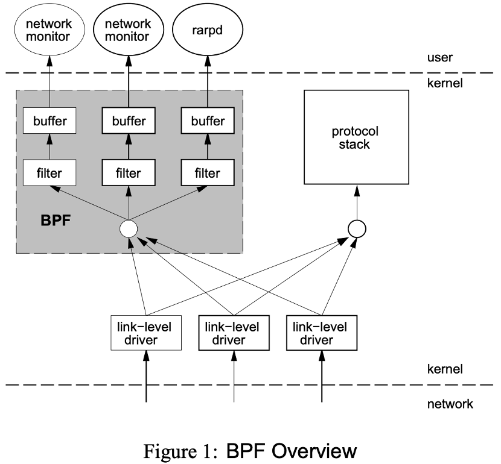
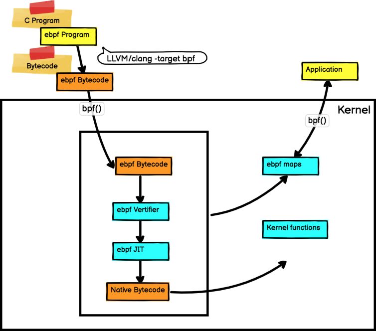

# eBPF开发教程

## 什么是eBPF
        Linux内核一直是实现监控/可观测性、网络和安全功能的理想地方，
但是直接在内核中进行监控并不是一个容易的事情。在传统的Linux软件开发中，
实现这些功能往往都离不开修改内核源码或加载内核模块。修改内核源码是一件非常危险的行为，
稍有不慎可能便会导致系统崩溃，并且每次检验修改的代码都需要重新编译内核，耗时耗力。
加载内核模块虽然来说更为灵活，不需要重新编译源码，但是也可能导致内核崩溃，且随着内核版本的变化
模块也需要进行相应的修改，否则将无法使用。在这一背景下，eBPF技术应运而生。
它是一项革命性技术，能在内核中运行沙箱程序（sandbox programs），而无需
修改内核源码或者加载内核模块。用户可以使用其提供的各种接口，实现在内核中追踪、监测系统的作用。

### 起源
        eBPF的雏形是BPF(Berkeley Packet Filter, 伯克利包过滤器)。BPF于
1992年被Steven McCanne和Van Jacobson在其[论文](https://www.tcpdump.org/papers/bpf-usenix93.pdf)
提出。二人提出BPF的初衷是是提供一种新的数据包过滤方法，该方法的模型如下图所示。   

        相较于其他过滤方法，BPF有两大创新点，首先是它使用了一个新的虚拟机，可以
有效地工作在基于寄存器结构的CPU之上。其次是其不会全盘复制数据包的所有信息，只会复制相关数据，可以有效地
提高效率。这两大创新使得BPF在实际应用中得到了巨大的成功，在被移植到Linux系统后，其被上层的`libcap`
和`tcpdump`等应用使用，是一个性能卓越的工具。
        传统的BPF是32位架构，其指令集编码格式为：
- 16 bit: 操作指令
- 8 bit: 下一条指令跳向正确目标的偏移量
- 8 bit: 下一条指令跳往错误目标的偏移量   

        经过十余年的沉积后，2013年，Alexei Starovoitov对BPF进行了彻底地改造，
改造后的BPF被命名为eBPF(extended BPF)，于Linux Kernel 3.15中引入Linux内核源码。
eBPF相较于BPF有了革命性的变化。首先在于eBPF支持了更多领域的应用，它不仅支持网络包的过滤，还可以通过
`kprobe`，`tracepoint`,`lsm`等Linux现有的工具对响应事件进行追踪。另一方面，其在使用上也更为
灵活，更为方便。同时，其JIT编译器也得到了升级，解释器也被替换，这直接使得其具有达到平台原生的
执行性能的能力。

### 执行逻辑
        eBPF在执行逻辑上和BPF有相似之处，eBPF也可以认为是一个基于寄存器的，使用自定义的64位RISC指令集的
微型"虚拟机"。它可以在Linux内核中，以一种安全可控的方式运行本机编译的eBPF程序并且访问内核函数和内存的子集。
在写好程序后，我们将代码使用llvm编译得到使用BPF指令集的ELF文件，解析出需要注入的部分后调用函数将其
注入内核。用户态的程序和注入内核态中的字节码公用一个位于内核的eBPF Map进行通信，实现数据的传递。同时，
为了防止我们写入的程序本身不会对内核产生较大影响，编译好的字节码在注入内核之前会被eBPF校验器严格地检查。
eBPF程序是由事件驱动的，我们在程序中需要提前确定程序的执行点。编译好的程序被注入内核后，如果提前确定的执行点
被调用，那么注入的程序就会被触发，按照既定方式处理。  
        eBPF的整体执行逻辑由图1所示。

### 架构
#### 寄存器设计
        eBPF有11个寄存器，分别是R0~R10，每个寄存器均是64位大小，有相应的32位
子寄存器，其指令集是固定的64位宽。
#### 指令编码格式
        eBPF指令编码格式为：
- 8 bit: 存放真实指令码
- 4 bit: 存放指令用到的目标寄存器号
- 4 bit: 存放指令用到的源寄存器号
- 16 bit: 存放偏移量，具体作用取决于指令类型
- 32 bit: 存放立即数

### 本节参考文章
[A thorough introduction to eBPF](https://lwn.net/Articles/740157/)
[bpf简介](https://www.collabora.com/news-and-blog/blog/2019/04/05/an-ebpf-overview-part-1-introduction/)
[bpf架构知识](https://www.collabora.com/news-and-blog/blog/2019/04/15/an-ebpf-overview-part-2-machine-and-bytecode/)

