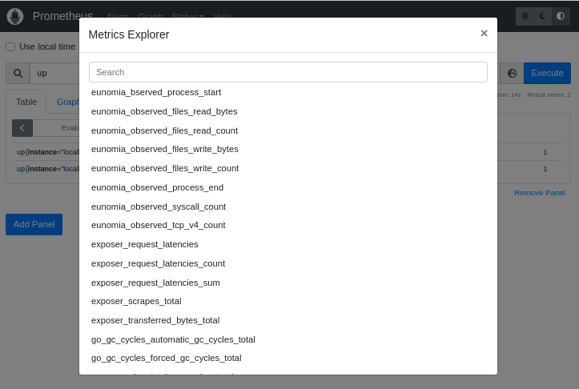

# 集成

Describe how to intergrate with other apps.

# prometheus

```sh
sudo docker pull prom/prometheus
cp ./prometheus.yml /etc/prometheus/prometheus.yml

sudo docker run -d --user root -p 9090:9090 -v /etc/prometheus/prometheus.yml:/etc/prometheus/prometheus.yml -v /etc/prometheus/data:/data/prometheus prom/prometheus --config.file="/etc/prometheus/prometheus.yml" --web.listen-address="0.0.0.0:9090"
```

or run locally:

```sh
/prometheus --config.file=prometheus.yml --web.listen-address="0.0.0.0:9090"
```

# grafana

```sh
sudo docker pull grafana/grafana:latest
```

or podman

```sh
sudo podman run --user root -d -p 3000:3000 grafana/grafana:latest
```

see: https://grafana.com/grafana/download

see: https://prometheus.io/docs/visualization/grafana/

or on Ubuntu:

```sh
sudo apt-get install -y adduser libfontconfig1
wget https://dl.grafana.com/enterprise/release/grafana-enterprise_8.5.4_amd64.deb
sudo dpkg -i grafana-enterprise_8.5.4_amd64.deb

sudo /bin/systemctl start grafana-server
```

## examples

Prometheus信息可视化测试：

  - 配置prometheus添加eunomia数据源
```
   job_name: "prometheus" 
     # metrics_path defaults to '/metrics'
     # scheme defaults to 'http'. 
     static_configs:
       - targets: ["localhost:9090"]
   job_name: "eunomia_node"
     static_configs:
       - targets: ["localhost:8528"] 
```
  - 从prometheus查看数据源的状态
    
  - 从promethesu查看eunomia暴露的指标列表
    
  - 从Prometheus查看部分指标的数值分布
    
    
    
- grafana

  - grafana配置从peometheus拉取数据的端口
    
  - grafana部分指标展示效果如下图，左上为文件读操作Bytes监控;左下为为系统调用热力图，方便定位到热点调用路径;右上为文件读操作TOP10;右下为文件写操作TOP10。
    
    

## OpenTelemetry
